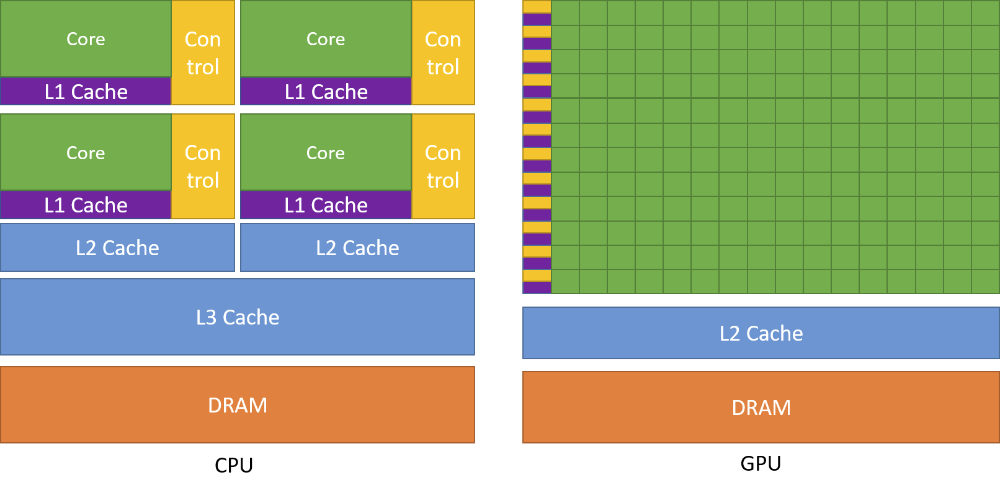
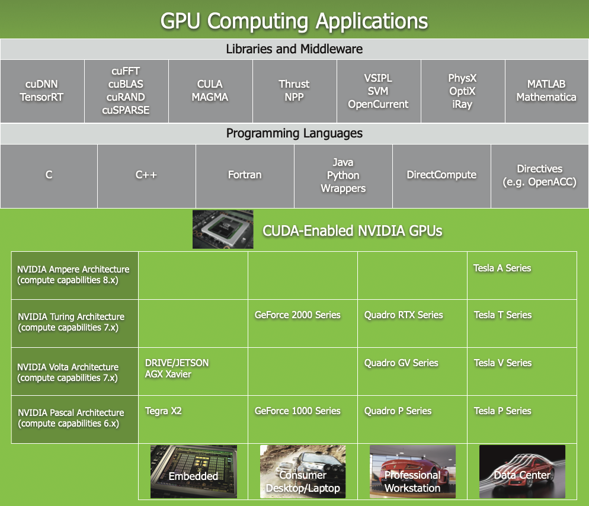
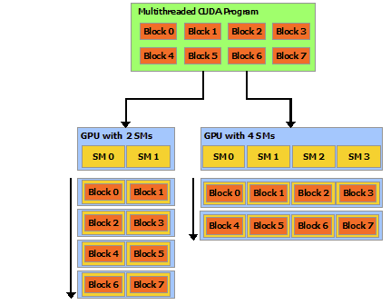
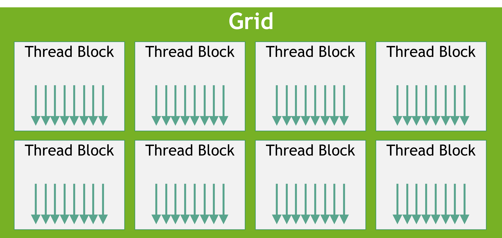

# <a href="https://docs.nvidia.com/cuda/cuda-c-programming-guide/index.html"> <<CUDA C++ Programming Guide>>学习笔记</a>

----------------------------------------------

HIPPO
更新日期 20230826
CUDA模块和接口开发文档 V12.2

----------------------------------------------

<span id="Title-1"></span>
# <a href="https://docs.nvidia.com/cuda/cuda-c-programming-guide/index.html#introduction"> 1、介绍</a>
<span id="Title-1.1"></span>
## <a href="https://docs.nvidia.com/cuda/cuda-c-programming-guide/index.html#the-benefits-of-using-gpus"> 1.1、 使用GPU的好处</a>

&emsp;&emsp;GPU(Graphics Processing Unit，图像处理单元)相比于CPU，在使用高指令吞吐量和内存带宽方面有更高的性价比。许多应用充分利用这些高性能特性使得在GPU上跑的比CPU更快。其他的计算硬件，比如FPGAs，也同样的效率，但是编程的灵活性更低。
&emsp;&emsp;因为设计时愿景不同，导致GPU与CPU存在这些性能差异。CPU可以并发执行数十个线程，而GPU的设计可以支持并发上千个线程（分摊较慢的单线程性能以实现更高的吞吐量）。
&emsp;&emsp;GPU专门用于高度并行计算，因此设计了更多的晶体管用于数据处理，而不是数据缓存和流量控制。[图1.1](#picture-1.1)显示了CPU和GPU的芯片资源分布示例

<span id="picture-1.1"></span>
<div> <!--块级封装-->
    <center> <!--将图片和文字居中-->
    
    <br> <!--换行-->
    <small>图1.1 GPU计算应用。CUDA旨在支持各种语言和应用程序编程接口</small> <!--标题-->
    </center>
</div>

&emsp;&emsp;将更多的晶体管用于数据处理，例如浮点计算，有利于高度并行计算;GPU可以通过计算隐藏内存访问延迟，而不是依赖于大型数据缓存和复杂的流控制来避免长内存访问延迟，这两者在晶体管方面都是昂贵的。
&emsp;&emsp;一般来说，应用程序混合了并行部分和顺序部分，因此系统被设计为混合使用gpu和cpu，以最大限度地提高整体性能。具有高度并行性的应用程序可以利用GPU的这种大规模并行特性来实现比CPU更高的性能。

<span id="Title-1.2"></span>
## <a href="https://docs.nvidia.com/cuda/cuda-c-programming-guide/index.html#cuda-a-general-purpose-parallel-computing-platform-and-programming-model"> 1.2、 CUDA®:一个通用并行计算平台和编程模型</a>

&emsp;&emsp;2006年11月，NVIDIA推出了CUDA，一个通用并行计算平台和编程模型，利用NVIDIA gpu中的并行计算引擎，以比CPU更有效的方式解决许多复杂的计算问题。
&emsp;&emsp;CUDA附带了一个软件环境，允许开发人员使用c++作为高级编程语言。如[图1.2](#picture-1.2)所示，支持其他语言、应用程序编程接口或基于指令的方法，例如FORTRAN、DirectCompute、OpenACC。

<span id="picture-1.2"></span>
<div> <!--块级封装-->
    <center> <!--将图片和文字居中-->
    
    <br> <!--换行-->
    <small>图1.2 GPU计算应用。CUDA旨在支持各种语言和应用程序编程接口</small> <!--标题-->
    </center>
</div>

<span id="Title-1.3"></span>
## <a href="https://docs.nvidia.com/cuda/cuda-c-programming-guide/index.html#a-scalable-programming-model"> 1.3、 CUDA®:一个通用并行计算平台和编程模型</a>

&emsp;&emsp;多核cpu和多核gpu的出现意味着主流处理器芯片现在是并行系统。当前的挑战是开发能够透明地扩展其并行性的应用软件，以利用不断增加的处理器核数，就像3D图形应用程序能够透明地将其并行性扩展到具有不同核数的众核gpu一样。 
&emsp;&emsp;CUDA并行编程模型旨在克服这一挑战，同时对熟悉C等标准编程语言的程序员保持较低的学习曲线。
其核心是三个关键的抽象——线程组的层次结构、共享内存和同步屏障——它们只是作为最小的语言扩展集暴露给程序员。
&emsp;&emsp;这些抽象提供细粒度的数据并行性和线程并行性，嵌套在粗粒度的数据并行性和任务并行性中。它们指导程序员将问题划分为可由线程块独立并行求解的粗粒度子问题，以及可由线程块内所有线程协同并行求解的细粒度子问题。
&emsp;&emsp;这种分解允许线程在解决每个子问题时进行协作，从而保持了语言的表达能力，同时允许自动扩展。 实际上，每个线程块都可以以任意顺序(并发或顺序)在GPU内的任何可用多处理器上调度，因此编译后的CUDA程序可以在任意数量的多处理器上执行，如[图1.3](#picture-1.3)所示，只有运行时系统需要知道物理多处理器数量。
&emsp;&emsp;这种可扩展的编程模型允许GPU架构通过简单地扩展多处理器和内存分区的数量来跨越广泛的市场范围:从高性能爱好者GeForce GPU和专业Quadro和Tesla计算产品到各种廉价的主流GeForce GPU(有关所有cuda支持的GPU的列表，请参阅[支持CUDA的gpu](#Title-6))。

<span id="picture-1.3"></span>
<div> <!--块级封装-->
    <center> <!--将图片和文字居中-->
    
    <br> <!--换行-->
    <small>图1.3 自主可伸缩</small> <!--标题-->
    </center>
</div>

> **<center>注意</center>** GPU是围绕一系列流多处理器(Streaming Multiprocessors, SMs)构建的(更多细节请参见[硬件实现](#Title-4))将多线程程序划分为多个独立执行的线程块，使得多处理器数量较多的GPU能够在比多处理器数量较少的GPU更短的时间内自动执行程序。

<span id="Title-1.4"></span>
## <a href="https://docs.nvidia.com/cuda/cuda-c-programming-guide/index.html#document-structure"> 1.4、目录结构</a>
本文档分为以下几个部分:

[1、介绍](#Title-1)是一个CUDA的简介。
[2、编程模型](#Title-2)概述了CUDA编程模型。
[3、编程接口](#Title-3)描述了编程接口。
[4、硬件实现](#Title-4)阐述了硬件实现。
[5、性能指南](#Title-5)给出了一些关于如何达到最大性能的指南。
[6、支持CUDA的GPU](#Title-6)列举了所有CUDA支持的硬件。
[7、C++语言扩展](#Title-7)详细描述了C++语言的扩展。
[8、协作组](#Title-8)描述了不同CUDA线程组的同步单元。
[9、CUDA动态并行](#Title-9)描述了如何发起和同步一个kernel到另一个kernel。
[10、虚拟内存管理](#Title-10)描述了如何管理用以虚拟内存空间。
[11、流有序内存分配器](#Title-11)描述了应用如何申请和释放有序内存。
[12、图像存储节点](#Title-12)描述了图像如何创建和分配自己的内存。
[13、数学方法](#Title-13)列举了CUDA支持的数学方法。
[14、C++语言支持](#Title-14)列举了device端支持的C++特性。
[15、纹理方法](#Title-15)给出了纹理方法更多的细节。
[16、计算能力](#Title-16)给出了各种设备的技术规格，以及更多的架构细节。
[17、Driver API](#Title-17)介绍了低等级的driver API。
[18、CUDA 环境变量](#Title-18)列举了所有的CUDA环境变量。
[19、统一存储编程](#Title-19)介绍了统一内存编程指导。

<small>[[1]](#Title-1.1) : 图形限定符源于这样一个事实:20年前，当GPU最初被创建时，它是作为加速图形渲染的专用处理器设计的。在对实时、高清、3D图形永不满足的市场需求的推动下，它已经发展成为一种通用处理器，用于更多的工作负载，而不仅仅是图形渲染。</small>

<span id="Title-2"></span>
# <a href="https://docs.nvidia.com/cuda/cuda-c-programming-guide/index.html#programming-model"> 2、编程模型</a>

本章主要介绍了CUDA编程模型背后的概念,概述了它们是如何暴露在c++中。从[编程接口](#Title-3)的角度对CUDA c++进行了详细的描述。本章和下一章的vector补充举例可以在<a href="https://docs.nvidia.com/cuda/cuda-samples/index.html#vector-addition"> vectorAdd CUDA sample</a>中找到。

<span id="Title-2.1"></span>
## <a href="https://docs.nvidia.com/cuda/cuda-c-programming-guide/index.html#kernels"> 2.1、Kernels</a>
&emsp;&emsp;CUDA C++扩展了C++，允许程序员自定义C++函数，称为Kernel，调用时，由N个不同的CUDA线程并行执行N次，而不是像普通的c++函数那样只执行一次。
&emsp;&emsp;Kernel使用`__global__`声明、使用新符号`<<<...>>>`给定的Kernel的CUDA线程数量来执行，配置语法(参见 [C++语言扩展](#Title-7))。每个执行内核的线程都有一个唯一的线程ID，在内核中可以通过内置变量访问。
&emsp;&emsp;作为说明，下面的示例代码使用内置变量threadIdx，将两个长度为N的向量A和B相加，并将结果存储到向量C中:

``` C++
// Kernel definition
__global__ void VecAdd(float* A, float* B, float* C)
{
    int i = threadIdx.x;
    C[i] = A[i] + B[i];
}

int main()
{
    ...
    // Kernel invocation with N threads
    VecAdd<<<1, N>>>(A, B, C);
    ...
}
```
在这里，执行VecAdd()的N个线程中的每一个执行一次成对加法。

<span id="Title-2.2"></span>
## <a href="https://docs.nvidia.com/cuda/cuda-c-programming-guide/index.html#thread-hierarchy"> 2.2、线程层次结构</a>

&emsp;&emsp;为了方便起见，threadIdx是一个3分量向量，因此可以使用一维、二维或三维线程索引来标识线程，形成一维、二维或三维线程块，称为线程块。这为跨域元素(如向量、矩阵或体积)调用计算提供了一种自然的方式。
&emsp;&emsp;线程的索引和线程ID以一种直接的方式相互关联:对于一维的block，它们是相同的;对于大小为(Dx, Dy)的二维block，索引为(x, y)的线程的线程ID为(x + y\*Dx);对于大小为(Dx, Dy, Dz)的三维block，索引为(x, y, z)的线程ID为(x + y*\Dx + z\*Dx\*Dy)。
&emsp;&emsp;下面的代码将大小为NxN的两个矩阵A和B相加，并将结果存储到矩阵C中:
``` C++
// Kernel definition
__global__ void MatAdd(float A[N][N], float B[N][N],
                       float C[N][N])
{
    int i = threadIdx.x;
    int j = threadIdx.y;
    C[i][j] = A[i][j] + B[i][j];
}

int main()
{
    ...
    // Kernel invocation with one block of N * N * 1 threads
    int numBlocks = 1;
    dim3 threadsPerBlock(N, N);
    MatAdd<<<numBlocks, threadsPerBlock>>>(A, B, C);
    ...
}
```

&emsp;&emsp;每个block的线程数是有限制的，因为一个block中的所有线程都应该驻留在同一个多处理器核上，并且必须共享该核有限的内存资源。当前的gpu,线程阻塞可能含有多达1024个线程。
&emsp;&emsp;一个Kernel可以由多个形状相等的block执行，因此线程的总数等于每个线程块的数目乘以块的个数。
&emsp;&emsp;如[图2.1](#picture-2.1)所示，线程块被组织成一维、二维或三维的线程块网格。网格中block的数量通常由正在处理的数据的大小决定，这通常超过了系统中处理器的数量。

<span id="picture-2.1"></span>
<div> <!--块级封装-->
    <center> <!--将图片和文字居中-->
    
    <br> <!--换行-->
    <small>图2.1 Grid线程块</small> <!--标题-->
    </center>
</div>

&emsp;&emsp;每个块的线程数和每个网格的块数在`<<<…>>>`中的语法类型可以是int或dim3。可以像上面的例子那样指定二维块或网格。
&emsp;&emsp;网格中的每个block都可以通过一个一维、二维或三维的唯一索引标识，在内核中可以通过内置的`blockIdx`变量访问。线程块的尺寸在内核中可以通过内置的blockDim变量访问。
&emsp;&emsp;代码扩展了前面的MatAdd()示例以处理多个块，如下所示。
```C++
// Kernel definition
__global__ void MatAdd(float A[N][N], float B[N][N], float C[N][N])
{
    int i = blockIdx.x * blockDim.x + threadIdx.x;
    int j = blockIdx.y * blockDim.y + threadIdx.y;
    if (i < N && j < N)
        C[i][j] = A[i][j] + B[i][j];
}

int main()
{
    ...
    // Kernel invocation
    dim3 threadsPerBlock(16, 16);
    dim3 numBlocks(N / threadsPerBlock.x, N / threadsPerBlock.y);
    MatAdd<<<numBlocks, threadsPerBlock>>>(A, B, C);
    ...
}
```

&emsp;&emsp;线程块大小为16x16(256个线程)，虽然在这里是任意大小，但是一种常见的选择。`grid`由足够的`block`创建，与之前一样，每个矩阵元素有一个线程。 为简单起见，本示例假设每个维度中每个`grid`的线程数可以被该维度中每个`block`的线程数整除，尽管事实并非如此。
&emsp;&emsp;线程块需要独立执行:必须能够以任意顺序执行它们，并行或串行。这种独立性要求允许线程块在任意数量的核心上按任意顺序进行调度，如[图1.3](#picture-1.3)所示，使程序员能够编写与核数量相关的代码。
&emsp;&emsp;同一个block中的线程可以通过共享内存共享数据，并通过同步它们的执行来协调内存访问。更准确地说，可以在内核中调用`__syncthreads()`内部函数来指定同步的地方。`__syncthreads()`就像一个屏障，`block`中的所有线程都必须等待，然后才允许继续执行。[共享内存](#Title-3.2.4)给出了一个使用共享内存的例子。除了`__syncthreads()`之外，[协作组API](#Title-8)还提供了一组丰富的线程同步原语。
&emsp;&emsp;为了高效合作，共享内存应该是靠近每个处理器核心的低延迟内存(很像L1缓存)，`__syncthreads()`应该是轻量级的。

<span id="Title-2.2.1"></span>
# <a href="https://docs.nvidia.com/cuda/cuda-c-programming-guide/index.html#thread-block-clusters"> 2.2.1、线程block组</a>

<span id="Title-3"></span>
# <a href="https://docs.nvidia.com/cuda/cuda-c-programming-guide/index.html#programming-interface"> 3、编程接口</a>

<span id="Title-3.2.4"></span>
# <a href="https://docs.nvidia.com/cuda/cuda-c-programming-guide/index.html#shared-memory"> 3.2.4、共享内存</a>

<span id="Title-4"></span>
# <a href="https://docs.nvidia.com/cuda/cuda-c-programming-guide/index.html#hardware-implementation"> 4、硬件实现</a>

<span id="Title-5"></span>
# <a href="https://docs.nvidia.com/cuda/cuda-c-programming-guide/index.html#performance-guidelines"> 5、性能指南</a>

<span id="Title-6"></span>
# <a href="https://docs.nvidia.com/cuda/cuda-c-programming-guide/index.html#cuda-enabled-gpus"> 6、支持CUDA的GPU</a>

<span id="Title-7"></span>
# <a href="https://docs.nvidia.com/cuda/cuda-c-programming-guide/index.html#c-language-extensions"> 7、C++语言扩展</a>

<span id="Title-8"></span>
# <a href="https://docs.nvidia.com/cuda/cuda-c-programming-guide/index.html#cooperative-groups"> 8、协作组</a>

<span id="Title-9"></span>
# <a href="https://docs.nvidia.com/cuda/cuda-c-programming-guide/index.html#cuda-dynamic-parallelism"> 9、CUDA动态并行</a>

<span id="Title-10"></span>
# <a href="https://docs.nvidia.com/cuda/cuda-c-programming-guide/index.html#virtual-memory-management"> 10、虚拟内存管理</a>

<span id="Title-11"></span>
# <a href="https://docs.nvidia.com/cuda/cuda-c-programming-guide/index.html#stream-ordered-memory-allocator"> 11、流有序内存分配器</a>

<span id="Title-12"></span>
# <a href="https://docs.nvidia.com/cuda/cuda-c-programming-guide/index.html#graph-memory-nodes"> 12、图像存储节点</a>

<span id="Title-13"></span>
# <a href="https://docs.nvidia.com/cuda/cuda-c-programming-guide/index.html#mathematical-functions-appendix"> 13、数学方法</a>

<span id="Title-14"></span>
# <a href="https://docs.nvidia.com/cuda/cuda-c-programming-guide/index.html#c-language-support"> 14、C++语言支持</a>

<span id="Title-15"></span>
# <a href="https://docs.nvidia.com/cuda/cuda-c-programming-guide/index.html#texture-fetching"> 15、纹理方法</a>

<span id="Title-16"></span>
# <a href="https://docs.nvidia.com/cuda/cuda-c-programming-guide/index.html#compute-capabilities"> 16、计算能力</a>

<span id="Title-17"></span>
# <a href="https://docs.nvidia.com/cuda/cuda-c-programming-guide/index.html#driver-api"> 17、Driver API</a>

<span id="Title-18"></span>
# <a href="https://docs.nvidia.com/cuda/cuda-c-programming-guide/index.html#cuda-environment-variables"> 18、CUDA环境变量</a>

<span id="Title-19"></span>
# <a href="https://docs.nvidia.com/cuda/cuda-c-programming-guide/index.html#unified-memory-programming"> 19、统一存储编程</a>

<span id="Title-20"></span>
# <a href="https://docs.nvidia.com/cuda/cuda-c-programming-guide/index.html#lazy-loading"> 20、延迟加载</a>

<span id="Title-21"></span>
# <a href="https://docs.nvidia.com/cuda/cuda-c-programming-guide/index.html#notices"> 21、注意</a>
