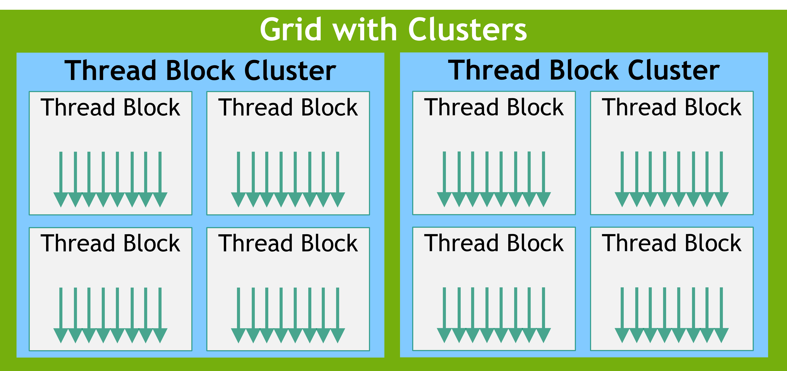
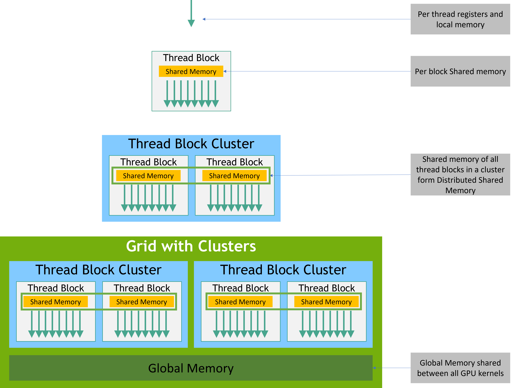
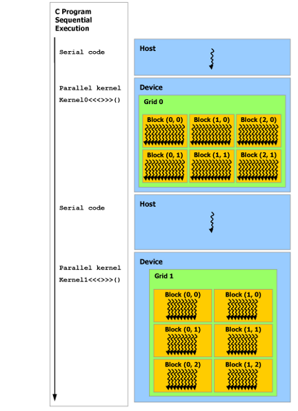

# <a href="https://docs.nvidia.com/cuda/cuda-c-programming-guide/index.html"> <<CUDA C++ Programming Guide>>学习笔记</a>

----------------------------------------------

HIPPO
更新日期 20230826
CUDA模块和接口开发文档 V12.2

----------------------------------------------

<span id="Title-1"></span>

# <a href="https://docs.nvidia.com/cuda/cuda-c-programming-guide/index.html#introduction"> 1、介绍</a>

<span id="Title-1.1"></span>

## <a href="https://docs.nvidia.com/cuda/cuda-c-programming-guide/index.html#the-benefits-of-using-gpus"> 1.1、 使用GPU的好处</a>

&emsp;&emsp;GPU(Graphics Processing Unit，图像处理单元)相比于CPU，在使用高指令吞吐量和内存带宽方面有更高的性价比。许多应用充分利用这些高性能特性使得在GPU上跑的比CPU更快。其他的计算硬件，比如FPGAs，也同样的效率，但是编程的灵活性更低。
&emsp;&emsp;因为设计时愿景不同，导致GPU与CPU存在这些性能差异。CPU可以并发执行数十个线程，而GPU的设计可以支持并发上千个线程（分摊较慢的单线程性能以实现更高的吞吐量）。
&emsp;&emsp;GPU专门用于高度并行计算，因此设计了更多的晶体管用于数据处理，而不是数据缓存和流量控制。[图1.1](#picture-1.1)显示了CPU和GPU的芯片资源分布示例

<span id="picture-1.1"></span>

<div> <!--块级封装-->
    <center> <!--将图片和文字居中-->
    
    <br> <!--换行-->
    <small>图1.1 GPU计算应用。CUDA旨在支持各种语言和应用程序编程接口</small> <!--标题-->
    </center>
</div>

&emsp;&emsp;将更多的晶体管用于数据处理，例如浮点计算，有利于高度并行计算;GPU可以通过计算隐藏内存访问延迟，而不是依赖于大型数据缓存和复杂的流控制来避免长内存访问延迟，这两者在晶体管方面都是昂贵的。
&emsp;&emsp;一般来说，应用程序混合了并行部分和顺序部分，因此系统被设计为混合使用gpu和cpu，以最大限度地提高整体性能。具有高度并行性的应用程序可以利用GPU的这种大规模并行特性来实现比CPU更高的性能。

<span id="Title-1.2"></span>

## <a href="https://docs.nvidia.com/cuda/cuda-c-programming-guide/index.html#cuda-a-general-purpose-parallel-computing-platform-and-programming-model"> 1.2、 CUDA®:一个通用并行计算平台和编程模型</a>

&emsp;&emsp;2006年11月，NVIDIA推出了CUDA，一个通用并行计算平台和编程模型，利用NVIDIA gpu中的并行计算引擎，以比CPU更有效的方式解决许多复杂的计算问题。
&emsp;&emsp;CUDA附带了一个软件环境，允许开发人员使用c++作为高级编程语言。如[图1.2](#picture-1.2)所示，支持其他语言、应用程序编程接口或基于指令的方法，例如FORTRAN、DirectCompute、OpenACC。

<span id="picture-1.2"></span>

<div> <!--块级封装-->
    <center> <!--将图片和文字居中-->
    
    <br> <!--换行-->
    <small>图1.2 GPU计算应用。CUDA旨在支持各种语言和应用程序编程接口</small> <!--标题-->
    </center>
</div>

<span id="Title-1.3"></span>

## <a href="https://docs.nvidia.com/cuda/cuda-c-programming-guide/index.html#a-scalable-programming-model"> 1.3、 CUDA®:一个通用并行计算平台和编程模型</a>

&emsp;&emsp;多核cpu和多核gpu的出现意味着主流处理器芯片现在是并行系统。当前的挑战是开发能够透明地扩展其并行性的应用软件，以利用不断增加的处理器核数，就像3D图形应用程序能够透明地将其并行性扩展到具有不同核数的众核gpu一样。 
&emsp;&emsp;CUDA并行编程模型旨在克服这一挑战，同时对熟悉C等标准编程语言的程序员保持较低的学习曲线。
其核心是三个关键的抽象——线程组的层次结构、共享内存和同步屏障——它们只是作为最小的语言扩展集暴露给程序员。
&emsp;&emsp;这些抽象提供细粒度的数据并行性和线程并行性，嵌套在粗粒度的数据并行性和任务并行性中。它们指导程序员将问题划分为可由线程块独立并行求解的粗粒度子问题，以及可由线程块内所有线程协同并行求解的细粒度子问题。
&emsp;&emsp;这种分解允许线程在解决每个子问题时进行协作，从而保持了语言的表达能力，同时允许自动扩展。 实际上，每个线程块都可以以任意顺序(并发或顺序)在GPU内的任何可用多处理器上调度，因此编译后的CUDA程序可以在任意数量的多处理器上执行，如[图1.3](#picture-1.3)所示，只有运行时系统需要知道物理多处理器数量。
&emsp;&emsp;这种可扩展的编程模型允许GPU架构通过简单地扩展多处理器和内存分区的数量来跨越广泛的市场范围:从高性能爱好者GeForce GPU和专业Quadro和Tesla计算产品到各种廉价的主流GeForce GPU(有关所有cuda支持的GPU的列表，请参阅[支持CUDA的gpu](#Title-6))。

<span id="picture-1.3"></span>

<div> <!--块级封装-->
    <center> <!--将图片和文字居中-->
    
    <br> <!--换行-->
    <small>图1.3 自主可伸缩</small> <!--标题-->
    </center>
</div>

> **<center>注意</center>** GPU是围绕一系列流多处理器(Streaming Multiprocessors, SMs)构建的(更多细节请参见[硬件实现](#Title-4))将多线程程序划分为多个独立执行的线程块，使得多处理器数量较多的GPU能够在比多处理器数量较少的GPU更短的时间内自动执行程序。

<span id="Title-1.4"></span>

## <a href="https://docs.nvidia.com/cuda/cuda-c-programming-guide/index.html#document-structure"> 1.4、目录结构</a>
本文档分为以下几个部分:

[1、介绍](#Title-1)是一个CUDA的简介。
[2、编程模型](#Title-2)概述了CUDA编程模型。
[3、编程接口](#Title-3)描述了编程接口。
[4、硬件实现](#Title-4)阐述了硬件实现。
[5、性能指南](#Title-5)给出了一些关于如何达到最大性能的指南。
[6、支持CUDA的GPU](#Title-6)列举了所有CUDA支持的硬件。
[7、C++语言扩展](#Title-7)详细描述了C++语言的扩展。
[8、协作组](#Title-8)描述了不同CUDA线程组的同步单元。
[9、CUDA动态并行](#Title-9)描述了如何发起和同步一个kernel到另一个kernel。
[10、虚拟内存管理](#Title-10)描述了如何管理用以虚拟内存空间。
[11、流有序内存分配器](#Title-11)描述了应用如何申请和释放有序内存。
[12、图像存储节点](#Title-12)描述了图像如何创建和分配自己的内存。
[13、数学方法](#Title-13)列举了CUDA支持的数学方法。
[14、C++语言支持](#Title-14)列举了device端支持的C++特性。
[15、纹理方法](#Title-15)给出了纹理方法更多的细节。
[16、计算能力](#Title-16)给出了各种设备的技术规格，以及更多的架构细节。
[17、Driver API](#Title-17)介绍了低等级的driver API。
[18、CUDA 环境变量](#Title-18)列举了所有的CUDA环境变量。
[19、统一存储编程](#Title-19)介绍了统一内存编程指导。

<small>[[1]](#Title-1.1) : 图形限定符源于这样一个事实:20年前，当GPU最初被创建时，它是作为加速图形渲染的专用处理器设计的。在对实时、高清、3D图形永不满足的市场需求的推动下，它已经发展成为一种通用处理器，用于更多的工作负载，而不仅仅是图形渲染。</small>

<span id="Title-2"></span>

# <a href="https://docs.nvidia.com/cuda/cuda-c-programming-guide/index.html#programming-model"> 2、编程模型</a>

本章主要介绍了CUDA编程模型背后的概念，概述了它们是如何暴露在c++中。从[编程接口](#Title-3)的角度对CUDA c++进行了详细的描述。[本章](#Title-2)和[下一章](#Title-3)的vector补充举例可以在<a href="https://docs.nvidia.com/cuda/cuda-samples/index.html#vector-addition"> vectorAdd CUDA sample</a>中找到。

<span id="Title-2.1"></span>

## <a href="https://docs.nvidia.com/cuda/cuda-c-programming-guide/index.html#kernels"> 2.1、Kernels</a>

&emsp;&emsp;CUDA C++扩展了C++，允许程序员自定义C++函数，称为`kernel`，调用时，由N个不同的CUDA线程并行执行N次，而不是像普通的c++函数那样只执行一次。

&emsp;&emsp;`kernel`使用`__global__`声明、使用新符号`<<<...>>>`给定的`kernel`的CUDA线程数量来执行，配置语法(参见 [C++语言扩展](#Title-7))。每个执行`kernel`的线程都有一个唯一的线程ID，在`kernel`中可以通过内置变量访问。

&emsp;&emsp;作为说明，[下面的示例代码](#code-2.1)#使用内置变量`threadIdx`，将两个长度为N的向量A和B相加，并将结果存储到向量C中:

<span id="code-2.1"></span>

``` C++
// Kernel definition
__global__ void VecAdd(float* A, float* B, float* C)
{
    int i = threadIdx.x;
    C[i] = A[i] + B[i];
}

int main()
{
    ...
    // Kernel invocation with N threads
    VecAdd<<<1, N>>>(A, B, C);
    ...
}
```

&emsp;&emsp;在这里，执行VecAdd()的N个线程中的每一个执行一次成对加法。

<span id="Title-2.2"></span>

## <a href="https://docs.nvidia.com/cuda/cuda-c-programming-guide/index.html#thread-hierarchy"> 2.2、线程层次结构</a>

&emsp;&emsp;为了方便起见，threadIdx是一个3分量向量，因此可以使用一维、二维或三维线程索引来标识线程，形成一维、二维或三维线程块，称为线程`block`。这为跨域元素(如向量、矩阵或体积)调用计算提供了一种自然的方式。

&emsp;&emsp;线程的索引和线程ID以一种直接的方式相互关联:对于一维的`block`，它们是相同的;对于大小为(Dx, Dy)的二维`block`，索引为(x, y)的线程的线程ID为(x + y\*Dx);对于大小为(Dx, Dy, Dz)的三维`block`，索引为(x, y, z)的线程ID为(x + y\*Dx + z\*Dx\*Dy)。

&emsp;&emsp;[示例代码](#code-2.2)将大小为NxN的两个矩阵A和B相加，并将结果存储到矩阵C中:

<span id="code-2.2"></span>

``` C++
// Kernel definition
__global__ void MatAdd(float A[N][N], float B[N][N],
                       float C[N][N])
{
    int i = threadIdx.x;
    int j = threadIdx.y;
    C[i][j] = A[i][j] + B[i][j];
}

int main()
{
    ...
    // Kernel invocation with one block of N * N * 1 threads
    int numBlocks = 1;
    dim3 threadsPerBlock(N, N);
    MatAdd<<<numBlocks, threadsPerBlock>>>(A, B, C);
    ...
}
```

&emsp;&emsp;每个block的线程数是有限制的，因为一个`block`中的所有线程都应该驻留在同一个多核处理器上，并且必须共享该核有限的内存资源。当前的gpu，线程阻塞可能含有多达1024个线程。

&emsp;&emsp;一个`kernel`可以由多个形状相等的`block`执行，因此线程的总数等于每个线程块的数目乘以`block`的个数。

&emsp;&emsp;如[图2.1](#picture-2.1)所示，线程`block`被组织成一维、二维或三维的线程`block` `grid`。`grid`中`block`的数量通常由正在处理的数据的大小决定，这通常超过了系统中处理器的数量。

<span id="picture-2.1"></span>

<div> <!--块级封装-->
    <center> <!--将图片和文字居中-->
    
    <br> <!--换行-->
    <small>图2.1 Grid线程块</small> <!--标题-->
    </center>
</div>

&emsp;&emsp;每个`block`的线程数和每个`grid`的`block`数在`<<<…>>>`中的语法类型可以是int或dim3。可以像上面的例子那样指定二维`block`或`grid`。

&emsp;&emsp;`grid`中的每个`block`都可以通过一个一维、二维或三维的唯一索引标识，在`kernel`中可以通过内置的`blockIdx`变量访问。线程`block`的尺寸在`kernel`中可以通过内置的blockDim变量访问。

&emsp;&emsp;代码扩展了前面的MatAdd()示例以处理多个`block`，如下所示。

<span id="code-2.3"></span>

```C++
// Kernel definition
__global__ void MatAdd(float A[N][N], float B[N][N], float C[N][N])
{
    int i = blockIdx.x * blockDim.x + threadIdx.x;
    int j = blockIdx.y * blockDim.y + threadIdx.y;
    if (i < N && j < N)
        C[i][j] = A[i][j] + B[i][j];
}

int main()
{
    ...
    // Kernel invocation
    dim3 threadsPerBlock(16, 16);
    dim3 numBlocks(N / threadsPerBlock.x, N / threadsPerBlock.y);
    MatAdd<<<numBlocks, threadsPerBlock>>>(A, B, C);
    ...
}
```

&emsp;&emsp;线程`block`大小为16x16(256个线程)，虽然在这里是任意大小，但是一种常见的选择。`grid`由足够的`block`创建，与之前一样，每个矩阵元素有一个线程。为简单起见，[本示例](#code-2.3)假设每个维度中每个`grid`的线程数可以被该维度中每个`block`的线程数整除，尽管事实并非如此。

&emsp;&emsp;线程`block`需要独立执行：必须能够以任意顺序执行它们，并行或串行。这种独立性要求允许线程`block`在任意数量的核心上按任意顺序进行调度，如[图1.3](#picture-1.3)所示，使程序员能够编写与核数量相关的代码。

&emsp;&emsp;同一个`block`中的线程可以通过共享内存共享数据，并通过同步它们的执行来协调内存访问。更准确地说，可以在内核中调用`__syncthreads()`内部函数来指定同步的地方。`__syncthreads()`就像一个屏障，`block`中的所有线程都必须等待，然后才允许继续执行。[共享内存](#Title-3.2.4)给出了一个使用共享内存的例子。除了`__syncthreads()`之外，[协作组API](#Title-8)还提供了一组丰富的线程同步原语。

&emsp;&emsp;为了高效合作，共享内存应该是靠近每个处理器核心的低延迟内存(很像L1缓存)，`__syncthreads()`应该是轻量级的。

<span id="Title-2.2.1"></span>

# <a href="https://docs.nvidia.com/cuda/cuda-c-programming-guide/index.html#thread-block-clusters"> 2.2.1、线程block cluster</a>

&emsp;&emsp;随着NVIDIA[计算能力9.0](#Title-16.8)的推出，CUDA编程模型引入了一个可选的层次结构级别，称为线程`block`集群，由线程`block`组成。类似于线程`block`保证线程在多核流处理器上的共同调度，`cluster`中的线程`blocks`也保证在GPU上的共同调度。

&emsp;&emsp;与线程块类似，集群也被组织成一维、二维或三维，如[图2.2](#picture-2.2)所示。

<span id="picture-2.2"></span>

<div> <!--块级封装-->
    <center> <!--将图片和文字居中-->
    
    <br> <!--换行-->
    <small>图2.2 自主可伸缩</small> <!--标题-->
    </center>
</div>

&emsp;&emsp;`cluster`中的线程`block`数量可以自定义，在CUDA中最多支持8个线程`block`作为可移植`cluster`大小。请注意，在GPU硬件或MIG配置太小而无法支持8个多处理器的情况下，最大`cluster`大小将相应减少。识别这些较小的配置，以及支持超过8的线程`block` `cluster`大小的较大配置，是特定于体系结构的，可以使用`cudaOccupancyMaxPotentialClusterSize`API进行查询。

> **注意**
> 在使用`cluster`支持启动的`kernel`中，出于兼容性的考虑，gridDim变量仍然以线程`block`的数量表示大小。可以使用cluster Group API找到`cluster`中块的下标。

&emsp;&emsp;线程`block` `cluster`可以在`kernel`中启用，使用`__cluster_dims__(X,Y,Z)`来使用编译器时间`kernel`属性，或使用CUDA`kernel`启动`cudaLaunchKernelEx`。[示例代码](#code-2.4)展示了如何使用编译器时间内核属性启动`cluster`。使用kernel属性的`cluster`大小在编译时是固定的，然后`kernel`可以使用经典的`<<<...>>>`。如果`kernel`使用编译时`cluster`大小，则在启动`kernel`时不能修改`cluster`大小。

<span id="code-2.4"></span>

```C++
// Kernel definition
// Compile time cluster size 2 in X-dimension and 1 in Y and Z dimension
__global__ void __cluster_dims__(2, 1, 1) cluster_kernel(float *input, float* output)
{

}

int main()
{
    float *input, *output;
    // Kernel invocation with compile time cluster size
    dim3 threadsPerBlock(16, 16);
    dim3 numBlocks(N / threadsPerBlock.x, N / threadsPerBlock.y);

    // The grid dimension is not affected by cluster launch, and is still enumerated
    // using number of blocks.
    // The grid dimension must be a multiple of cluster size.
    cluster_kernel<<<numBlocks, threadsPerBlock>>>(input, output);
}
```

线程`block` `cluster`大小也可以在运行时设置，`kernel`可以使用CUDA`kernel`启动API启动`cudaLaunchKernelEx`。[示例代码](#code-2.5)展示了如何使用可扩展API启动`cluster` `kernel`。

<span id="code-2.5"></span>

```C++
// Kernel definition
// No compile time attribute attached to the kernel
__global__ void cluster_kernel(float *input, float* output)
{

}

int main()
{
    float *input, *output;
    dim3 threadsPerBlock(16, 16);
    dim3 numBlocks(N / threadsPerBlock.x, N / threadsPerBlock.y);

    // Kernel invocation with runtime cluster size
    {
        cudaLaunchConfig_t config = {0};
        // The grid dimension is not affected by cluster launch, and is still enumerated
        // using number of blocks.
        // The grid dimension should be a multiple of cluster size.
        config.gridDim = numBlocks;
        config.blockDim = threadsPerBlock;

        cudaLaunchAttribute attribute[1];
        attribute[0].id = cudaLaunchAttributeClusterDimension;
        attribute[0].val.clusterDim.x = 2; // Cluster size in X-dimension
        attribute[0].val.clusterDim.y = 1;
        attribute[0].val.clusterDim.z = 1;
        config.attrs = attribute;
        config.numAttrs = 1;

        cudaLaunchKernelEx(&config, cluster_kernel, input, output);
    }
}
```

&emsp;&emsp;支持计算能力为9.0的gpu，`cluster`中的所有线程`block`都保证在单个GPU处理集群(GPU Processing Cluster, GPC)上共同调度，并允许`cluster`中的线程`block`使用集群组API cluster.sync()执行硬件支持的同步。`cluster`组还提供了成员函数，分别使用`num_threads()`API查询线程数大小，`num_blocks()`API查询线程`block`大小。可以使用`dim_threads()`API查询`cluster group`中线程的下标，使用`dim_blocks()`API查询`cluster group`中`block`的下标。

&emsp;&emsp;属于`cluster`的线程`block`可以访问分布式共享内存。`cluster`中的线程`block`能够对分布式共享内存中的任何地址进行读、写和执行原子操作。[分布式共享](#Title-3.2.5)内存给出了一个在分布式共享内存中执行矩阵的示例。

<span id="Title-2.3"></span>
## <a href="https://docs.nvidia.com/cuda/cuda-c-programming-guide/index.html#shared-memory"> 2.3、内存层级</a>

&emsp;&emsp;CUDA线程可以在执行期间访问多个内存空间中的数据，[如图](#picture-2.3)所示。每个线程都有私有的本地内存。每个线程`block`都有共享内存，对该`block`的所有线程可见，并且与该`block`具有相同的生存期。线程`block cluster`中的线程`block`可以对彼此的共享内存执行读、写和原子操作。所有线程都可以访问相同的全局内存。

&emsp;&emsp;还有两个额外的只读内存空间可供所有线程访问：`constant`和`texture`内存空间。`global`、`constant`和`texture`内存空间针对不同用途的内存进行了优化(参见[设备内存访问](#Title-5.3.2))。`texture`内存还提供了不同的寻址方式，以及一些特定数据格式的数据过滤(参见[`texture`和`surface`内存](#Title-3.2.14))。

&emsp;&emsp;`global`、`constant`和`texture`内存空间始终贯穿应用启动的`kernel`。

<span id="picture-2.3"></span>

<div> <!--块级封装-->
    <center> <!--将图片和文字居中-->
    
    <br> <!--换行-->
    <small>图2.3 内存层级</small> <!--标题-->
    </center>
</div>

<span id="Title-2.4"></span>

## <a href="https://docs.nvidia.com/cuda/cuda-c-programming-guide/index.html#heterogeneous-programming"> 2.4、异构编程</a>

&emsp;&emsp;[如图](#picture-2.4)所示，CUDA编程模型假设CUDA线程在物理上独立的设备上执行，该设备作为运行c++程序`host`的协同处理器运行。例如，当`kernels`在GPU上执行而c++程序的其余部分在CPU上执行时，就是这种情况。

&emsp;&emsp;CUDA编程模型还假设`host`和`device`在DRAM中保持各自独立的内存空间，分别称为`host memory`和`device memory`。因此，程序通过调用CUDA运行时(在[编程接口](#Title-3)中描述)来管理`kernel`可见的`global`、`constant`和`texture`内存空间。这包括设备内存分配和回收，以及`host memory`和`device memory`之间的数据传输。

&emsp;&emsp;统一内存提供托管内存来连接`host memory`和`device memory`。托管内存作为具有公共地址空间的单个连贯内存映像，系统中的所有cpu和gpu都可以访问。此功能允许超设备内存订阅，并且可以通过消除在`host`和`device`上显式镜像数据的需要，大大简化移植应用程序的任务。有关统一内存的介绍，请参阅[统一内存编程](#Title-19)。


<span id="picture-2.4"></span>

<div> <!--块级封装-->
    <center> <!--将图片和文字居中-->
    
    <br> <!--换行-->
    <small>图2.4 异构编程</small> <!--标题-->
    </center>
</div>

> **注意**
> 串行代码在主机上执行，并行代码在设备上执行。

<span id="Title-2.5"></span>

## <a href="https://docs.nvidia.com/cuda/cuda-c-programming-guide/index.html#asynchronous-simt-programming-model"> 2.5、异步SIMT编程模型</a>

&emsp;&emsp;在CUDA编程模型中，线程是执行计算或内存操作的最低抽象级别。从基于NVIDIA Ampere GPU架构的设备开始，CUDA编程模型通过异步编程模型为内存操作提供加速。

&emsp;&emsp;异步编程模型为CUDA线程之间的同步定义了[异步屏障](#Title-7.26)的行为。该模型还解释并定义了[cuda::memcpy_async](#Title-7.27)如何用于在GPU计算时从全局内存中异步移动数据。

<span id="Title-2.5.1"></span>

### <a href="https://docs.nvidia.com/cuda/cuda-c-programming-guide/index.html#programming-interface"> 2.5.1、异步操作</a>

&emsp;&emsp;异步操作被定义为由CUDA线程发起并由另一个线程异步执行的操作。In a well formed program one or more CUDA threads synchronize with the asynchronous operation。发起异步操作的CUDA线程不需要在同步线程中。

&emsp;&emsp;异步线程(as-if线程)总是与发起异步操作的CUDA线程相关联。异步操作使用同步对象来完成同步操作。这样的同步对象可以由用户显式地管理(例如，`cuda::memcpy_async`)或在库中隐式地管理(例如，`cooperative_groups::memcpy_async`)。

&emsp;&emsp;同步对象可以是`cuda::barrier`或者`cuda::pipeline`。这些对象在使用`cuda::pipeline`的[异步屏障](#Title-7.26)和[异步数据副本 using cuda::pipeline](#Title-7.27)中有详细的解释。这些同步对象可以在不同的线程作用域中使用。作用域定义了一组线程，这些线程可以使用同步对象来同步异步操作。下表定义了CUDA C++中可用的线程范围以及可以与每个线程同步的线程。

| Thread Scope | Description |
| -- | -- |
| `cuda::thread_scope::thread_scope_thread` | 只有启动异步操作的 CUDA 线程同步。|
| `cuda::thread_scope::thread_scope_block`  | 所有或任何 CUDA 线程在相同的线程块作为启动线程同步。 |
| `cuda::thread_scope::thread_scope_device` | 在同一 GPU 设备中的所有或任何 CUDA 线程与初始线程同步。|
| `cuda::thread_scope::thread_scope_system` | 所有或任何 CUDA 或 CPU 线程在同一系统作为启动线程同步。|

&emsp;&emsp;这些线程作用域是在CUDA标准c++库中作为标准c++的扩展实现的。

<span id="Title-2.6"></span>

### <a href="https://docs.nvidia.com/cuda/cuda-c-programming-guide/index.html#compute-capability"> 2.6、计算能力</a>

&emsp;&emsp;设备的计算能力由版本号表示，有时也称为它的"SM版本"。版本号标识GPU硬件支持的特性，应用程序在运行时用来确定当前GPU上有哪些硬件特性、指令可用。

&emsp;&emsp;计算能力由主修订号X和次修订号Y组成，用x.y表示。

&emsp;&emsp;相同主修订号的设备核心架构相同。主修订号为9，基于`NVIDIA Hopper GPU`架构；8，基于`NVIDIA Ampere GPU`架构；7，基于`Volta`架构；6，基于`Maxwell`架构；5，基于`Maxwell`架构；3，基于`Kepler`架构。

&emsp;&emsp;次要修订号对应于对核心体系结构的增量改进，可能包括新特性。

&emsp;&emsp;`Turing`是用于计算能力为7.5的设备的架构，是基于`Volta`架构的增量更新。

&emsp;&emsp;[支持CUDA的GPU](#Title-6)列举了所有CUDA支持的设备及计算能力。[计算能力](#Title-16)给出了每种计算能力的技术说明。

> __注意__
> 特定GPU的计算能力版本不应与CUDA版本(例如，CUDA 7.5, CUDA 8, CUDA 9)混淆，CUDA版本是CUDA软件平台的版本。CUDA平台被应用程序开发人员用来创建在多代GPU架构上运行的应用程序，包括未来有待发明的GPU架构。虽然CUDA平台的新版本通常通过支持新的图形处理器架构的计算能力版本来增加对新的图形处理器架构的本地支持，但 CUDA 平台的新版本通常也包括独立于硬件生成的软件特性。

&emsp;&emsp;从CUDA 7.0开始，不再支持`Tesla`架构。9.0不再支持`Fermi`架构。

<span id="Title-3"></span>

# <a href="https://docs.nvidia.com/cuda/cuda-c-programming-guide/index.html#programming-interface"> 3、编程接口</a>

<span id="Title-3.2.4"></span>

### <a href="https://docs.nvidia.com/cuda/cuda-c-programming-guide/index.html#shared-memory"> 3.2.4、共享内存</a>

<span id="Title-3.2.5"></span>

### <a href="https://docs.nvidia.com/cuda/cuda-c-programming-guide/index.html#distributed-shared-memory"> 3.2.5、分布式共享内存</a>

<span id="Title-3.2.14"></span>

### <a href="https://docs.nvidia.com/cuda/cuda-c-programming-guide/index.html#texture-and-surface-memory"> 3.2.14、`texture`和`surface`内存</a>

<span id="Title-4"></span>

# <a href="https://docs.nvidia.com/cuda/cuda-c-programming-guide/index.html#hardware-implementation"> 4、硬件实现</a>

<span id="Title-5"></span>

# <a href="https://docs.nvidia.com/cuda/cuda-c-programming-guide/index.html#performance-guidelines"> 5、性能指南</a>

<span id="Title-5.3.2"></span>

## <a href="https://docs.nvidia.com/cuda/cuda-c-programming-guide/index.html#device-memory-accesses"> 5.3.2、设备内存访问</a>

<span id="Title-6"></span>

# <a href="https://docs.nvidia.com/cuda/cuda-c-programming-guide/index.html#cuda-enabled-gpus"> 6、支持CUDA的GPU</a>

<span id="Title-7"></span>

# <a href="https://docs.nvidia.com/cuda/cuda-c-programming-guide/index.html#c-language-extensions"> 7、C++语言扩展</a>

<span id="Title-7.26"></span>

## <a href="https://docs.nvidia.com/cuda/cuda-c-programming-guide/index.html#aw-barrier"> 7.26、异步屏障</a>

<span id="Title-7.27"></span>

## <a href="https://docs.nvidia.com/cuda/cuda-c-programming-guide/index.html#asynchronous-data-copies"> 7.27、异步数据副本</a>

<span id="Title-8"></span>

# <a href="https://docs.nvidia.com/cuda/cuda-c-programming-guide/index.html#cooperative-groups"> 8、协作组</a>

<span id="Title-9"></span>

# <a href="https://docs.nvidia.com/cuda/cuda-c-programming-guide/index.html#cuda-dynamic-parallelism"> 9、CUDA动态并行</a>

<span id="Title-10"></span>

# <a href="https://docs.nvidia.com/cuda/cuda-c-programming-guide/index.html#virtual-memory-management"> 10、虚拟内存管理</a>

<span id="Title-11"></span>

# <a href="https://docs.nvidia.com/cuda/cuda-c-programming-guide/index.html#stream-ordered-memory-allocator"> 11、流有序内存分配器</a>

<span id="Title-12"></span>

# <a href="https://docs.nvidia.com/cuda/cuda-c-programming-guide/index.html#graph-memory-nodes"> 12、图像存储节点</a>

<span id="Title-13"></span>

# <a href="https://docs.nvidia.com/cuda/cuda-c-programming-guide/index.html#mathematical-functions-appendix"> 13、数学方法</a>

<span id="Title-14"></span>

# <a href="https://docs.nvidia.com/cuda/cuda-c-programming-guide/index.html#c-language-support"> 14、C++语言支持</a>

<span id="Title-15"></span>

# <a href="https://docs.nvidia.com/cuda/cuda-c-programming-guide/index.html#texture-fetching"> 15、纹理方法</a>

<span id="Title-16"></span>

# <a href="https://docs.nvidia.com/cuda/cuda-c-programming-guide/index.html#compute-capabilities"> 16、计算能力</a>

<span id="Title-16.8"></span>

## <a href="https://docs.nvidia.com/cuda/cuda-c-programming-guide/index.html#compute-capability-9-0"> 16.8、计算能力 9.0</a>

<span id="Title-17"></span>
# <a href="https://docs.nvidia.com/cuda/cuda-c-programming-guide/index.html#driver-api"> 17、Driver API</a>

<span id="Title-18"></span>

# <a href="https://docs.nvidia.com/cuda/cuda-c-programming-guide/index.html#cuda-environment-variables"> 18、CUDA环境变量</a>

<span id="Title-19"></span>

# <a href="https://docs.nvidia.com/cuda/cuda-c-programming-guide/index.html#unified-memory-programming"> 19、统一内存编程</a>

<span id="Title-20"></span>

# <a href="https://docs.nvidia.com/cuda/cuda-c-programming-guide/index.html#lazy-loading"> 20、延迟加载</a>

<span id="Title-21"></span>

# <a href="https://docs.nvidia.com/cuda/cuda-c-programming-guide/index.html#notices"> 21、注意</a>
