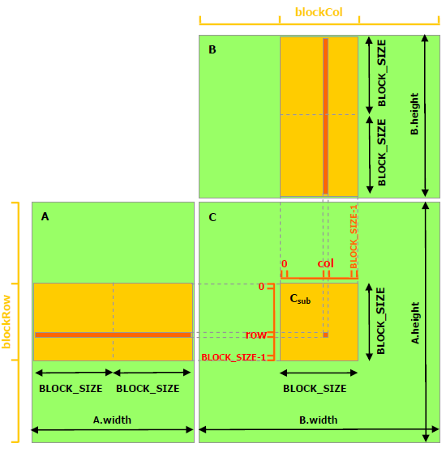
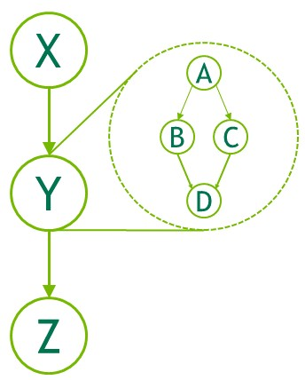
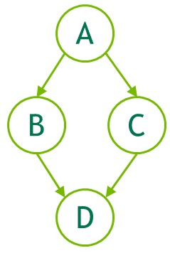

<span id="picture-logo"></span>

<div> <!--块级封装-->
    <center> <!--将图片和文字居中-->
    
    <br> <!--换行-->
    </center>
</div>

# <a href="https://docs.nvidia.com/cuda/cuda-c-programming-guide/index.html"> <<CUDA C++ Programming Guide>>学习笔记</a>

----------------------------------------------

HIPPO
更新日期 20230826
CUDA模块和接口开发文档 V12.2

----------------------------------------------


<span id="Title-1"></span>

# <a href="https://docs.nvidia.com/cuda/cuda-c-programming-guide/index.html#introduction"> 1、介绍</a>

<span id="Title-1.1"></span>

## <a href="https://docs.nvidia.com/cuda/cuda-c-programming-guide/index.html#the-benefits-of-using-gpus"> 1.1、 使用GPU的好处</a>

&emsp;&emsp;GPU(Graphics Processing Unit，图像处理单元)相比于CPU，在使用高指令吞吐量和内存带宽方面有更高的性价比。许多应用充分利用这些高性能特性使得在GPU上跑的比CPU更快。其他的计算硬件，比如FPGAs，也同样的效率，但是编程的灵活性更低。
&emsp;&emsp;因为设计时愿景不同，导致GPU与CPU存在这些性能差异。CPU可以并发执行数十个线程，而GPU的设计可以支持并发上千个线程（分摊较慢的单线程性能以实现更高的吞吐量）。
&emsp;&emsp;GPU专门用于高度并行计算，因此设计了更多的晶体管用于数据处理，而不是数据缓存和流量控制。[图1.1](#picture-1.1)显示了CPU和GPU的芯片资源分布示例

<span id="picture-1.1"></span>

<div> <!--块级封装-->
    <center> <!--将图片和文字居中-->
    
    <br> <!--换行-->
    <small>图1.1 GPU计算应用。CUDA旨在支持各种语言和应用程序编程接口</small> <!--标题-->
    </center>
</div>

&emsp;&emsp;将更多的晶体管用于数据处理，例如浮点计算，有利于高度并行计算;GPU可以通过计算隐藏内存访问延迟，而不是依赖于大型数据缓存和复杂的流控制来避免长内存访问延迟，这两者在晶体管方面都是昂贵的。
&emsp;&emsp;一般来说，应用程序混合了并行部分和顺序部分，因此系统被设计为混合使用gpu和cpu，以最大限度地提高整体性能。具有高度并行性的应用程序可以利用GPU的这种大规模并行特性来实现比CPU更高的性能。

<span id="Title-1.2"></span>

## <a href="https://docs.nvidia.com/cuda/cuda-c-programming-guide/index.html#cuda-a-general-purpose-parallel-computing-platform-and-programming-model"> 1.2、 CUDA®:一个通用并行计算平台和编程模型</a>

&emsp;&emsp;2006年11月，NVIDIA推出了CUDA，一个通用并行计算平台和编程模型，利用NVIDIA gpu中的并行计算引擎，以比CPU更有效的方式解决许多复杂的计算问题。
&emsp;&emsp;CUDA附带了一个软件环境，允许开发人员使用c++作为高级编程语言。如[图1.2](#picture-1.2)所示，支持其他语言、应用程序编程接口或基于指令的方法，例如FORTRAN、DirectCompute、OpenACC。

<span id="picture-1.2"></span>

<div> <!--块级封装-->
    <center> <!--将图片和文字居中-->
    
    <br> <!--换行-->
    <small>图1.2 GPU计算应用。CUDA旨在支持各种语言和应用程序编程接口</small> <!--标题-->
    </center>
</div>

<span id="Title-1.3"></span>

## <a href="https://docs.nvidia.com/cuda/cuda-c-programming-guide/index.html#a-scalable-programming-model"> 1.3、 CUDA®:一个通用并行计算平台和编程模型</a>

&emsp;&emsp;多核cpu和多核gpu的出现意味着主流处理器芯片现在是并行系统。当前的挑战是开发能够透明地扩展其并行性的应用软件，以利用不断增加的处理器核数，就像3D图形应用程序能够透明地将其并行性扩展到具有不同核数的众核gpu一样。
&emsp;&emsp;CUDA并行编程模型旨在克服这一挑战，同时对熟悉C等标准编程语言的程序员保持较低的学习曲线。
其核心是三个关键的抽象——线程组的层次结构、`shared memory`和同步屏障——它们只是作为最小的语言扩展集暴露给程序员。
&emsp;&emsp;这些抽象提供细粒度的数据并行性和线程并行性，嵌套在粗粒度的数据并行性和任务并行性中。它们指导程序员将问题划分为可由线程块独立并行求解的粗粒度子问题，以及可由线程块内所有线程协同并行求解的细粒度子问题。
&emsp;&emsp;这种分解允许线程在解决每个子问题时进行协作，从而保持了语言的表达能力，同时允许自动扩展。 实际上，每个线程块都可以以任意顺序(并发或顺序)在GPU内的任何可用多处理器上调度，因此编译后的CUDA程序可以在任意数量的多处理器上执行，如[图1.3](#picture-1.3)所示，只有`runtime`系统需要知道物理多处理器数量。
&emsp;&emsp;这种可扩展的编程模型允许GPU架构通过简单地扩展多处理器和内存分区的数量来跨越广泛的市场范围:从高性能爱好者GeForce GPU和专业Quadro和Tesla计算产品到各种廉价的主流GeForce GPU(有关所有cuda支持的GPU的列表，请参阅[支持CUDA的gpu](#Title-6))。

<span id="picture-1.3"></span>

<div> <!--块级封装-->
    <center> <!--将图片和文字居中-->
    
    <br> <!--换行-->
    <small>图1.3 自主可伸缩</small> <!--标题-->
    </center>
</div>

> **<center>注意</center>** GPU是围绕一系列流多处理器(Streaming Multiprocessors, SMs)构建的(更多细节请参见[硬件实现](#Title-4))将多线程程序划分为多个独立执行的线程块，使得多处理器数量较多的GPU能够在比多处理器数量较少的GPU更短的时间内自动执行程序。

<span id="Title-1.4"></span>

## <a href="https://docs.nvidia.com/cuda/cuda-c-programming-guide/index.html#document-structure"> 1.4、目录结构</a>
本文档分为以下几个部分:

[1、介绍](#Title-1)是一个CUDA的简介。
[2、编程模型](#Title-2)概述了CUDA编程模型。
[3、编程接口](#Title-3)描述了编程接口。
[4、硬件实现](#Title-4)阐述了硬件实现。
[5、性能指南](#Title-5)给出了一些关于如何达到最大性能的指南。
[6、支持CUDA的GPU](#Title-6)列举了所有CUDA支持的硬件。
[7、C++语言扩展](#Title-7)详细描述了C++语言的扩展。
[8、协作组](#Title-8)描述了不同CUDA线程组的同步单元。
[9、CUDA动态并行](#Title-9)描述了如何发起和同步一个kernel到另一个kernel。
[10、虚拟内存管理](#Title-10)描述了如何管理用以虚拟内存空间。
[11、流有序内存分配器](#Title-11)描述了应用如何申请和释放有序内存。
[12、图像存储节点](#Title-12)描述了图像如何创建和分配自己的内存。
[13、数学方法](#Title-13)列举了CUDA支持的数学方法。
[14、C++语言支持](#Title-14)列举了device端支持的C++特性。
[15、纹理方法](#Title-15)给出了纹理方法更多的细节。
[16、计算能力](#Title-16)给出了各种`device`的技术规格，以及更多的架构细节。
[17、Driver API](#Title-17)介绍了低等级的driver API。
[18、CUDA 环境变量](#Title-18)列举了所有的CUDA环境变量。
[19、统一存储编程](#Title-19)介绍了统一内存编程指导。

<small>[[1]](#Title-1.1) : 图形限定符源于这样一个事实:20年前，当GPU最初被创建时，它是作为加速图形渲染的专用处理器设计的。在对实时、高清、3D图形永不满足的市场需求的推动下，它已经发展成为一种通用处理器，用于更多的工作负载，而不仅仅是图形渲染。</small>

<span id="Title-2"></span>

# <a href="https://docs.nvidia.com/cuda/cuda-c-programming-guide/index.html#programming-model"> 2、编程模型</a>

本章主要介绍了CUDA编程模型背后的概念，概述了它们是如何暴露在c++中。从[编程接口](#Title-3)的角度对CUDA c++进行了详细的描述。[本章](#Title-2)和[下一章](#Title-3)的vector补充举例可以在<a href="https://docs.nvidia.com/cuda/cuda-samples/index.html#vector-addition"> vectorAdd CUDA sample</a>中找到。

<span id="Title-2.1"></span>

## <a href="https://docs.nvidia.com/cuda/cuda-c-programming-guide/index.html#kernels"> 2.1、Kernels</a>

&emsp;&emsp;CUDA C++扩展了C++，允许程序员自定义C++函数，称为`kernel`，调用时，由N个不同的CUDA线程并行执行N次，而不是像普通的c++函数那样只执行一次。

&emsp;&emsp;`kernel`使用`__global__`声明、使用新符号`<<<...>>>`给定的`kernel`的CUDA线程数量来执行，配置语法(参见 [C++语言扩展](#Title-7))。每个执行`kernel`的线程都有一个唯一的线程ID，在`kernel`中可以通过内置变量访问。

&emsp;&emsp;作为说明，[下面的示例代码](#code-2.1)#使用内置变量`threadIdx`，将两个长度为N的向量A和B相加，并将结果存储到向量C中:

<span id="code-2.1"></span>

``` C++
// Kernel definition
__global__ void VecAdd(float* A, float* B, float* C)
{
    int i = threadIdx.x;
    C[i] = A[i] + B[i];
}

int main()
{
    ...
    // Kernel invocation with N threads
    VecAdd<<<1, N>>>(A, B, C);
    ...
}
```

&emsp;&emsp;在这里，执行VecAdd()的N个线程中的每一个执行一次成对加法。

<span id="Title-2.2"></span>

## <a href="https://docs.nvidia.com/cuda/cuda-c-programming-guide/index.html#thread-hierarchy"> 2.2、线程层次结构</a>

&emsp;&emsp;为了方便起见，threadIdx是一个3分量向量，因此可以使用一维、二维或三维线程索引来标识线程，形成一维、二维或三维线程块，称为线程`block`。这为跨域元素(如向量、矩阵或体积)调用计算提供了一种自然的方式。

&emsp;&emsp;线程的索引和线程ID以一种直接的方式相互关联:对于一维的`block`，它们是相同的;对于大小为(Dx, Dy)的二维`block`，索引为(x, y)的线程的线程ID为(x + y\*Dx);对于大小为(Dx, Dy, Dz)的三维`block`，索引为(x, y, z)的线程ID为(x + y\*Dx + z\*Dx\*Dy)。

&emsp;&emsp;[示例代码](#code-2.2)将大小为NxN的两个矩阵A和B相加，并将结果存储到矩阵C中:

<span id="code-2.2"></span>

``` C++
// Kernel definition
__global__ void MatAdd(float A[N][N], float B[N][N],
                       float C[N][N])
{
    int i = threadIdx.x;
    int j = threadIdx.y;
    C[i][j] = A[i][j] + B[i][j];
}

int main()
{
    ...
    // Kernel invocation with one block of N * N * 1 threads
    int numBlocks = 1;
    dim3 threadsPerBlock(N, N);
    MatAdd<<<numBlocks, threadsPerBlock>>>(A, B, C);
    ...
}
```

&emsp;&emsp;每个block的线程数是有限制的，因为一个`block`中的所有线程都应该驻留在同一个多核处理器上，并且必须共享该核有限的内存资源。当前的gpu，线程阻塞可能含有多达1024个线程。

&emsp;&emsp;一个`kernel`可以由多个形状相等的`block`执行，因此线程的总数等于每个线程块的数目乘以`block`的个数。

&emsp;&emsp;如[图2.1](#picture-2.1)所示，线程`block`被组织成一维、二维或三维的线程`block` `grid`。`grid`中`block`的数量通常由正在处理的数据的大小决定，这通常超过了系统中处理器的数量。

<span id="picture-2.1"></span>

<div> <!--块级封装-->
    <center> <!--将图片和文字居中-->
    
    <br> <!--换行-->
    <small>图2.1 Grid线程块</small> <!--标题-->
    </center>
</div>

&emsp;&emsp;每个`block`的线程数和每个`grid`的`block`数在`<<<…>>>`中的语法类型可以是int或dim3。可以像上面的例子那样指定二维`block`或`grid`。

&emsp;&emsp;`grid`中的每个`block`都可以通过一个一维、二维或三维的唯一索引标识，在`kernel`中可以通过内置的`blockIdx`变量访问。线程`block`的尺寸在`kernel`中可以通过内置的blockDim变量访问。

&emsp;&emsp;代码扩展了前面的MatAdd()示例以处理多个`block`，如下所示。

<span id="code-2.3"></span>

```C++
// Kernel definition
__global__ void MatAdd(float A[N][N], float B[N][N], float C[N][N])
{
    int i = blockIdx.x * blockDim.x + threadIdx.x;
    int j = blockIdx.y * blockDim.y + threadIdx.y;
    if (i < N && j < N)
        C[i][j] = A[i][j] + B[i][j];
}

int main()
{
    ...
    // Kernel invocation
    dim3 threadsPerBlock(16, 16);
    dim3 numBlocks(N / threadsPerBlock.x, N / threadsPerBlock.y);
    MatAdd<<<numBlocks, threadsPerBlock>>>(A, B, C);
    ...
}
```

&emsp;&emsp;线程`block`大小为16x16(256个线程)，虽然在这里是任意大小，但是一种常见的选择。`grid`由足够的`block`创建，与之前一样，每个矩阵元素有一个线程。为简单起见，[本示例](#code-2.3)假设每个维度中每个`grid`的线程数可以被该维度中每个`block`的线程数整除，尽管事实并非如此。

&emsp;&emsp;线程`block`需要独立执行：必须能够以任意顺序执行它们，并行或串行。这种独立性要求允许线程`block`在任意数量的核心上按任意顺序进行调度，如[图1.3](#picture-1.3)所示，使程序员能够编写与核数量相关的代码。

&emsp;&emsp;同一个`block`中的线程可以通过`shared memory`共享数据，并通过同步它们的执行来协调内存访问。更准确地说，可以在`kernel`中调用`__syncthreads()`内部函数来指定同步的地方。`__syncthreads()`就像一个屏障，`block`中的所有线程都必须等待，然后才允许继续执行。[`shared memory`](#Title-3.2.4)给出了一个使用`shared memory`的例子。除了`__syncthreads()`之外，[协作组API](#Title-8)还提供了一组丰富的线程同步原语。

&emsp;&emsp;为了高效合作，`shared memory`应该是靠近每个处理器核心的低延迟内存(很像L1缓存)，`__syncthreads()`应该是轻量级的。

<span id="Title-2.2.1"></span>

# <a href="https://docs.nvidia.com/cuda/cuda-c-programming-guide/index.html#thread-block-clusters"> 2.2.1、线程block cluster</a>

&emsp;&emsp;随着NVIDIA[计算能力9.0](#Title-16.8)的推出，CUDA编程模型引入了一个可选的层次结构级别，称为线程`block`集群，由线程`block`组成。类似于线程`block`保证线程在多核流处理器上的共同调度，`cluster`中的线程`blocks`也保证在GPU上的共同调度。

&emsp;&emsp;与线程块类似，集群也被组织成一维、二维或三维，如[图2.2](#picture-2.2)所示。

<span id="picture-2.2"></span>

<div> <!--块级封装-->
    <center> <!--将图片和文字居中-->
    
    <br> <!--换行-->
    <small>图2.2 自主可伸缩</small> <!--标题-->
    </center>
</div>

&emsp;&emsp;`cluster`中的线程`block`数量可以自定义，在CUDA中最多支持8个线程`block`作为可移植`cluster`大小。请注意，在GPU硬件或MIG配置太小而无法支持8个多处理器的情况下，最大`cluster`大小将相应减少。识别这些较小的配置，以及支持超过8的线程`block` `cluster`大小的较大配置，是特定于体系结构的，可以使用`cudaOccupancyMaxPotentialClusterSize`API进行查询。

> **注意**
> 在使用`cluster`支持启动的`kernel`中，出于兼容性的考虑，gridDim变量仍然以线程`block`的数量表示大小。可以使用cluster Group API找到`cluster`中块的下标。

&emsp;&emsp;线程`block` `cluster`可以在`kernel`中启用，使用`__cluster_dims__(X,Y,Z)`来使用编译器时间`kernel`属性，或使用CUDA`kernel`启动`cudaLaunchKernelEx`。[示例代码](#code-2.4)展示了如何使用编译器时间`kernel`属性启动`cluster`。使用kernel属性的`cluster`大小在编译时是固定的，然后`kernel`可以使用经典的`<<<...>>>`。如果`kernel`使用编译时`cluster`大小，则在启动`kernel`时不能修改`cluster`大小。

<span id="code-2.4"></span>

```C++
// Kernel definition
// Compile time cluster size 2 in X-dimension and 1 in Y and Z dimension
__global__ void __cluster_dims__(2, 1, 1) cluster_kernel(float *input, float* output)
{

}

int main()
{
    float *input, *output;
    // Kernel invocation with compile time cluster size
    dim3 threadsPerBlock(16, 16);
    dim3 numBlocks(N / threadsPerBlock.x, N / threadsPerBlock.y);

    // The grid dimension is not affected by cluster launch, and is still enumerated
    // using number of blocks.
    // The grid dimension must be a multiple of cluster size.
    cluster_kernel<<<numBlocks, threadsPerBlock>>>(input, output);
}
```

线程`block` `cluster`大小也可以在`runtime`设置，`kernel`可以使用CUDA`kernel`启动API启动`cudaLaunchKernelEx`。[示例代码](#code-2.5)展示了如何使用可扩展API启动`cluster` `kernel`。

<span id="code-2.5"></span>

```C++
// Kernel definition
// No compile time attribute attached to the kernel
__global__ void cluster_kernel(float *input, float* output)
{

}

int main()
{
    float *input, *output;
    dim3 threadsPerBlock(16, 16);
    dim3 numBlocks(N / threadsPerBlock.x, N / threadsPerBlock.y);

    // Kernel invocation with runtime cluster size
    {
        cudaLaunchConfig_t config = {0};
        // The grid dimension is not affected by cluster launch, and is still enumerated
        // using number of blocks.
        // The grid dimension should be a multiple of cluster size.
        config.gridDim = numBlocks;
        config.blockDim = threadsPerBlock;

        cudaLaunchAttribute attribute[1];
        attribute[0].id = cudaLaunchAttributeClusterDimension;
        attribute[0].val.clusterDim.x = 2; // Cluster size in X-dimension
        attribute[0].val.clusterDim.y = 1;
        attribute[0].val.clusterDim.z = 1;
        config.attrs = attribute;
        config.numAttrs = 1;

        cudaLaunchKernelEx(&config, cluster_kernel, input, output);
    }
}
```

&emsp;&emsp;支持计算能力为9.0的gpu，`cluster`中的所有线程`block`都保证在单个GPU处理集群(GPU Processing Cluster, GPC)上共同调度，并允许`cluster`中的线程`block`使用集群组API cluster.sync()执行硬件支持的同步。`cluster`组还提供了成员函数，分别使用`num_threads()`API查询线程数大小，`num_blocks()`API查询线程`block`大小。可以使用`dim_threads()`API查询`cluster group`中线程的下标，使用`dim_blocks()`API查询`cluster group`中`block`的下标。

&emsp;&emsp;属于`cluster`的线程`block`可以访问`distributed shared memory`。`cluster`中的线程`block`能够对`distributed shared memory`中的任何地址进行读、写和执行原子操作。[分布式共享](#Title-3.2.5)内存给出了一个在`distributed shared memory`中执行矩阵的示例。

<span id="Title-2.3"></span>
## <a href="https://docs.nvidia.com/cuda/cuda-c-programming-guide/index.html#shared-memory"> 2.3、内存层级</a>

&emsp;&emsp;CUDA线程可以在执行期间访问多个内存空间中的数据，[如图](#picture-2.3)所示。每个线程都有私有的本地内存。每个线程`block`都有`shared memory`，对该`block`的所有线程可见，并且与该`block`具有相同的生存期。线程`block cluster`中的线程`block`可以对彼此的`shared memory`执行读、写和原子操作。所有线程都可以访问相同的全局内存。

&emsp;&emsp;还有两个额外的只读内存空间可供所有线程访问：`constant`和`texture`内存空间。`global`、`constant`和`texture`内存空间针对不同用途的内存进行了优化(参见[`device`内存访问](#Title-5.3.2))。`texture`内存还提供了不同的寻址方式，以及一些特定数据格式的数据过滤(参见[`texture`和`surface`内存](#Title-3.2.14))。

&emsp;&emsp;`global`、`constant`和`texture`内存空间始终贯穿应用启动的`kernel`。

<span id="picture-2.3"></span>

<div> <!--块级封装-->
    <center> <!--将图片和文字居中-->
    
    <br> <!--换行-->
    <small>图2.3 内存层级</small> <!--标题-->
    </center>
</div>

<span id="Title-2.4"></span>

## <a href="https://docs.nvidia.com/cuda/cuda-c-programming-guide/index.html#heterogeneous-programming"> 2.4、异构编程</a>

&emsp;&emsp;[如图](#picture-2.4)所示，CUDA编程模型假设CUDA线程在物理上独立的`device`上执行，该`device`作为运行c++程序`host`的协同处理器运行。例如，当`kernels`在GPU上执行而c++程序的其余部分在CPU上执行时，就是这种情况。

&emsp;&emsp;CUDA编程模型还假设`host`和`device`在DRAM中保持各自独立的内存空间，分别称为`host memory`和`device memory`。因此，程序通过调用CUDA`runtime`(在[编程接口](#Title-3)中描述)来管理`kernel`可见的`global`、`constant`和`texture`内存空间。这包括`device`内存分配和回收，以及`host memory`和`device memory`之间的数据传输。

&emsp;&emsp;统一内存提供托管内存来连接`host memory`和`device memory`。托管内存作为具有公共地址空间的单个连贯内存映像，系统中的所有cpu和gpu都可以访问。此功能允许超`device`内存订阅，并且可以通过消除在`host`和`device`上显式镜像数据的需要，大大简化移植应用程序的任务。有关统一内存的介绍，请参阅[统一内存编程](#Title-19)。


<span id="picture-2.4"></span>

<div> <!--块级封装-->
    <center> <!--将图片和文字居中-->
    
    <br> <!--换行-->
    <small>图2.4 异构编程</small> <!--标题-->
    </center>
</div>

> **注意**
> 串行代码在`host`上执行，并行代码在`device`上执行。

<span id="Title-2.5"></span>

## <a href="https://docs.nvidia.com/cuda/cuda-c-programming-guide/index.html#asynchronous-simt-programming-model"> 2.5、异步SIMT编程模型</a>

&emsp;&emsp;在CUDA编程模型中，线程是执行计算或内存操作的最低抽象级别。从基于NVIDIA Ampere GPU架构的`device`开始，CUDA编程模型通过异步编程模型为内存操作提供加速。

&emsp;&emsp;异步编程模型为CUDA线程之间的同步定义了[异步屏障](#Title-7.26)的行为。该模型还解释并定义了[cuda::memcpy_async](#Title-7.27)如何用于在GPU计算时从全局内存中异步移动数据。

<span id="Title-2.5.1"></span>

### <a href="https://docs.nvidia.com/cuda/cuda-c-programming-guide/index.html#programming-interface"> 2.5.1、异步操作</a>

&emsp;&emsp;异步操作被定义为由CUDA线程发起并由另一个线程异步执行的操作。In a well formed program one or more CUDA threads synchronize with the asynchronous operation。发起异步操作的CUDA线程不需要在同步线程中。

&emsp;&emsp;异步线程(as-if线程)总是与发起异步操作的CUDA线程相关联。异步操作使用同步对象来完成同步操作。这样的同步对象可以由用户显式地管理(例如，`cuda::memcpy_async`)或在库中隐式地管理(例如，`cooperative_groups::memcpy_async`)。

&emsp;&emsp;同步对象可以是`cuda::barrier`或者`cuda::pipeline`。这些对象在使用`cuda::pipeline`的[异步屏障](#Title-7.26)和[异步数据拷贝 using cuda::pipeline](#Title-7.27)中有详细的解释。这些同步对象可以在不同的线程作用域中使用。作用域定义了一组线程，这些线程可以使用同步对象来同步异步操作。下表定义了CUDA C++中可用的线程范围以及可以与每个线程同步的线程。

<span id="Table-2.1"></span>

<table class="table-no-stripes colwidths-given docutils align-default">
<colgroup>
<col style="width: 70%">
<col style="width: 30%">
</colgroup>
<thead>
<tr class="row-odd">
<th class="head"><p>Thread Scope</p></th>
<th class="head"><p>Description</p></th>
</tr>
</thead>
<tbody>
<tr class="row-even">
<td><p><code class="docutils literal notranslate"><span class="pre">cuda::thread_scope::thread_scope_thread</span></code></p></td>
<td><p>只有启动异步操作的CUDA线程同步。</p></td>
</tr>
<tr class="row-odd">
<td><p><code class="docutils literal notranslate"><span class="pre">cuda::thread_scope::thread_scope_block</span></code></p></td>
<td><p>所有或任何CUDA线程在相同的线程块作为启动线程同步。</p></td>
</tr>
<tr class="row-even">
<td><p><code class="docutils literal notranslate"><span class="pre">cuda::thread_scope::thread_scope_device</span></code></p></td>
<td><p>在同一GPU`device`中的所有或任何CUDA线程与初始线程同步。</p></td>
</tr>
<tr class="row-odd">
<td><p><code class="docutils literal notranslate"><span class="pre">cuda::thread_scope::thread_scope_system</span></code></p></td>
<td><p>所有或任何CUDA或CPU线程在同一系统作为启动线程同步。</p></td>
</tr>
</tbody>
</table>

&emsp;&emsp;这些线程作用域是在CUDA标准c++库中作为标准c++的扩展实现的。

<span id="Title-2.6"></span>

### <a href="https://docs.nvidia.com/cuda/cuda-c-programming-guide/index.html#compute-capability"> 2.6、计算能力</a>

&emsp;&emsp;`device`的计算能力由版本号表示，有时也称为它的"SM版本"。版本号标识GPU硬件支持的特性，应用程序在`runtime`用来确定当前GPU上有哪些硬件特性、指令可用。

&emsp;&emsp;计算能力由主修订号X和次修订号Y组成，用x.y表示。

&emsp;&emsp;相同主修订号的`device`核心架构相同。主修订号为9，基于`NVIDIA Hopper GPU`架构；8，基于`NVIDIA Ampere GPU`架构；7，基于`Volta`架构；6，基于`Maxwell`架构；5，基于`Maxwell`架构；3，基于`Kepler`架构。

&emsp;&emsp;次要修订号对应于对核心体系结构的增量改进，可能包括新特性。

&emsp;&emsp;`Turing`是用于计算能力为7.5的`device`的架构，是基于`Volta`架构的增量更新。

&emsp;&emsp;[支持CUDA的GPU](#Title-6)列举了所有CUDA支持的`device`及计算能力。[计算能力](#Title-16)给出了每种计算能力的技术说明。

> **注意**
> 特定GPU的计算能力版本不应与CUDA版本(例如，CUDA 7.5, CUDA 8, CUDA 9)混淆，CUDA版本是CUDA软件平台的版本。CUDA平台被应用程序开发人员用来创建在多代GPU架构上运行的应用程序，包括未来有待发明的GPU架构。虽然CUDA平台的新版本通常通过支持新的图形处理器架构的计算能力版本来增加对新的图形处理器架构的本地支持，但 CUDA 平台的新版本通常也包括独立于硬件生成的软件特性。

&emsp;&emsp;从CUDA 7.0开始，不再支持`Tesla`架构。9.0不再支持`Fermi`架构。

<span id="Title-3"></span>

# <a href="https://docs.nvidia.com/cuda/cuda-c-programming-guide/index.html#programming-interface"> 3、编程接口</a>

&emsp;&emsp;CUDA C++为熟悉C++编程语言的用户提供了一个简单的路径，可以轻松编写供`device`执行的程序。

&emsp;&emsp;它由C++语言的最小扩展集和`runtime`库组成。

&emsp;&emsp;在[编程模型](#Title-2)中引入了核心语言扩展。开发人员定义C++函数就像一样定义`kernel`，并在每次调用时使用一些新的语法来指定`grid`和`block`。所有扩展的完整描述可以在[C++语言扩展](#Title-7)中找到。任何包含这些扩展名的源文件都必须用`nvcc`编译，如[使用nvcc编译](#Title-3.1)所述。

&emsp;&emsp;在[CUDA运行](#Title-3.2)时中引入了`runtime`。`runtime`提供了在`host`上执行的C和C++函数来分配和释放`device`内存，在`host`内存和`device`内存之间传输数据，管理具有多个`device`的系统等。`runtime`的完整描述可以在CUDA参考手册中找到。

&emsp;&emsp;`runtime`建立在一个较低级别的C API, `CUDA driver` API之上，`runtime`也可以被应用程序访问。`CUDA driver` API通过暴露底层概念提供了额外的控制级别，如CUDA `contexts`(模拟`device`的`host`进程)和CUDA 模块(模拟`device`动态加载库)。大多数应用程序不使用`CUDA driver`API，因为它们不需要这种额外的控制级别，并且在使用`runtime`，`context`和`module`管理是隐式的，从而产生更简洁的代码。由于`runtime`可与`CUDA driver`API互操作，因此大多数需要某些`driver`API特性的应用程序可以默认使用`runtime`API，并且仅在需要时使用`driver`API。`driver`API在[Driver API](#Title-17)中介绍，并在参考手册中进行了详细描述。

<span id="Title-3.1"></span>

## <a href="https://docs.nvidia.com/cuda/cuda-c-programming-guide/index.html#compilation-with-nvcc"> 3.1、使用nvcc编译</a>

&emsp;&emsp;`kernels`可以使用CUDA指令集架构编写，称为`PTX`。`PTX`参考手册中有描述。然而，使用高级编程语言(如C++)通常更有效。在这两种情况下，`kernels`都必须通过`nvcc`编译成二进制代码才能在`device`上执行。

&emsp;&emsp;`nvcc`是一个编译器`driver`，它简化了编译C++或`PTX`代码的过程。`nvcc`提供简单而熟悉的命令行选项，并通过调用实现不同编译阶段的工具集合来执行这些选项。本节概述了`nvcc` `workflow`和命令选项。`nvcc`用户手册有完整描述。

<span id="Title-3.1.1"></span>

### <a href="https://docs.nvidia.com/cuda/cuda-c-programming-guide/index.html#compilation-workflow"> 3.1.1、编译`workflow`</a>

<span id="Title-3.1.1.1"></span>

#### <a href="https://docs.nvidia.com/cuda/cuda-c-programming-guide/index.html#offline-compilation"> 3.1.1.1、离线编译</a>

&emsp;&emsp;用`nvcc`编译的源文件包括`host`代码(即，在`host`上执行的代码)和`device`代码(即，在`device`上执行的代码)。`nvcc`的`basic workflow`包括从`host`上分离的`device`代码，然后：
* 将`device`代码编译成汇编形式(`PTX` 代码)、二进制形式(`Cubin` 对象) 。
* [Kernels](#Title-2.1)中有介绍([执行配置](#Title-7.35)有更多描述)，`nvcc`通过必要的CUDA `runtime`函数调用中引入的`<<<...>>>`语法， 调用`PTX`代码、`Cubin`对象加载和启动每个已编译的`kernel`。

&emsp;&emsp;修改后的`host`代码要么作为C++代码输出，留给其他工具编译，要么在最后编译阶段通过调用`nvcc`调用`host`编译器直接作为目标代码输出。然后应用可以：
* 要么连接到编译`host`代码(这是最常见的情况)
* 要么忽略修改的`host`代码(如果有的话)，并使用`CUDA drvier`API(参见[Drvier API](#Title-17))来加载和执行`PTX`代码或`cubin`对象。

<span id="Title-3.1.1.2"></span>

#### <a href="https://docs.nvidia.com/cuda/cuda-c-programming-guide/index.html#just-in-time-compilation"> 3.1.1.2、即时编译</a>

&emsp;&emsp;应用程序在`runtime`加载的任何`PTX`代码都由`device driver`进一步编译为二进制代码。这就是即时编译。即时编译增加了应用程序的加载时间，但允许应用程序从每个新`device driver`带来的任何新的编译器改进中受益。即时编译也是应用程序在非编译时的`device`上运行的唯一方法。详见[应用兼容性](#Title-3.1.4)。

&emsp;&emsp;当`device driver`为某个应用即时编译某些`PTX`代码时，它会自动缓存生成的二进制代码的拷贝，以避免在应用的后续调用中重复编译。缓存(计算缓存)在`device driver`升级时自动失效，因此应用可以从编译到`device driver`中的新即时编译器的改进中受益。

&emsp;&emsp;环境变量可用于控制即时编译，如[CUDA 环境变量](#Title-18)所述。

&emsp;&emsp;作为使用`nvcc`编译CUDA C++ `device`代码的替代方案。`NVRTC`可以在`runtime`时将CUDA C++ `device`代码编译`PTX`。`NVRTC`是CUDA C++的`runtime`编译库。更多信息可以在`NVRTC`用户指南中找到。

<span id="Title-3.1.2"></span>

### <a href="https://docs.nvidia.com/cuda/cuda-c-programming-guide/index.html#binary-compatibility"> 3.1.2、二进制兼容性</a>

&emsp;&emsp;二进制文件是一个特殊的架构。`cubin`是使用`-code`编译选项指定目标架构生成的，例如：使用`-code=sm_80`编译具有8.0计算能力的`devices`生成二进制代码。二进制兼容性保证一个次要版本到下一个版本的兼容性，但不能保证从一个小版本到前一个小版本或跨主要版本的二进制兼容性。换句话说，为X.y的计算能力生成的`cubin`对象保证能在拥有X.z计算能力的`devices`上运行，只要z>=y。

> **注意**
> 二进制兼容性仅支持`desktop`。二进制兼容性不支持`Tegra`。此外，`desktop`和`Tegra`之间的二进制兼容性也不支持。

<span id="Title-3.1.3"></span>

### <a href="https://docs.nvidia.com/cuda/cuda-c-programming-guide/index.html#ptx-compatibility"> 3.1.3、`PTX`兼容性</a>

&emsp;&emsp;一些`PTX`指令仅支持具有更高计算能力的`device`。例如，`Warp Shuffle Functions`仅支持计算能力5.0及以上的`device`。`-arch`编译选项指定将C++编译为假定的计算能力。因此，例如，包含`warp shuffle`的代码必须使用`-arch=compute 50`(或更高)进行编译。

&emsp;&emsp;为某些特定计算能力而产生的`PTX`代码可以被编译成具有更高或同等计算能力的二进制代码。请注意，从早期`PTX`版本编译的二进制文件可能无法使用某些硬件特性。例如，由为计算能力6.0(`Pascal`)生成的`PTX`编译的具有计算能力7.0(`Volta`)的二进制目标`device`将不使用`Tensor Core`指令，因为这些指令在`Pascal`上不可用。因此，最终的二进制文件的性能可能比使用最新版本的`PTX`生成的二进制文件的性能更差。

<span id="Title-3.1.4"></span>

### <a href="https://docs.nvidia.com/cuda/cuda-c-programming-guide/index.html#application-compatibility"> 3.1.4、应用兼容性</a>

&emsp;&emsp;要在具有特定计算能力的`device`上执行代码，应用程序必须加载与此计算能力兼容的二进制代码或`PTX`代码，如[二进制兼容性](#Title-3.1.2)和[`PTX`兼容性](#Title-3.1.3)中所述。特别是，为了能够在计算能力更强的未来架构上执行代码(目前还不能生成二进制代码)，应用程序必须加载为这些`devices`即时编译的`PTX`代码(见[即时编译](#Title-3.1.1.2))。

&emsp;&emsp;在CUDA C++应用程序中嵌入哪些`PTX`和二进制代码由`-arch`和`-code`编译器选项或`-gencode`编译器选项控制，详见`nvcc`用户手册。例如：

<span id="code-3.1"></span>

```C++
nvcc x.cu
        -gencode arch=compute_50,code=sm_50
        -gencode arch=compute_60,code=sm_60
        -gencode arch=compute_70,code=\"compute_70,sm_70\"
```

&emsp;&emsp;计算能力5.0和6.0的嵌入式二进制代码兼容性(第一选项或第二选项 `-gencode`)，计算能力7.0的`PTX`兼容性和二进制代码兼容性。

&emsp;&emsp;生成`host`代码，以便在`runtime`自动选择要加载和执行的最合适的代码，在[上述示例](#code-3.1)中，这些代码将是:

* 具有5.0和5.2计算能力的`device`的5.0二进制代码
* 具有6.0和6.1计算能力的`device`的6.0二进制代码
* 具有7.0和7.5计算能力的`device`的7.0二进制代码
* 具有8.0和8.6计算能力的`device`的编译成`runtime`二进制代码`PTX`代码

&emsp;&emsp;`x.cu`文件有一个优化代码的路径，它使用`warp`减少操作。例如，只支持在8.0或更高计算能力的`device`。`__CUDA_ARCH__`宏可用于根据计算能力区分各种代码路径。`__CUDA_ARCH__`只定义了`device`代码。例如，当使用`-arch=compute_80`编译时，`__CUDA_ARCH__`等于800。

&emsp;&emsp;使用`driver`API的应用程序必须分离文件来编译代码，并且在`runtime`显示加载和执行最合适的文件。

&emsp;&emsp;`Volta`架构架构引入了[独立线程调度](#Title-16.6.2)，它改变了GPU上线程调度的方式。对于依赖于先前体系结构中[`SIMT`调度](#Title-4.1)的特定行为的代码，[独立线程调度](#Title-16.6.2)可能会改变参与线程的集合，从而导致不正确的结果。为了在实现[独立线程调度](#Title-16.6.2)中详细描述的纠正措施的同时帮助迁移，`Volta`开发人员可以使用编译器选项组合`-arch=compute_60 -code=sm_70`来选择`Pascal`的线程调度。

&emsp;&emsp;`nvcc`手册列举了各种`-arch`,`-code`和`-gencode`编译选项的缩写。例如`-arch=sm_70`是`-arch=compute_70 -code=compute_70,sm_70`(或`-gencode arch=compute_70,code=\"compute_70,sm_70\"`)的缩写。

<span id="Title-3.1.5"></span>

### <a href="https://docs.nvidia.com/cuda/cuda-c-programming-guide/index.html#c-compatibility"> 3.1.5、C++兼容性</a>

&emsp;&emsp;遵循C++语法规则是编译CUDA源文件的前提。`host`代码完整支持C++。然而，就像[C++语言支持](#Title-14)中描述的`device`代码只完全支持C++的一个子集。

<span id="Title-3.1.6"></span>

### <a href="https://docs.nvidia.com/cuda/cuda-c-programming-guide/index.html#bit-compatibility"> 3.1.6、64位兼容性</a>

&emsp;&emsp;64位版本的`nvcc`以64位模式编译`device`代码(即，指针是64位的)。以64位模式编译的`device`代码仅支持以64位模式编译的`host`代码。

<span id="Title-3.2"></span>

## <a href="https://docs.nvidia.com/cuda/cuda-c-programming-guide/index.html#cuda-runtime"> 3.2、CUDA `runtime`</a>

&emsp;&emsp;`runtime`是在`cudart`库中实现的，通过`cudart.lib`或者`libcudart.a`静态链接到应用，或通过`cudart.dll`或`libcudart.so`动态链接到应用。对于动态链接来说，需要 cutart.dll 和/或 cutart.so 的应用程序通常将它们作为应用程序安装包的一部分。只有在链接到相同CUDA`runtime`实例的组件之间传递CUDA`runtime`符号的地址才是安全的。

&emsp;&emsp;`runtime`所有的入口都是以`cuda`为前缀的。

&emsp;&emsp;正如在[异构编程](#Title-2.4)中提到的，CUDA编程模型假定一个由`host`和`device`组成的系统，每个`host`和`device`都有自己独立的内存。[`device`内存](#Title-3.2.2)概述了用于管理`device`内存的`runtime`函数。

&emsp;&emsp;[`shared memory`](#Title-3.2.4)演示了如何使用[线程层次结构](#Title-2.2)中引入的`shared memory`来最大限度地提高性能。

&emsp;&emsp;[页面锁定`host`内存](#Title-3.2.6)引入页面锁定`host`内存，需要重叠`kernel`执行与`host`内存和`device`内存之间的数据传输。

&emsp;&emsp;[异步并发执行](#Title-3.2.8)描述了用于在系统的不同级别上支持异步并发执行的概念和API。

&emsp;&emsp;[多`device`系统](#Title-3.2.9)演示了如何将编程模型扩展到具有多个`device`连接到同一`host`的系统。

&emsp;&emsp;[错误检查](#Title-3.2.12)描述如何正确检查`runtime`生成的错误。

&emsp;&emsp;[调用堆栈](#Title-3.2.13)提到了用于管理CUDA C++调用堆栈的`runtime`函数。

&emsp;&emsp;[`texture`和`surface`内存](#Title-3.2.14)提供了`texture`和`surface`存储器空间，提供了另一种访问`device`存储器的方式; 它们还公开了GPU`texture`硬件的一个子集。

&emsp;&emsp;[图形互操作性](#Title-3.2.15)引入了`runtime`提供的与两个主要图形API(`OpenGL`和`Direct3D`)互操作的各种功能。

<span id="Title-3.2.1"></span>

### <a href="https://docs.nvidia.com/cuda/cuda-c-programming-guide/index.html#initialization"> 3.2.1、初始化</a>

&emsp;&emsp;从CUDA 12.0开始，`cudaInitDevice()`和`cudaSetDevice()`调用初始化`runtime`和指定`device`的主要`context`。如果没有这些调用，`runtime`将根据需要隐式使用`device 0`和自初始化来处理其他`runtime`API请求。在计时调用`runtime`函数以及将第一次调用的错误代码解释到`runtime`时，需要记住这一点。在12.0之前，`cudaSetDevice()`不会初始化`runtime`，应用程序通常会使用无操作`runtime`调用`cudaFree(0)`来将`runtime`初始化与其他api活动隔离开来(都是为了计时和错误处理)。

&emsp;&emsp;`runtime`为系统中的每个`device`创建一个CUDA`context`(有关CUDA`context`的更多详细信息，请参阅[`context`](#Title-17.1))。此`context`是`device`的主`context`，并在第一个`runtime`函数中初始化，该函数需要此`device`上的活动`context`。`context`在应用程序的所有`host`线程之间共享。作为`context`创建的一部分，如果有必要，`device`代码将被即时编译(参见[即时编译](#Title-3.1.1.2))并加载到`device`内存中。这一切都是显而易见的。如果需要，例如，对于`driver`API的互操作性，`device`的主要`context`可以从`driver`API访问，如[`runtime`和`driver`APIs之间的互操作性](#Title-17.4)中所述。

&emsp;&emsp;当`host`线程调用`cudaDeviceReset()`时，这会破坏`host`线程当前操作的`device`的主`context`(即，[`device`选择](#Title-3.2.9.2)中定义的当前`device`)。任何拥有此`device`的`host`线程的下一个`runtime`函数调用将为该`device`创建一个新的主`context`。

> **注意**
> CUDA接口使用全局状态，在`host`程序启动期间初始化，在`host`程序终止期间销毁。CUDA`runtime`和`driver`程序无法检测此状态是否无效，因此在程序启动或main后终止期间使用任何这些接口(隐式或显式)将导致未定义的行为。
>
> 从CUDA 12.0开始，`cudaSetDevice()`会在更改当前`device`的`host`线程后显示初始化`runtime`。之前的CUDA延迟了新`device` `runtime`初始化，直到`cudaSetDevice()`之后进行第一次`runtime`调用。此更改意味着现在检查`cudaSetDevice()`的初始化错误很重要。
>
> 参考手册中的错误处理和版本管理部分中的`runtime`函数不会初始化`runtime`。

<span id="Title-3.2.2"></span>

### <a href="https://docs.nvidia.com/cuda/cuda-c-programming-guide/index.html#device-memory"> 3.2.2、`device`内存</a>

&emsp;&emsp;正如[异构编程](#Title-2.4)中提到的，CUDA编程模型假设一个由`host`和`device`组成的系统，每个`host`和`device`都有自己独立的内存。`kernel`在`device`内存之外运行，因此`runtime`提供了分配、释放和复制`device`内存的函数，以及在`host`内存和`device`内存之间传输数据。

&emsp;&emsp;`device`内存可以分配为线性内存或CUDA arrays。

&emsp;&emsp;CUDA数组是针对`texture`获取优化的不透明内存布局。[texture和surface内存](#Title-3.2.14)中有提到。

&emsp;&emsp;线性内存分配在一个单一的统一地址空间中，这意味着单独分配的实体可以通过指针相互引用，例如，在二叉树或链表中。地址空间的大小取决于`host`系统(CPU)和GPU的计算能力

<span id="Table-3.1"></span>

<table class="table-no-stripes docutils align-default" id="id106">
<caption>
<span class="caption-text">Linear Memory Address Space</span>
</caption>
<colgroup>
<col style="width: 48%">
<col style="width: 18%">
<col style="width: 19%">
<col style="width: 15%">
</colgroup>
<thead>
<tr class="row-odd">
<th class="head"></th>
<th class="head"><p>x86_64 (AMD64)</p></th>
<th class="head"><p>POWER (ppc64le)</p></th>
<th class="head"><p>ARM64</p></th>
</tr>
</thead>
<tbody>
<tr class="row-even">
<td><p>up to compute capability 5.3 (Maxwell)</p></td>
<td><p>40bit</p></td>
<td><p>40bit</p></td>
<td><p>40bit</p></td>
</tr>
<tr class="row-odd">
<td><p>compute capability 6.0 (Pascal) or newer</p></td>
<td><p>up to 47bit</p></td>
<td><p>up to 49bit</p></td>
<td><p>up to 48bit</p></td>
</tr>
</tbody>
</table>

> **注意**
> 在计算能力为5.3(`Maxwell`)和更早版本的`device`上，CUDA `drivcer`创建一个未提交的40位虚拟地址预留，以确保内存分配(指针)符合支持的范围。这个预留显示为保留的虚拟内存，但是在程序实际分配内存之前不占用任何物理内存。

&emsp;&emsp;线性内存通常使用`cudaMalloc()`分配，使用`cudaFree()`释放，`host`内存和`device`内存之间的数据传输通常使用`cudaMemcpy()`完成。在`kernel`的向量加法[代码示例](#code-3.2)中，向量需要从`host`内存复制到`device`内存:

<span id="code-3.2"></span>

```C++
// Device code
__global__ void VecAdd(float* A, float* B, float* C, int N)
{
    int i = blockDim.x * blockIdx.x + threadIdx.x;
    if (i < N)
        C[i] = A[i] + B[i];
}

// Host code
int main()
{
    int N = ...;
    size_t size = N * sizeof(float);

    // Allocate input vectors h_A and h_B in host memory
    float* h_A = (float*)malloc(size);
    float* h_B = (float*)malloc(size);
    float* h_C = (float*)malloc(size);

    // Initialize input vectors
    ...

    // Allocate vectors in device memory
    float* d_A;
    cudaMalloc(&d_A, size);
    float* d_B;
    cudaMalloc(&d_B, size);
    float* d_C;
    cudaMalloc(&d_C, size);

    // Copy vectors from host memory to device memory
    cudaMemcpy(d_A, h_A, size, cudaMemcpyHostToDevice);
    cudaMemcpy(d_B, h_B, size, cudaMemcpyHostToDevice);

    // Invoke kernel
    int threadsPerBlock = 256;
    int blocksPerGrid =
            (N + threadsPerBlock - 1) / threadsPerBlock;
    VecAdd<<<blocksPerGrid, threadsPerBlock>>>(d_A, d_B, d_C, N);

    // Copy result from device memory to host memory
    // h_C contains the result in host memory
    cudaMemcpy(h_C, d_C, size, cudaMemcpyDeviceToHost);

    // Free device memory
    cudaFree(d_A);
    cudaFree(d_B);
    cudaFree(d_C);

    // Free host memory
    ...
}
```

&emsp;&emsp;线性内存也可以通过`cudaMallocPitch()`和`cudaMalloc3D()`分配。这些函数被推荐用于2D或3D`array`的分配，因为它确保分配被适当地填充以满足[`device`内存访问](#Title-5.3.2)中描述的对齐要求，从而确保在访问行地址或在2D阵列和`device`内存的其他区域之间执行拷贝时的最佳性能(使用`cudaMemcpy2D()`和`cudaMemcpy3D()`函数)。[代码示例](#code-3.3)分配一个由float组成的宽 x 高的2D数组，并演示如何在`device`代码中循环数组元素:

<span id="code-3.3"></span>

```C++
// Host code
int width = 64, height = 64;
float* devPtr;
size_t pitch;
cudaMallocPitch(&devPtr, &pitch, width * sizeof(float), height);
MyKernel<<<100, 512>>>(devPtr, pitch, width, height);

// Device code
__global__ void MyKernel(float* devPtr, size_t pitch, int width, int height)
{
    for (int r = 0; r < height; ++r)
    {
        float* row = (float*)((char*)devPtr + r * pitch);
        for (int c = 0; c < width; ++c)
        {
            float element = row[c];
        }
    }
}
```

&emsp;&emsp;[代码示例](#code-3.4)分配一个float的宽度 x 高度 x 深度的3D数组，并演示如何在`device`代码中循环遍历数组元素:

<span id="code-3.4"></span>

```C++
// Host code
int width = 64, height = 64, depth = 64;
cudaExtent extent = make_cudaExtent(width * sizeof(float), height, depth);
cudaPitchedPtr devPitchedPtr;
cudaMalloc3D(&devPitchedPtr, extent);
MyKernel<<<100, 512>>>(devPitchedPtr, width, height, depth);

// Device code
__global__ void MyKernel(cudaPitchedPtr devPitchedPtr, int width, int height, int depth)
{
    char* devPtr = devPitchedPtr.ptr;
    size_t pitch = devPitchedPtr.pitch;
    size_t slicePitch = pitch * height;
    for (int z = 0; z < depth; ++z)
    {
        char* slice = devPtr + z * slicePitch;
        for (int y = 0; y < height; ++y)
        {
            float* row = (float*)(slice + y * pitch);
            for (int x = 0; x < width; ++x)
            {
                float element = row[x];
            }
        }
    }
}
```

> **注意**
> 为了避免分配过多的内存从而影响系统范围的性能，根据问题大小向用户请求分配参数。如果分配失败，您可以退回到其他较慢的内存类型(`cudaMallocHost()`，`cudaHostRegister()`等)，或者返回一个错误，告诉用户需要多少内存被拒绝。如果您的应用程序由于某些原因无法请求分配参数，我们建议在支持它的平台上使用`cudaMallocManaged()`。

&emsp;&emsp;参考手册列出了所有用于复制线性内存之间的内存的各种函数，用 `cudaMallocPitch()`分配的线性内存，用 `cudaMallocPitch()`或`cudaMalloc3D()`分配的线性内存，CUDA `arrays`以及在`global`或`constant`内存空间声明的变量分配的内存。

&emsp;&emsp;代码示例说明了通过`runtime` API 访问全局变量的各种方法:

<span id="code-3.5"></span>

```C++
__constant__ float constData[256];
float data[256];
cudaMemcpyToSymbol(constData, data, sizeof(data));
cudaMemcpyFromSymbol(data, constData, sizeof(data));

__device__ float devData;
float value = 3.14f;
cudaMemcpyToSymbol(devData, &value, sizeof(float));

__device__ float* devPointer;
float* ptr;
cudaMalloc(&ptr, 256 * sizeof(float));
cudaMemcpyToSymbol(devPointer, &ptr, sizeof(ptr));
```

&emsp;&emsp;`CudaGetSymbolAddress()`用于检索指向为`global`内存空间中声明的变量分配的内存的地址。`cudaGetSymbolSize()`可获得所分配内存的大小。

<span id="Title-3.2.3"></span>

### <a href="https://docs.nvidia.com/cuda/cuda-c-programming-guide/index.html#device-memory-l2-access-management"> 3.2.3、`device`内存L2访问管理</a>

&emsp;&emsp;当CUDA`kernel`重复访问`global`内存中的一个数据区域时，这种数据访问可以被认为是持久的。另一方面，如果数据只被访问一次，那么这种数据访问可以被认为是流式的。

&emsp;&emsp;从CUDA11.0开始，具有8.0及以上计算能力的`device`能够影响L2缓存中数据的持久性，有可能提供更高的带宽和对`global`内存的更低延迟访问。

<span id="Title-3.2.3.1"></span>

#### <a href="https://docs.nvidia.com/cuda/cuda-c-programming-guide/index.html#l2-cache-set-aside-for-persisting-accesses"> 3.2.3.1、L2缓存用于持久访问的设置</a>

&emsp;&emsp;L2缓存的一部分可以预留出来，用于对`global`内存进行持久化数据访问。持久化访问优先使用这个L2缓存的预留部分，而对`global`内存的正常或流式访问只能在持久化访问未使用时使用L2的这一部分。

&emsp;&emsp;用于持久访问的L2缓存预留大小可以在限制范围内进行调整:

<span id="code-3.6"></span>

```C++
cudaGetDeviceProperties(&prop, device_id);
size_t size = min(int(prop.l2CacheSize * 0.75), prop.persistingL2CacheMaxSize);
cudaDeviceSetLimit(cudaLimitPersistingL2CacheSize, size); /* set-aside 3/4 of L2 cache for persisting accesses or the max allowed*/
```

&emsp;&emsp;当GPU配置为多实例GPU(MIG)模式时，将禁用L2缓存设置功能。

&emsp;&emsp;使用多进程服务(Multi-Process Service，MPS)时，`CudaDeviceSetlimit()`不能更改L2缓存的预留大小。相反，预留大小只能在启动MPS服务器时通过环境变量`CUDA_DEVICE_DEFAULT_PERSISTING_L2_CACHE_PERCENTAGE_LIMIT`指定。

<span id="Title-3.2.3.2"></span>

#### <a href="https://docs.nvidia.com/cuda/cuda-c-programming-guide/index.html#l2-policy-for-persisting-accesses"> 3.2.3.2、L2持久访问策略</a>

&emsp;&emsp;访问策略窗口指定一个连续的`global`内存区域和L2缓存中用于该区域内访问的持久性属性。

&emsp;&emsp;[代码示例](#code-3.7)演示如何使用CUDA流设置L2持久访问窗口。

__CUDA Stream Example__

<span id="code-3.7"></span>

```C++
cudaStreamAttrValue stream_attribute;                                         // Stream level attributes data structure
stream_attribute.accessPolicyWindow.base_ptr  = reinterpret_cast<void*>(ptr); // Global Memory data pointer
stream_attribute.accessPolicyWindow.num_bytes = num_bytes;                    // Number of bytes for persistence access.
                                                                              // (Must be less than cudaDeviceProp::accessPolicyMaxWindowSize)
stream_attribute.accessPolicyWindow.hitRatio  = 0.6;                          // Hint for cache hit ratio
stream_attribute.accessPolicyWindow.hitProp   = cudaAccessPropertyPersisting; // Type of access property on cache hit
stream_attribute.accessPolicyWindow.missProp  = cudaAccessPropertyStreaming;  // Type of access property on cache miss.

//Set the attributes to a CUDA stream of type cudaStream_t
cudaStreamSetAttribute(stream, cudaStreamAttributeAccessPolicyWindow, &stream_attribute);
```

&emsp;&emsp;当`kernel`随后在CUDA流中执行时，访问`global`内存范围`[ptr..ptr+num_bytes)`比访问其他`global`内存位置更有可能持久存储在L2缓存中。

&emsp;&emsp;L2持久性也可以为CUDA`gragh kernel node`设置，如[代码示例](#code-3.9)所示

__CUDA GraphKernelNode Example__

<span id="code-3.9"></span>

```C++
cudaKernelNodeAttrValue node_attribute;                                     // Kernel level attributes data structure
node_attribute.accessPolicyWindow.base_ptr  = reinterpret_cast<void*>(ptr); // Global Memory data pointer
node_attribute.accessPolicyWindow.num_bytes = num_bytes;                    // Number of bytes for persistence access.
                                                                            // (Must be less than cudaDeviceProp::accessPolicyMaxWindowSize)
node_attribute.accessPolicyWindow.hitRatio  = 0.6;                          // Hint for cache hit ratio
node_attribute.accessPolicyWindow.hitProp   = cudaAccessPropertyPersisting; // Type of access property on cache hit
node_attribute.accessPolicyWindow.missProp  = cudaAccessPropertyStreaming;  // Type of access property on cache miss.

//Set the attributes to a CUDA Graph Kernel node of type cudaGraphNode_t
cudaGraphKernelNodeSetAttribute(node, cudaKernelNodeAttributeAccessPolicyWindow, &node_attribute);
```

&emsp;&emsp;`hitRatio`参数可用于指定接收`hitProp`属性的访问的分数。在上面的两个示例中，60%的内存访问在`global`内存区域`[ptr..ptr+num_bytes)`具有持久化属性，40%的内存访问具有流属性。哪些特定的内存访问被归类为持久化(`hitProp`)是随机的，其概率接近`hitRatio`，其概率分布取决于硬件架构和内存范围。

&emsp;&emsp;例如，如果L2预留缓存大小为16KB，而`accPolicyWindow`中的`num_bytes`为32KB:
* 当`hitRatio`为0.5时，硬件将随机选择32KB窗口中的16KB作为持久化并缓存在预留的L2缓存区域中。
* 当`hitRatio`为1.0时，硬件将尝试在预留的L2缓存区缓存整个32KB窗口。由于预留区域小于窗口，因此将删除缓存线路，以便将最近使用的32KB数据中的16KB保留在L2缓存的预留部分中。

&emsp;&emsp;因此，可以使用`hitRatio`来避免缓存线路的颠簸，并总体上减少进出L2缓存的数据量。

&emsp;&emsp;`hitRatio`值低于1.0可以用来手动控制数据量不同的`accessPolicyWindow`从并发CUDA流可以缓存在L2。例如，设置L2的预留缓存大小为16KB; 两个不同CUDA流中的两个并发`kernel`，每个都有16KB的`accessPolicyWindow`，并且都有`hitRatio`值1.0，可能会在竞争共享L2资源时排除对方的缓存线。

<span id="Title-3.2.3.3"></span>

#### <a href="https://docs.nvidia.com/cuda/cuda-c-programming-guide/index.html#l2-access-properties"> 3.2.3.3、L2访问属性</a>

&emsp;&emsp;为不同的`global`内存数据访问定义了三种类型的访问属性:
* `cudaAccessPropertyStreaming`：使用流属性发生的内存访问不太可能在L2缓存中持久存在，因为这些访问被优先驱逐。
* `cudaAccessPropertyPersisting`：使用持久化属性发生的内存访问更有可能在L2缓存中持久化，因为这些访问优先保留在L2缓存的预留部分中。
* `cudaAccessPropertyNormal`：此访问属性强制将先前应用的持久访问属性重置为正常状态。具有先前CUDA`kernel`持久化属性的内存访问可能在预期使用后很长时间内保留在L2缓存中。这种使用后持久化减少了不使用持久化属性的后续`kernel`可用的L2缓存的数量。重置访问属性窗口时，使用 `cudaAccessPropertyNormal`属性可以删除先前访问的持久(优先保留)状态，就好像先前的访问没有访问属性一样。

<span id="Title-3.2.3.4"></span>

#### <a href="https://docs.nvidia.com/cuda/cuda-c-programming-guide/index.html#l2-persistence-example"> 3.2.3.4、L2持久性示例</a>

&emsp;&emsp;[代码示例](#code-3.8)演示如何为持久访问设置备用L2缓存，通过CUDA流使用CUDA`kernel`中的备用L2缓存，然后重置L2缓存。

<span id="code-3.8"></span>

```C++
cudaStream_t stream;
cudaStreamCreate(&stream);                                                                  // Create CUDA stream

cudaDeviceProp prop;                                                                        // CUDA device properties variable
cudaGetDeviceProperties( &prop, device_id);                                                 // Query GPU properties
size_t size = min( int(prop.l2CacheSize * 0.75) , prop.persistingL2CacheMaxSize );
cudaDeviceSetLimit( cudaLimitPersistingL2CacheSize, size);                                  // set-aside 3/4 of L2 cache for persisting accesses or the max allowed

size_t window_size = min(prop.accessPolicyMaxWindowSize, num_bytes);                        // Select minimum of user defined num_bytes and max window size.

cudaStreamAttrValue stream_attribute;                                                       // Stream level attributes data structure
stream_attribute.accessPolicyWindow.base_ptr  = reinterpret_cast<void*>(data1);               // Global Memory data pointer
stream_attribute.accessPolicyWindow.num_bytes = window_size;                                // Number of bytes for persistence access
stream_attribute.accessPolicyWindow.hitRatio  = 0.6;                                        // Hint for cache hit ratio
stream_attribute.accessPolicyWindow.hitProp   = cudaAccessPropertyPersisting;               // Persistence Property
stream_attribute.accessPolicyWindow.missProp  = cudaAccessPropertyStreaming;                // Type of access property on cache miss

cudaStreamSetAttribute(stream, cudaStreamAttributeAccessPolicyWindow, &stream_attribute);   // Set the attributes to a CUDA Stream

for(int i = 0; i < 10; i++)
{
    cuda_kernelA<<<grid_size,block_size,0,stream>>>(data1);                                 // This data1 is used by a kernel multiple times
}                                                                                           // [data1 + num_bytes) benefits from L2 persistence
cuda_kernelB<<<grid_size,block_size,0,stream>>>(data1);                                     // A different kernel in the same stream can also benefit
                                                                                            // from the persistence of data1

stream_attribute.accessPolicyWindow.num_bytes = 0;                                          // Setting the window size to 0 disable it
cudaStreamSetAttribute(stream, cudaStreamAttributeAccessPolicyWindow, &stream_attribute);   // Overwrite the access policy attribute to a CUDA Stream
cudaCtxResetPersistingL2Cache();                                                            // Remove any persistent lines in L2

cuda_kernelC<<<grid_size,block_size,0,stream>>>(data2);                                     // data2 can now benefit from full L2 in normal mode
```

<span id="Title-3.2.3.5"></span>

#### <a href="https://docs.nvidia.com/cuda/cuda-c-programming-guide/index.html#reset-l2-access-to-normal"> 3.2.3.5、重置L2访问正常</a>

&emsp;&emsp;来自以前CUDA`kernel`的持久化L2缓存行可能在使用后很长时间内持久化在L2中。因此，对于流式或普通内存访问来说，L2缓存的正常重置对于利用具有正常优先级的L2缓存非常重要。可以通过三种方式将持久访问重置为正常状态。
* 使用 access 属性`cudaAccessPropertyNormal`设置以前的持久化内存区域。
* 通过调用`cudaCtxResetPersisingL2Cache()`，将所有持久化L2缓存线路重置为正常。
* 最终，未接触的线路会自动重置为正常。强烈建议不要依赖自动复位，因为自动复位发生所需的时间长度不确定。

<span id="Title-3.2.3.6"></span>

#### <a href="https://docs.nvidia.com/cuda/cuda-c-programming-guide/index.html#manage-utilization-of-l2-set-aside-cache"> 3.2.3.6、管理L2预置缓存利用率</a>

&emsp;&emsp;在不同CUDA流中并发执行的多个CUDA`kernel`可能有不同的访问策略窗口分配给它们的流。然而，L2预留缓存部分是在所有这些并发CUDA`kernel`之间共享的。因此，这个预留缓存部分的净利用率是所有并发`kernel`各自使用情况的总和。将内存访问指定为持久访问的好处会随着持久访问量超过预留的L2缓存容量而减少。

&emsp;&emsp;为了管理预留L2缓存部分的使用，应用程序必须考虑以下几点:
* L2预留缓存的大小。
* 可并发执行的CUDA`kernel`。
* 所有可能并发执行的CUDA`kernel`的访问策略窗口。
* 为了允许正常访问或流访问以同等优先级利用先前预留的L2缓存，需要L2重置的时间和方式。

<span id="Title-3.2.3.7"></span>

#### <a href="https://docs.nvidia.com/cuda/cuda-c-programming-guide/index.html#query-l2-cache-properties"> 3.2.3.7、查询L2缓存属性</a>

&emsp;&emsp;与L2缓存相关的属性是`cudaDeviceProp`结构的一部分，可以使用CUDA`runtime` API`cudaGetDeviceProperties`进行查询。

&emsp;&emsp;CUDA`device`属性包括:
* `l2CacheSize`：GPU上可用的L2缓存量。
* `persistingL2CacheMaxSize`：可以留出来用于持久化内存访问的L2缓存的最大数量。
* `accessPolicyMaxWindowSize`：访问策略窗口的最大大小。

<span id="Title-3.2.3.8"></span>

#### <a href="https://docs.nvidia.com/cuda/cuda-c-programming-guide/index.html#control-l2-cache-set-aside-size-for-persisting-memory-access"> 3.2.3.8、控制L2预置缓存大小来持久访问内存</a>

&emsp;&emsp;用于持久内存访问的L2预留缓存大小使用CUDA`runtime`API`cudaDeviceGetlimit`进行查询，并使用CUDA`runtime`API`cudaDeviceSetlimit`作为`cudaLimit`进行设置。设置此限制的最大值是`cudaDeviceProp::eneringL2CacheMaxSize`。

<span id="code-3.10"></span>

```C++
enum cudaLimit {
    /* other fields not shown */
    cudaLimitPersistingL2CacheSize
};
```


<span id="Title-3.2.4"></span>

### <a href="https://docs.nvidia.com/cuda/cuda-c-programming-guide/index.html#shared-memory"> 3.2.4、`shared memory`</a>

&emsp;&emsp;如[可变内存空间说明符](#Title-7.2)所详述的，`shared memory`是使用`__shared__`内存空间说明符分配的。`shared memory`预计将比[线程层次结构](#Title-2.2)中提到的`global`内存快得多，在[`shared memory`](#Title-3.2.4)中有详细说明。它可以用作暂存式记忆体缓存(或软件管理的缓存)，以减少来自 CUDA`block`的`global`内存访问，如下面的[矩阵乘法示例](#code-3.11)所示。

&emsp;&emsp;下面的[代码示例](#code-3.11)是一个简单的矩阵乘法实现，它没有利用`shared memory`。每个线程读取一行A和一列B，并计算C的对应元素，[如图](#picture-3.1)所示。因此，从`global`内存中读取A是B的宽度时间，而B是读取A的高度时间。

<span id="code-3.11"></span>

```C++
// Matrices are stored in row-major order:
// M(row, col) = *(M.elements + row * M.width + col)
typedef struct {
    int width;
    int height;
    float* elements;
} Matrix;

// Thread block size
#define BLOCK_SIZE 16

// Forward declaration of the matrix multiplication kernel
__global__ void MatMulKernel(const Matrix, const Matrix, Matrix);

// Matrix multiplication - Host code
// Matrix dimensions are assumed to be multiples of BLOCK_SIZE
void MatMul(const Matrix A, const Matrix B, Matrix C)
{
    // Load A and B to device memory
    Matrix d_A;
    d_A.width = A.width; d_A.height = A.height;
    size_t size = A.width * A.height * sizeof(float);
    cudaMalloc(&d_A.elements, size);
    cudaMemcpy(d_A.elements, A.elements, size,
               cudaMemcpyHostToDevice);
    Matrix d_B;
    d_B.width = B.width; d_B.height = B.height;
    size = B.width * B.height * sizeof(float);
    cudaMalloc(&d_B.elements, size);
    cudaMemcpy(d_B.elements, B.elements, size,
               cudaMemcpyHostToDevice);

    // Allocate C in device memory
    Matrix d_C;
    d_C.width = C.width; d_C.height = C.height;
    size = C.width * C.height * sizeof(float);
    cudaMalloc(&d_C.elements, size);

    // Invoke kernel
    dim3 dimBlock(BLOCK_SIZE, BLOCK_SIZE);
    dim3 dimGrid(B.width / dimBlock.x, A.height / dimBlock.y);
    MatMulKernel<<<dimGrid, dimBlock>>>(d_A, d_B, d_C);

    // Read C from device memory
    cudaMemcpy(C.elements, d_C.elements, size,
               cudaMemcpyDeviceToHost);

    // Free device memory
    cudaFree(d_A.elements);
    cudaFree(d_B.elements);
    cudaFree(d_C.elements);
}

// Matrix multiplication kernel called by MatMul()
__global__ void MatMulKernel(Matrix A, Matrix B, Matrix C)
{
    // Each thread computes one element of C
    // by accumulating results into Cvalue
    float Cvalue = 0;
    int row = blockIdx.y * blockDim.y + threadIdx.y;
    int col = blockIdx.x * blockDim.x + threadIdx.x;
    for (int e = 0; e < A.width; ++e)
        Cvalue += A.elements[row * A.width + e]
                * B.elements[e * B.width + col];
    C.elements[row * C.width + col] = Cvalue;
}
```

<span id="picture-3.1"></span>

<div> <!--块级封装-->
    <center> <!--将图片和文字居中-->
    
    <br> <!--换行-->
    </center>
</div>

&emsp;&emsp;[没有共享记忆的矩阵乘法](#picture-3.1)。

&emsp;&emsp;下面的[代码示例](#code-3.12)是一个利用`shared memory`的矩阵乘法实现。在该实现中，每个线程`block`负责计算C的一个平方子矩阵Csub，每个线程`block`内的线程负责计算Csub的一个元素。[如图](#picture-3.2)所示，Csub等于两个矩阵的乘积：维度a的子矩阵(a宽，`block`大小)与Csub的行指数相同，维度b的子矩阵(`block`大小，a宽)与列指数相同。为了适应器件的资源，将这两个矩阵按需要分成多个维数为block_size的方阵，并计算Csub作为这些方阵的乘积之和。这些产品都是通过首先将两个对应的方阵从`global`存储器加载到共享存储器，由一个线程加载每个矩阵的一个元素，然后让每个线程计算产品的一个元素来完成的。每个线程将这些产品的结果累积到一个寄存器中，并在完成后将结果写入`global`内存。

&emsp;&emsp;通过这种方式阻塞计算，我们利用了快速`shared memory`的优势，节省了大量的`global`内存带宽，因为A只从`global`内存读取(B.width/block_size)次数，而B是读取(A.height/block_size)次数。

&emsp;&emsp;[代码示例](#code-3.12)中的Matrix类型通过一个步长字段进行了扩展，这样子矩阵就可以有效地用同一类型表示。函数用于获取和设置元素，并从矩阵中构建任意子矩阵。

<span id="code-3.12"></span>

```C++
// Matrices are stored in row-major order:
// M(row, col) = *(M.elements + row * M.stride + col)
typedef struct {
    int width;
    int height;
    int stride;
    float* elements;
} Matrix;
// Thread block size
#define BLOCK_SIZE 16
// Get a matrix element
__device__ float GetElement(const Matrix A, int row, int col)
{
    return A.elements[row * A.stride + col];
}
// Set a matrix element
__device__ void SetElement(Matrix A, int row, int col, float value)
{
    A.elements[row * A.stride + col] = value;
}
// Get the BLOCK_SIZExBLOCK_SIZE sub-matrix Asub of A that is
// located col sub-matrices to the right and row sub-matrices down
// from the upper-left corner of A
 __device__ Matrix GetSubMatrix(Matrix A, int row, int col)
{
    Matrix Asub;
    Asub.width    = BLOCK_SIZE;
    Asub.height   = BLOCK_SIZE;
    Asub.stride   = A.stride;
    Asub.elements = &A.elements[A.stride * BLOCK_SIZE * row + BLOCK_SIZE * col];
    return Asub;
}
// Forward declaration of the matrix multiplication kernel
__global__ void MatMulKernel(const Matrix, const Matrix, Matrix);
// Matrix multiplication - Host code
// Matrix dimensions are assumed to be multiples of BLOCK_SIZE
void MatMul(const Matrix A, const Matrix B, Matrix C)
{
    // Load A and B to device memory
    Matrix d_A;
    d_A.width = d_A.stride = A.width; d_A.height = A.height;
    size_t size = A.width * A.height * sizeof(float);
    cudaMalloc(&d_A.elements, size);
    cudaMemcpy(d_A.elements, A.elements, size, cudaMemcpyHostToDevice);
    Matrix d_B;
    d_B.width = d_B.stride = B.width; d_B.height = B.height;
    size = B.width * B.height * sizeof(float);
    cudaMalloc(&d_B.elements, size);
    cudaMemcpy(d_B.elements, B.elements, size, cudaMemcpyHostToDevice);
    // Allocate C in device memory
    Matrix d_C;
    d_C.width = d_C.stride = C.width; d_C.height = C.height;
    size = C.width * C.height * sizeof(float);
    cudaMalloc(&d_C.elements, size);
    // Invoke kernel
    dim3 dimBlock(BLOCK_SIZE, BLOCK_SIZE);
    dim3 dimGrid(B.width / dimBlock.x, A.height / dimBlock.y);
    MatMulKernel<<<dimGrid, dimBlock>>>(d_A, d_B, d_C);
    // Read C from device memory
    cudaMemcpy(C.elements, d_C.elements, size, cudaMemcpyDeviceToHost);
    // Free device memory
    cudaFree(d_A.elements);
    cudaFree(d_B.elements);
    cudaFree(d_C.elements);
}
// Matrix multiplication kernel called by MatMul()
 __global__ void MatMulKernel(Matrix A, Matrix B, Matrix C)
{
    // Block row and column
    int blockRow = blockIdx.y;
    int blockCol = blockIdx.x;
    // Each thread block computes one sub-matrix Csub of C
    Matrix Csub = GetSubMatrix(C, blockRow, blockCol);
    // Each thread computes one element of Csub
    // by accumulating results into Cvalue
    float Cvalue = 0;
    // Thread row and column within Csub
    int row = threadIdx.y;
    int col = threadIdx.x;
    // Loop over all the sub-matrices of A and B that are
    // required to compute Csub
    // Multiply each pair of sub-matrices together
    // and accumulate the results
    for (int m = 0; m < (A.width / BLOCK_SIZE); ++m) {
        // Get sub-matrix Asub of A
        Matrix Asub = GetSubMatrix(A, blockRow, m);
        // Get sub-matrix Bsub of B
        Matrix Bsub = GetSubMatrix(B, m, blockCol);
        // Shared memory used to store Asub and Bsub respectively
        __shared__ float As[BLOCK_SIZE][BLOCK_SIZE];
        __shared__ float Bs[BLOCK_SIZE][BLOCK_SIZE];
        // Load Asub and Bsub from device memory to shared memory
        // Each thread loads one element of each sub-matrix
        As[row][col] = GetElement(Asub, row, col);
        Bs[row][col] = GetElement(Bsub, row, col);
        // Synchronize to make sure the sub-matrices are loaded
        // before starting the computation
        __syncthreads();
        // Multiply Asub and Bsub together
        for (int e = 0; e < BLOCK_SIZE; ++e)
            Cvalue += As[row][e] * Bs[e][col];
        // Synchronize to make sure that the preceding
        // computation is done before loading two new
        // sub-matrices of A and B in the next iteration
        __syncthreads();
    }
    // Write Csub to device memory
    // Each thread writes one element
    SetElement(Csub, row, col, Cvalue);
}
```

<span id="picture-3.2"></span>

<div> <!--块级封装-->
    <center> <!--将图片和文字居中-->
    
    <br> <!--换行-->
    </center>
</div>

[`shared memory`的矩阵乘法](#picture-3.2)

<span id="Title-3.2.5"></span>

### <a href="https://docs.nvidia.com/cuda/cuda-c-programming-guide/index.html#distributed-shared-memory"> 3.2.5、`distributed shared memory`</a>

&emsp;&emsp;在计算能力9.0中引入的线程`block cluster`为线程`block cluster`中的线程提供了访问集群中所有参与`block cluster`的`shared memory`的能力。这种分区`shared memory`称为`distributed shared memory`，相应的地址空间称为`distributed shared memory`地址空间。属于线程`block cluster`的线程可以在分布式地址空间中读、写或执行原子操作，而不管地址属于本地线程`block`还是远程线程`block`。无论`kernel`是否使用`distributed shared memory`，静态或动态`shared memory`的大小规格仍然是每个线程`block`。`distributed shared memory`的大小就是每个`cluster`的线程`block`数乘以每个线程`block`的`shared memory`大小。

&emsp;&emsp;访问`distributed shared memory`中的数据需要存在所有的线程`block`。用户可以使用 `cluster.sync()`从[集群组](#Title-8.4.1.2)API保证所有线程`block`已经开始执行。用户还需要确保所有的`distributed shared memory`操作都发生在线程`block`退出之前，例如，如果一个远程线程`block`试图读取给定线程`block`的`shared memory`，用户需要确保远程线程`block`读取的`shared memory`在退出之前已经完成。

&emsp;&emsp;CUDA提供了一种访问`distributed shared memory`的机制，应用程序可以从其能力中受益。让我们看看一个简单的直方图计算，以及如何使用线程`block cluster`在GPU上优化它。计算直方图的一种标准方法是在每个线程`block`的`shared memory`中进行计算，然后执行`global`内存原子。这种方法的一个局限性是`shared memory`容量。一旦直方图箱不再适合`shared memory`，用户就需要直接计算直方图，从而计算`global`内存中的原子。对于`distributed shared memory`，CUDA提供了一个中间步骤，根据直方图箱的大小，直方图可以直接在`shared memory`、`distributed shared memory`或`global`内存中计算。

&emsp;&emsp;[下面的CUDA`kernel`示例](#code-3.13)展示了如何根据直方图箱数计算`shared memory`或`distributed shared memory`中的直方图。

<span id="code-3.12"></span>

```C++
#include <cooperative_groups.h>

// Distributed Shared memory histogram kernel
__global__ void clusterHist_kernel(int *bins, const int nbins, const int bins_per_block, const int *__restrict__ input,
                                   size_t array_size)
{
  extern __shared__ int smem[];
  namespace cg = cooperative_groups;
  int tid = cg::this_grid().thread_rank();

  // Cluster initialization, size and calculating local bin offsets.
  cg::cluster_group cluster = cg::this_cluster();
  unsigned int clusterBlockRank = cluster.block_rank();
  int cluster_size = cluster.dim_blocks().x;

  for (int i = threadIdx.x; i < bins_per_block; i += blockDim.x)
  {
    smem[i] = 0; //Initialize shared memory histogram to zeros
  }

  // cluster synchronization ensures that shared memory is initialized to zero in
  // all thread blocks in the cluster. It also ensures that all thread blocks
  // have started executing and they exist concurrently.
  cluster.sync();

  for (int i = tid; i < array_size; i += blockDim.x * gridDim.x)
  {
    int ldata = input[i];

    //Find the right histogram bin.
    int binid = ldata;
    if (ldata < 0)
      binid = 0;
    else if (ldata >= nbins)
      binid = nbins - 1;

    //Find destination block rank and offset for computing
    //distributed shared memory histogram
    int dst_block_rank = (int)(binid / bins_per_block);
    int dst_offset = binid % bins_per_block;

    //Pointer to target block shared memory
    int *dst_smem = cluster.map_shared_rank(smem, dst_block_rank);

    //Perform atomic update of the histogram bin
    atomicAdd(dst_smem + dst_offset, 1);
  }

  // cluster synchronization is required to ensure all distributed shared
  // memory operations are completed and no thread block exits while
  // other thread blocks are still accessing distributed shared memory
  cluster.sync();

  // Perform global memory histogram, using the local distributed memory histogram
  int *lbins = bins + cluster.block_rank() * bins_per_block;
  for (int i = threadIdx.x; i < bins_per_block; i += blockDim.x)
  {
    atomicAdd(&lbins[i], smem[i]);
  }
}
```

&emsp;&emsp;上面的`kernel`可以在`runtime`启动，`cluster`大小取决于所需的`distributed shared memory`数量。如果直方图足够小，只能容纳一个`block`的`shared memory`，那么用户可以启动`cluster`大小为1的`kernel`。[代码示例](#code-3.13)显示了如何根据`shared memory`需求动态启动`cluster kernel`。

<span id="code-3.13"></span>

```C++
// Launch via extensible launch
{
  cudaLaunchConfig_t config = {0};
  config.gridDim = array_size / threads_per_block;
  config.blockDim = threads_per_block;

  // cluster_size depends on the histogram size.
  // ( cluster_size == 1 ) implies no distributed shared memory, just thread block local shared memory
  int cluster_size = 2; // size 2 is an example here
  int nbins_per_block = nbins / cluster_size;

  //dynamic shared memory size is per block.
  //Distributed shared memory size =  cluster_size * nbins_per_block * sizeof(int)
  config.dynamicSmemBytes = nbins_per_block * sizeof(int);

  CUDA_CHECK(::cudaFuncSetAttribute((void *)clusterHist_kernel, cudaFuncAttributeMaxDynamicSharedMemorySize, config.dynamicSmemBytes));

  cudaLaunchAttribute attribute[1];
  attribute[0].id = cudaLaunchAttributeClusterDimension;
  attribute[0].val.clusterDim.x = cluster_size;
  attribute[0].val.clusterDim.y = 1;
  attribute[0].val.clusterDim.z = 1;

  config.numAttrs = 1;
  config.attrs = attribute;

  cudaLaunchKernelEx(&config, clusterHist_kernel, bins, nbins, nbins_per_block, input, array_size);
}
```

<span id="Title-3.2.6"></span>

### <a href="https://docs.nvidia.com/cuda/cuda-c-programming-guide/index.html#page-locked-host-memory"> 3.2.6、页面锁定`host`内存</a>

&emsp;&emsp;`runtime`提供的函数允许使用页面锁定(也称为`pinned`)`host`内存(与 `malloc()`分配的常规分页`host`内存不同)：
* `cudaHostAlloc()`和`CudaFreeHost()`分配和释放锁定页面的`host`内存;
* `cudaHostRegister()`页面锁定`malloc()`分配的内存范围(有关限制，请参阅参考手册)。

&emsp;&emsp;使用锁页`host`内存有几个好处:
* 对于[异步并发执行](#Title-3.2.8)中提到的某些`device`，页锁定的`host`内存和`device`内存之间的拷贝可以与`kernel`并发执行。
* 在某些`device`上，页锁定的`host`内存可以映射到`device`的地址空间，从而不需要像映射内存中详细说明的那样将其复制到`device`内存或从`device`内存中复制。
* 在具有前端总线的系统上，如果`host`内存被分配为页锁定，那么`host`内存和`device`内存之间的带宽会更高，如果另外按写-组合内存中描述的那样，`host`内存被分配为写-组合内存，那么带宽会更高。

> **注意**
> 非I/O相干`Tegra` `device`上不缓存锁页`host`内存。另外，在非I/O相干`Tegra` `device`上不支持`cudaHostRegister()`。

&emsp;&emsp;简单的零拷贝CUDA示例提供了关于页锁内存API的详细文档。

<span id="Title-3.2.6.1"></span>

#### <a href="https://docs.nvidia.com/cuda/cuda-c-programming-guide/index.html#portable-memory"> 3.2.6.1、便携式存储器</a>

&emsp;&emsp;一块页面锁定内存可以与系统中的任何`device`结合使用(更多关于多`device`系统的详细信息，请参阅[多`device`系统](#Title-3.2.9))，但默认情况下，使用上述页面锁定内存的好处只能与分配该`blcok`时当前的`device`结合使用(以及所有`device`共享相同的统一地址空间，如果有的话，如[统一虚拟地址空间](#Title-3.2.10)所述)。为了让所有`device`都能获得这些优势，需要通过将标志 `cudaHostAllocPortable`传递给`cudaHostAlloc()`来分配`block`，或者通过将标志 `cudaHostRegisterPortable`传递给`cudaHostRegister()`来锁定页面。

<span id="Title-3.2.6.2"></span>

#### <a href="https://docs.nvidia.com/cuda/cuda-c-programming-guide/index.html#write-combining-memory"> 3.2.6.2、`write-combining`内存</a>

&emsp;&emsp;默认情况下，页锁定`host`内存是作为可缓存分配的。可以选择将其分配为`write-combining`，而不是通过将标志`cudaHostAllocWriteComposite`传递给`cudaHostAlloc()`。写组合内存释放`host`的L1和L2缓存资源，使更多的缓存可用于应用程序的其余部分。此外，在跨`PCI Express`总线的传输过程中，`write-combining`内存不会被窥探，这可以提高高达40%的传输性能。

&emsp;&emsp;从`host`读取`write-combining`内存的速度慢得令人望而却步，因此`write-combining`内存通常应该用于`host`只写入的内存。

&emsp;&emsp;应该避免在`write-combining`内存上使用CPU原子指令，因为并非所有CPU实现都保证了这一功能。

<span id="Title-3.2.6.3"></span>

#### <a href="https://docs.nvidia.com/cuda/cuda-c-programming-guide/index.html#mapped-memory"> 3.2.6.3、`mapped-memory`</a>

&emsp;&emsp;页锁定`host`内存还可以通过将标志`cudaHostAllocMated`传递给`cudaHostAlloc()`，或者将标志`cudaHostRegisterMated`传递给`cudaHostRegister()`映射到`device`的地址空间。因此，这样的`block`通常有两个地址：一个位于由`cudaHostAlloc()`或`malloc()`返回的`host`内存中，另一个位于可以使用`cudaHostGetDevicePointer()`检索的`device`内存中，然后用于从`kernel`中访问`block`。唯一的例外是分配给`cudaHostAlloc()`的指针，以及在[统一虚拟地址空间](#Title-3.2.10)中提到的为`host`和`device`使用统一地址空间时。

&emsp;&emsp;直接从`kernel`访问`host`内存不会提供与`device`内存相同的带宽，但是有一些优点:
* 没有必要在`device`内存中分配一个`block`，并在这个`block`和`host`内存中的`block`之间复制数据; 数据传输是根据`kernel`的需要隐式执行的;
* 不需要使用流(请参阅[并发数据传输](#Title-3.2.8.4))将数据传输与`kernel`执行重叠; 源自`kernel`的数据传输将自动与`kernel`执行重叠。

&emsp;&emsp;由于映射的锁页内存是在`host`和`device`之间共享的，因此应用程序必须使用流或事件(参见[异步并发执行](#Title-3.2.8))来同步内存访问，以避免任何潜在的写后读、写后读或写后写危险。

&emsp;&emsp;为了能够检索到任何映射的页面锁定内存的`device`指针，在执行任何其他CUDA调用之前，必须通过使用`cudaDeviceMapHost`标志调用`cudaSetDeviceFlags()`来启用页面锁定内存映射。否则，`cudaHostGetDevicePointer()`将返回错误。

&emsp;&emsp;如果`device`不支持映射的页锁定`host`内存，`cudaHostGetDevicePointer()`也会返回一个错误。应用程序可以通过检查`canMapHostMemory` `device`属性(请参阅[`device`枚举](#Title-3.2.9.1))来查询此功能，对于支持映射的页锁定`host`内存的`device`，该属性等于1。

&emsp;&emsp;请注意，从`host`或其他`device`的角度来看，在映射的页锁定内存上操作的原子函数(请参见[原子函数](#Title-7.14))不是原子函数。

&emsp;&emsp;还要注意的是，从`host`和其他`device`单一访问的角度来看，CUDA`runtime`要求从`device`启动的1字节、2字节、4字节和8字节自动对齐，加载和存储到从`device`启动的`host`内存保存完好。在某些平台上，硬件可能会将内存的原子分解为单独的加载和存储操作。这些组件加载和存储操作对于保存自动对齐的访问具有相同的要求。例如，CUDA`runtime`不支持`PCI Express`总线拓扑，其中`PCI Express`桥将8字节的自动对齐写入分成`device`和`host`之间的两个4字节写入。

<span id="Title-3.2.7"></span>

### <a href="https://docs.nvidia.com/cuda/cuda-c-programming-guide/index.html#memory-synchronization-domains"> 3.2.7、内存同步域</a>

<span id="Title-3.2.7.1"></span>

#### <a href="https://docs.nvidia.com/cuda/cuda-c-programming-guide/index.html#memory-fence-interference"> 3.2.7.1、内存`fence`干扰</a>

&emsp;&emsp;一些CUDA应用程序可能会出现性能下降的情况，原因是内存`fence`/刷新操作等待的事务比CUDA内存一致性模型所需的更多。

<span id="Table-3.2"></span>

<table class="table-no-stripes docutils align-default">
<colgroup>
<col style="width: 59%">
<col style="width: 20%">
<col style="width: 20%">
</colgroup>
<tbody>
<tr class="row-odd">
<td>
<div class="highlight-c++ notranslate">
<div class="highlight"><pre><span></span><span class="n">__managed__</span><span class="w"> </span><span class="kt">int</span><span class="w"> </span><span class="n">x</span><span class="w"> </span><span class="o">=</span><span class="w"> </span><span class="mi">0</span><span class="p">;</span><span class="w"></span>
<span class="n">__device__</span><span class="w">  </span><span class="n">cuda</span><span class="o">::</span><span class="n">atomic</span><span class="o">&lt;</span><span class="kt">int</span><span class="p">,</span><span class="w"> </span><span class="n">cuda</span><span class="o">::</span><span class="n">thread_scope_device</span><span class="o">&gt;</span><span class="w"> </span><span class="n">a</span><span class="p">(</span><span class="mi">0</span><span class="p">);</span><span class="w"></span>
<span class="n">__managed__</span><span class="w"> </span><span class="n">cuda</span><span class="o">::</span><span class="n">atomic</span><span class="o">&lt;</span><span class="kt">int</span><span class="p">,</span><span class="w"> </span><span class="n">cuda</span><span class="o">::</span><span class="n">thread_scope_system</span><span class="o">&gt;</span><span class="w"> </span><span class="n">b</span><span class="p">(</span><span class="mi">0</span><span class="p">);</span><span class="w"></span>
</pre></div>
</div>
</td>
<td></td>
<td></td>
</tr>
<tr class="row-even">
<td>
<p>Thread 1 (SM)</p>
<div class="highlight-c++ notranslate">
<div class="highlight"><pre><span></span><span class="n">x</span><span class="w"> </span><span class="o">=</span><span class="w"> </span><span class="mi">1</span><span class="p">;</span><span class="w"></span>
<span class="n">a</span><span class="w"> </span><span class="o">=</span><span class="w"> </span><span class="mi">1</span><span class="p">;</span><span class="w"></span>
</pre></div>
</div>
</td>
<td>
<p>Thread 2 (SM)</p>
<div class="highlight-c++ notranslate">
<div class="highlight"><pre><span></span><span class="k">while</span><span class="w"> </span><span class="p">(</span><span class="n">a</span><span class="w"> </span><span class="o">!=</span><span class="w"> </span><span class="mi">1</span><span class="p">)</span><span class="w"> </span><span class="p">;</span><span class="w"></span>
<span class="n">assert</span><span class="p">(</span><span class="n">x</span><span class="w"> </span><span class="o">==</span><span class="w"> </span><span class="mi">1</span><span class="p">);</span><span class="w"></span>
<span class="n">b</span><span class="w"> </span><span class="o">=</span><span class="w"> </span><span class="mi">1</span><span class="p">;</span><span class="w"></span>
</pre></div>
</div>
</td>
<td>
<p>Thread 3 (CPU)</p>
<div class="highlight-c++ notranslate">
<div class="highlight"><pre><span></span><span class="k">while</span><span class="w"> </span><span class="p">(</span><span class="n">b</span><span class="w"> </span><span class="o">!=</span><span class="w"> </span><span class="mi">1</span><span class="p">)</span><span class="w"> </span><span class="p">;</span><span class="w"></span>
<span class="n">assert</span><span class="p">(</span><span class="n">x</span><span class="w"> </span><span class="o">==</span><span class="w"> </span><span class="mi">1</span><span class="p">);</span><span class="w"></span>
</pre></div>
</div>
</td>
</tr>
</tbody>
</table>

&emsp;&emsp;考虑上面的例子。CUDA内存一致性模型保证断言的条件为真，因此在从线程2写到b之前，线程1对x的写操作必须对线程3可见。

&emsp;&emsp;由释放和获取a所提供的内存顺序只能使x对线程2而不是线程3可见，因为它是一个`device`作用域操作。因此，发布和获取b所提供的系统范围排序需要确保不仅线程2本身发出的写操作对线程3可见，而且对线程2可见的其他线程的写操作也是可见的。这就是所谓的累积性。由于GPU在执行时无法知道哪些写操作在源级别已经保证可见，哪些写操作只能通过偶然计时才可见，因此它必须为`in-flight`中内存操作建立一个保守的广泛网络。

&emsp;&emsp;这有时会导致干扰：因为GPU正在等待内存操作，所以在源代码级别不需要这样做，所以`fence`/刷新可能会花费比必要时间更长的时间。

&emsp;&emsp;注意，在代码中，`fence`可以像示例中那样显式地以内部特性或原子的形式出现，也可以隐式地实现同步-与任务边界处的关系。

&emsp;&emsp;常见的例子是当一个`kernel`在本地GPU内存中执行计算时，一个并行`kernel`(例如来自`NCCL`)正在执行与对等体的通信。完成后，本地`kernel`将隐式刷新其写操作，以满足任何与下游工作的同步关系。这可能完全或部分地不必要地等待来自通信`kernel`的较慢的nvlink或PCIe写入。

<span id="Title-3.2.7.2"></span>

#### <a href="https://docs.nvidia.com/cuda/cuda-c-programming-guide/index.html#isolating-traffic-with-domains"> 3.2.7.2、用域隔离流量</a>

&emsp;&emsp;从`Hopper`架构GPU和CUDA12.0开始，内存同步域特性提供了一种减轻这种干扰的方法。作为代码显式帮助的交换，GPU可以通过`fence`操作减少网络广播。每个`kernel`启动都有一个域ID。写和`fence`都用ID标记，`fence`只会命令与`fence`的域相匹配的写。在并发计算与通信的例子中，通信`kernel`可以放置在不同的域中。使用域时，

&emsp;&emsp;代码必须遵守**在同一 GPU 上不同域之间进行排序或同步需要系统范围隔离的规则**。在域中，`device`范围范围隔离仍然是足够的。这对于累积性是必要的，因为一个`kernel`的写操作不会被另一个域中的`kernel`发出的`fence`所包围。实质上，通过确保跨域流量提前到达系统范围，可以满足累积性。

&emsp;&emsp;注意，这会修改`thread_scope_device`的定义。但是，由于`kernel`将默认为域0(如下所述) ，因此维护了向下兼容。

<span id="Title-3.2.7.3"></span>

#### <a href="https://docs.nvidia.com/cuda/cuda-c-programming-guide/index.html#using-domains-in-cuda"> 3.2.7.3、在 CUDA 中使用域</a>

&emsp;&emsp;域可以通过新的启动属性`cudaLaunchAttributeMemSyncDomain`和`cudaLaunchAttributeMemSyncDomainMap`访问。前者在逻辑域`CudaLaunchMemSyncDomainDefault`和`CudaLaunchMemcDomainRemote`之间进行选择，后者提供从逻辑域到物理域的映射。远程域用于执行远程内存访问的`kernel`，以便将它们的内存通信与本地`kernel`隔离开来。但是请注意，特定域的选择并不影响`kernel`合法执行的内存访问。

&emsp;&emsp;可以通过`device`属性`cudaDevAttrMemSyncDomainCount`查询域计数。`Hopper`有4个域。为了方便便携式代码，域功能可以在所有`device`上使用，CUDA将在`Hopper`之前报告1。

&emsp;&emsp;拥有逻辑域可以简化应用程序组合。单个`kernel`在栈的低级别启动，比如从`NCCL`启动，可以选择语义逻辑域，而不必关心周围的应用程序体系结构。更高的级别可以使用映射来引导逻辑域。未设置时，逻辑域默认为默认域，默认映射为默认域映射为0，远端域映射为1(对于1个以上域的gpu)。特定的库可以用CUDA12.0及更高版本中的远程域标记启动; 例如，`NCCL2.16`将这样做。总之，这为普通应用程序提供了一种开箱即用的有益使用模式，无需在其他组件、框架或应用程序级别更改代码。另一种使用模式(例如在使用`nvshmem`的应用程序中或者没有明确的`kernel`类型分离的应用程序中)可以是对并行流进行分区。流A可以将逻辑域映射到物理域0，流B映射到物理域1，以此类推。

<span id="code-3.14"></span>

```C++
// Example of launching a kernel with the remote logical domain
cudaLaunchAttribute domainAttr;
domainAttr.id = cudaLaunchAttrMemSyncDomain;
domainAttr.val = cudaLaunchMemSyncDomainRemote;
cudaLaunchConfig_t config;
// Fill out other config fields
config.attrs = &domainAttr;
config.numAttrs = 1;
cudaLaunchKernelEx(&config, myKernel, kernelArg1, kernelArg2...);
```

<span id="code-3.15"></span>

```C++
// Example of setting a mapping for a stream
// (This mapping is the default for streams starting on Hopper if not
// explicitly set, and provided for illustration)
cudaLaunchAttributeValue mapAttr;
mapAttr.memSyncDomainMap.default_ = 0;
mapAttr.memSyncDomainMap.remote = 1;
cudaStreamSetAttribute(stream, cudaLaunchAttrMemSyncDomainMap, &mapAttr);
```

<span id="code-3.16"></span>

```C++
// Example of mapping different streams to different physical domains, ignoring
// logical domain settings
cudaLaunchAttributeValue mapAttr;
mapAttr.memSyncDomainMap.default_ = 0;
mapAttr.memSyncDomainMap.remote = 0;
cudaStreamSetAttribute(streamA, cudaLaunchAttrMemSyncDomainMap, &mapAttr);
mapAttr.memSyncDomainMap.default_ = 1;
mapAttr.memSyncDomainMap.remote = 1;
cudaStreamSetAttribute(streamB, cudaLaunchAttrMemSyncDomainMap, &mapAttr);
```

&emsp;&emsp;与其他启动属性一样，这些属性在CUDA流、使用`cudaLaunchKernelEx`的单独启动以及CUDA图中的`kernel`节点上统一暴露。典型的使用方式是在流级别设置映射，在启动级别设置逻辑域(或者包括流使用的一部分) ，如上所述。

&emsp;&emsp;在`stream capture`期间，这两个属性都被复制到`graph`节点。`graph`从节点本身获取这两个属性，本质上是指定物理域的间接方法。在`graph`的执行中，不使用启动到的流上设置的与领域相关的属性。

<span id="Title-3.2.8"></span>

### <a href="https://docs.nvidia.com/cuda/cuda-c-programming-guide/index.html#asynchronous-concurrent-execution"> 3.2.8、异步并发执行</a>

&emsp;&emsp;CUDA将下列操作公开为可以相互并行操作的独立任务:
* 在`host`上计算；
* 在`device`上计算；
* 内存从`host`传输到`device`；
* 内存从`device`传输到`host`；
* 在给定`device`的内存内进行内存传输；
* `device`间的内存传输。

&emsp;&emsp;这些操作之间达到的并发水平将取决于下面描述的`device`的特性集和计算能力。

<span id="Title-3.2.8.1"></span>

#### <a href="https://docs.nvidia.com/cuda/cuda-c-programming-guide/index.html#concurrent-execution-between-host-and-device"> 3.2.8.1、`host`和`device`之间的并发执行</a>

&emsp;&emsp;并发`host`执行是通过异步库函数实现的，异步库函数在`device`完成请求的任务之前将控制返回给`host`线程。使用异步调用，当适当的`device`资源可用时，许多`device`操作可以排队等待由CUDA`driver`执行。这减轻了`host`线程管理`device`的大部分责任，使其可以自由地执行其他任务。下列`driver`操作对于`host`是异步的:

* `kernel`启动；
* 单个`device`内存中的内存拷贝；
* 内存从`host`拷贝到内存64KB或更小的内存`block`的`device`；
* 由以`Async`为后缀的函数执行的内存拷贝；
* 内存设置函数调用。

&emsp;&emsp;通过将`CUDA_LAUNCH_BLOCKING`环境变量设置为1，程序员可以在全面禁用在系统上运行的所有CUDA应用程序的`kenel`启动异步性。此特性仅用于调试目的，不应用作使生产软件可靠运行的方法。

&emsp;&emsp;如果通过探查器(`Nsight`、`Visual Profiler`)收集硬件计数器，则`kenel`启动是同步的，除非启用了并发`kenel`剖析。如果涉及不锁页的`host`内存，`Async`内存拷贝也可能是同步的。

<span id="Title-3.2.8.2"></span>

#### <a href="https://docs.nvidia.com/cuda/cuda-c-programming-guide/index.html#concurrent-kernel-execution"> 3.2.8.2、并发`kernel`执行</a>

&emsp;&emsp;一些具有2.x或更高计算能力的`device`可以同时执行多个`kernel`。应用程序可以通过检查`concurrentKernels` `device`属性(参见[`device`枚举](#Title-3.2.9.1))来查询此功能，对于支持该功能的`device`，该属性等于1。

&emsp;&emsp;`device`可以并发执行的最大`kernel`启动次数取决于其计算能力，[如表](#table-16.2)所示。

&emsp;&emsp;来自一个CUDA`context`的`kernel`不能与来自另一个CUDA`context`的`kernel`并发执行。GPU可以进行时间切片，为每个`context`提供向前的进度。如果用户希望在`SM`上同时从多个进程运行`kernel`，则必须启用`MPS`。

&emsp;&emsp;使用许多`textures`或大量本地内存的`kernel`不太可能与其他`kernel`并发执行。

<span id="Title-3.2.8.3"></span>

#### <a href="https://docs.nvidia.com/cuda/cuda-c-programming-guide/index.html#overlap-of-data-transfer-and-kernel-execution"> 3.2.8.3、数据传输和`kernel`执行的重叠</a>

&emsp;&emsp;一些`device`可以在`kernel`执行的同时执行到GPU或从GPU的异步内存复制。应用程序可以通过检查异步工程计数`device`属性(请参阅[`device`枚举](#Title-3.2.9.1))来查询此功能，对于支持该功能的`device`，该属性大于零。如果复制涉及到``host`内存，那么它必须是页锁定的。

&emsp;&emsp;还可以与`kernel`执行(在支持`concurrentKernel` `device`属性的`device`上)和/或与`device`之间的拷贝(对于支持`syncEngineCount`属性的`device`)同时执行`device`内部拷贝。使用标准内存复制函数启动`device`内部拷贝，目标和源地址位于同一`device`上。

<span id="Title-3.2.8.4"></span>

#### <a href="https://docs.nvidia.com/cuda/cuda-c-programming-guide/index.html#concurrent-data-transfers"> 3.2.8.4、并发数据传输</a>

&emsp;&emsp;一些具有2.x或更高计算能力的`device`可以与`device`之间的拷贝重叠。应用程序可以通过检查`syncEngineCount` `device`属性(请参阅[`device`枚举](#Title-3.2.9.1))来查询此功能，对于支持该功能的`device`，该属性等于2。为了重叠，传输中涉及的任何`host`内存都必须是页锁定的。

<span id="Title-3.2.8.5"></span>

#### <a href="https://docs.nvidia.com/cuda/cuda-c-programming-guide/index.html#streams"> 3.2.8.5、流</a>

&emsp;&emsp;应用程序通过流管理上述并发操作。流是按顺序执行的一系列命令(可能由不同的`host`线程发出)。另一方面，不同的流可以相对于另一个或并发地乱序执行它们的命令；这种行为不能得到保证，因此不应该依赖于其正确性(例如，`kernel`间通信是未定义的)。当满足命令的所有依赖项时，可以执行在流上发出的命令。依赖项可以是先前在同一流上启动的命令，也可以是来自其他流的依赖项。同步调用的成功完成保证了所有启动的命令都已完成。

<span id="Title-3.2.8.5.1"></span>

##### <a href="https://docs.nvidia.com/cuda/cuda-c-programming-guide/index.html#creation-and-destruction"> 3.2.8.5.1、申请和释放</a>

&emsp;&emsp;通过创建一个流对象并将其指定为`kernel`启动和`host`<->`device`内存复制序列的流参数，可以定义一个流。[代码示例](#code-3.17)创建两个流，并在页锁定内存中分配一个float数组hostPtr。

<span id="code-3.17"></span>

```C++
cudaStream_t stream[2];
for (int i = 0; i < 2; ++i)
    cudaStreamCreate(&stream[i]);
float* hostPtr;
cudaMallocHost(&hostPtr, 2 * size);
```

&emsp;&emsp;[代码示例](#code-3.18)将每个流定义为从`host`到`device`的一个内存拷贝、从`device`到`host`的一个`kernel`启动和一个内存拷贝的序列:

<span id="code-3.18"></span>

```C++
for (int i = 0; i < 2; ++i)
{
    cudaMemcpyAsync(inputDevPtr + i * size, hostPtr + i * size,
                    size, cudaMemcpyHostToDevice, stream[i]);
    MyKernel <<<100, 512, 0, stream[i]>>>
          (outputDevPtr + i * size, inputDevPtr + i * size, size);
    cudaMemcpyAsync(hostPtr + i * size, outputDevPtr + i * size,
                    size, cudaMemcpyDeviceToHost, stream[i]);
}
```

&emsp;&emsp;每个流将其输入数组`hostPtr`的部分复制到`device`内存中的数组`inputDevPtr`，通过调用`MyKernel()`在`device`上处理`inputDevPtr`，并将结果`outputDevPtr`复制回`hostPtr`的相同部分。[重叠行为](#Title-3.2.8.5.5)描述了这个示例中流如何根据`device`的性能重叠。请注意，`hostPtr`必须指向页面锁定的`host`内存，否则会发生任何重叠。

&emsp;&emsp;通过调用`cudaStreamDestroy()`释放流。

<span id="Title-3.2.8.5.1"></span>

##### <a href="https://docs.nvidia.com/cuda/cuda-c-programming-guide/index.html#creation-and-destruction"> 3.2.8.5.1、申请和释放</a>

<span id="code-3.19"></span>

```C++
for (int i = 0; i < 2; ++i)
    cudaStreamDestroy(stream[i]);
```

&emsp;&emsp;如果`device`在调用`cudaStreamDestroy()`时仍然在流中工作，那么该函数将立即返回，一旦`device`完成流中的所有工作，与流相关的资源将自动释放。

<span id="Title-3.2.8.5.2"></span>

##### <a href="https://docs.nvidia.com/cuda/cuda-c-programming-guide/index.html#default-stream"> 3.2.8.5.2、默认流</a>

&emsp;&emsp;没有指定任何流参数的`kennel`启动和`host<->device`内存拷贝，或者等效地将流参数设置为零的拷贝，都会发送给默认流。因此，它们是按顺序执行的。

&emsp;&emsp;对于使用`--default-stream per-thread`编译标志编译的代码(或者在包含CUDA头之前定义`CUDA_API_PER_THREAD_DEFAULT_STREAM`宏的代码(CUDA.h 和CUDA_runtime.h)) ，默认流是常规流，每个`host`线程都有自己的默认流。

> **注意**
> #define CUDA_API_PER_THREAD_DEFAULT_STREAM 1不能用于在`nvcc`编译代码时启用这种行为，因为`nvcc`隐式地在`cuda_runtime.h`顶部包含翻译单元。在这种情况下，需要使用`--default-stream per-thread`编译标志，或者需要使用`CUDA_API_PER_THREAD_DEFAULT_STREAM`宏定义`CUDA_API_PER_THREAD_DEFAULT_STREAM=1`编译标志。

&emsp;&emsp;对于使用`--default-stream legacy`遗留编译标志编译的代码，默认流是一个称为NULL流的特殊流，每个`device`都有一个用于所有`host`线程的NULL流。NULL流是特殊的，因为它会导致隐式同步，如[隐式同步](#Title-3.2.8.5.4)中所述。

&emsp;&emsp;对于没有指定`--default-stream`编译标志而进行编译的代码，假定`--default-stream`遗留代码为默认代码。

<span id="Title-3.2.8.5.3"></span>

##### <a href="https://docs.nvidia.com/cuda/cuda-c-programming-guide/index.html#explicit-synchronization"> 3.2.8.5.3、显式同步</a>

&emsp;&emsp;有多种方法可以显式地彼此同步流。

&emsp;&emsp;`cudaDeviceSynchronize()`等待，直到所有`host`线程的所有流中的所有前面的命令都完成。

&emsp;&emsp;`cudaDeviceSynchronize()`接受一个流作为参数，并等待给定流中的所有前面的命令完成。它可用于将`host`与特定流同步，从而允许其他流继续在`device`上执行。

&emsp;&emsp;`cudaStreamWaitEvent()`接受一个流和一个事件作为参数(有关事件的描述，请参阅[事件](#Title-3.2.8.8)) ，并使得所有添加到给定流中的命令在调用 `cudaStreamWaitEvent()`之后延迟执行，直到给定事件完成。

&emsp;&emsp;`cudaStreamQuery()`为应用程序提供了一种知道流中所有前面的命令是否已经完成的方法。

<span id="Title-3.2.8.5.4"></span>

##### <a href="https://docs.nvidia.com/cuda/cuda-c-programming-guide/index.html#implicit-synchronization"> 3.2.8.5.4、隐式同步</a>

&emsp;&emsp;如果主线程在两个命令流之间发出以下任何一个操作，则来自不同流的两个命令不能并发运行:

* 锁定页面的`host`内存分配；
* `device`内存分配；
* 设置`device`内存；
* 两个地址之间到同一`device`内存的内存拷贝；
* 任何到NULL流的CUDA命令；
* [计算能力7.x](#Title-16.6)中描述的L1/共享内存配置之间的切换。

&emsp;&emsp;需要依赖性检查的操作包括与被检查的启动相同的流中的任何其他命令，以及对该流上的任何`cudaStreamQuery()`的调用。因此，应用程序应该遵循以下指导原则，以提高并发`kernel`执行的潜力:

* 所有独立操作应在独立操作之前签发；
* 任何类型的同步都应该尽可能延迟。

<span id="Title-3.2.8.5.5"></span>

##### <a href="https://docs.nvidia.com/cuda/cuda-c-programming-guide/index.html#overlapping-behavior"> 3.2.8.5.5、重叠行为</a>

&emsp;&emsp;两个流之间的执行重叠的数量取决于命令发送到每个流的顺序，以及`device`是否支持数据传输和`kernel`执行的重叠(参见[数据传输和内核执行的重叠](#Title-3.2.8.5)) ，并发`kernel`执行(参见[并发内核执行](#Title-3.2.8.2)) ，和/或并发数据传输(参见[并发数据传输](#Title-3.2.8.4))。

&emsp;&emsp;例如，在不支持并发数据传输的`device`上，[申请和释放](#Title-3.2.5.8.1)代码样本的两个流根本不重叠，因为从`host`到`device`的内存拷贝在从`device`到主机的内存拷贝发布到流[0]之后发布到流[1] ，所以它只能在从`device`到`host`发布到流[0]的内存拷贝完成之后才能启动。如果以下方式重写代码(并假设`device`支持数据传输和`kernel`执行的重叠)。

<span id="code-3.20"></span>

```C++
for (int i = 0; i < 2; ++i)
    cudaMemcpyAsync(inputDevPtr + i * size, hostPtr + i * size, size, cudaMemcpyHostToDevice, stream[i]);
for (int i = 0; i < 2; ++i)
    MyKernel<<<100, 512, 0, stream[i]>>>(outputDevPtr + i * size, inputDevPtr + i * size, size);
for (int i = 0; i < 2; ++i)
    cudaMemcpyAsync(hostPtr + i * size, outputDevPtr + i * size, size, cudaMemcpyDeviceToHost, stream[i]);
```

&emsp;&emsp;然后从`host`到发布到流[1]的`device`的内存拷贝与发布到流[0]的内核启动重叠。

&emsp;&emsp;在确实支持并发数据`device`的`device`上，[申请和释放](#Title-3.2.5.8.1)代码样本的两个流确实重叠: 从`host`到`device`发布到流[1]的内存拷贝与从`device`到`host`发布到流[0]的内存拷贝重叠，甚至与发布到流[0]的`kernel`启动重叠(假设`device`支持数据传输和`kernel`执行的重叠)。

<span id="Title-3.2.8.5.6"></span>

##### <a href="https://docs.nvidia.com/cuda/cuda-c-programming-guide/index.html#host-functions-callbacks"> 3.2.8.5.6、`host`函数(回调)</a>

&emsp;&emsp;`runtime`提供了一种方法，可以通过`cudaLaunchHostFunc()`在流的任何位置插入CPU函数调用。一旦在回调完成之前向流发出的所有命令都在`host`上执行所提供的函数。

&emsp;&emsp;[代码示例](#code-3.20)将`host`函数`MyCallback`添加到两个流中的每一个，在每个流中发出一个`host`到`device`内存拷贝、一个`kernel`启动和一个`device`到`host`内存拷贝之后。

<span id="code-3.20"></span>

```C++
void CUDART_CB MyCallback(cudaStream_t stream, cudaError_t status, void *data)
{
    printf("Inside callback %d\n", (size_t)data);
}
...
for (size_t i = 0; i < 2; ++i)
{
    cudaMemcpyAsync(devPtrIn[i], hostPtr[i], size,cudaMemcpyHostToDevice, stream[i]);
    MyKernel<<<100, 512, 0, stream[i]>>>(devPtrOut[i], devPtrIn[i], size);
    cudaMemcpyAsync(hostPtr[i], devPtrOut[i], size, cudaMemcpyDeviceToHost, stream[i]);
    cudaLaunchHostFunc(stream[i], MyCallback, (void*)i);
}
```

&emsp;&emsp;在宿主函数之后的流中发出的命令不会在函数完成之前开始执行。

&emsp;&emsp;排队到流中的`host`函数不能(直接或间接)进行CUDA API调用，因为如果进行这样的调用导致死锁，它可能最终等待自己。

<span id="Title-3.2.8.5.7"></span>

##### <a href="https://docs.nvidia.com/cuda/cuda-c-programming-guide/index.html#stream-priorities"> 3.2.8.5.7、流优先级</a>

&emsp;&emsp;流的相对优先级可以在创建的时候使用`cudaStreamCreateWithRank()`指定。可以使用`cudaDeviceGetStreamPriorityRange()`函数获得允许优先级的范围，按(最高优先级，最低优先级)排序。在`runtime`，高优先级流中的挂起工作优先于低优先级流中的挂起工作。

&emsp;&emsp;[代码示例](#code-3.21)获取当前`device`的允许优先级范围，并创建具有最高和最低可用优先级的流。

<span id="code-3.21"></span>

```C++
// get the range of stream priorities for this device
int priority_high, priority_low;
cudaDeviceGetStreamPriorityRange(&priority_low, &priority_high);
// create streams with highest and lowest available priorities
cudaStream_t st_high, st_low;
cudaStreamCreateWithPriority(&st_high, cudaStreamNonBlocking, priority_high);
cudaStreamCreateWithPriority(&st_low, cudaStreamNonBlocking, priority_low);
```

<span id="Title-3.2.8.6"></span>

#### <a href="https://docs.nvidia.com/cuda/cuda-c-programming-guide/index.html#programmatic-dependent-launch-and-synchronization"> 3.2.8.6、与程序相关的启动和同步</a>

&emsp;&emsp;程序相关启动机制允许在相同CUDA流中所依赖的主`kernel`完成执行之前启动相关的`secondary kernel`。从计算能力为9.0的`device`开始，当`secondary kernel`可以完成不依赖于`primary kernel`结果的重要工作时，这种技术可以提供性能优势。

<span id="Title-3.2.8.6.1"></span>

##### <a href="https://docs.nvidia.com/cuda/cuda-c-programming-guide/index.html#background"> 3.2.8.6.1、背景资料</a>

&emsp;&emsp;CUDA应用程序利用GPU启动和执行多个`kernel`。一个典型的GPU活动时间线[如图](#picture-gpu-activity)所示。

<span id="picture-gpu-activity"></span>

<div> <!--块级封装-->
    <center> <!--将图片和文字居中-->
    
    <br> <!--换行-->
    </center>
</div>

[GPU activity timeline](#picture-gpu-activity)

&emsp;&emsp;在这里，`secondary_kernel`是在`primary_kernel`完成其执行之后启动的。串行化的执行通常是必要的，因为`secondary_kernel`依赖于`primary_kernel`生成的结果数据。如果`secondary_kernel`对`primary_kernel`没有依赖关系，那么可以通过使用CUDA流同时启动它们。即使`secondary_kernel`依赖于`primary_kernel`，也存在一些并发执行的可能性。例如，几乎所有的`kernel`都有某种类型的前导部分，在这个部分中执行缓冲区归零或加载常量值等任务。

<span id="picture-secondary-kernel-preamble"></span>

<div> <!--块级封装-->
    <center> <!--将图片和文字居中-->
    
    <br> <!--换行-->
    </center>
</div>

[Preamble section of `secondary_kernel`](#picture-secondary-kernel-preamble)

&emsp;&emsp;[上图](#picture-secondary-kernel-preamble)展示了在不影响应用程序的情况下可以并发执行的`secondary_kernel`部分。请注意，并发启动还允许我们在`primary_kernel`执行之后隐藏`secondary_kernel`的启动延迟。

<span id="picture-preamble-overlap"></span>

<div> <!--块级封装-->
    <center> <!--将图片和文字居中-->
    
    <br> <!--换行-->
    </center>
</div>

[Concurrent execution of `primary_kernel` and `secondary_kernel`](#picture-preamble-overlap)

&emsp;&emsp;[上图](#picture-preamble-overlap)展示了`secondary_kernel`的并发启动和执行可以通过使用程序相关启动来实现。

&emsp;&emsp;程序相关启动介绍了对CUDA`kernel`启动API的更改，如下一节所述。这些API至少需要计算能力9.0来提供重叠执行。

<span id="Title-3.2.8.6.2"></span>

##### <a href="https://docs.nvidia.com/cuda/cuda-c-programming-guide/index.html#api-description"> 3.2.8.6.2、API描述</a>

&emsp;&emsp;在程序相关启动中，`primary kernel`和`secondary kernel`在相同的CUDA流中启动。当`primary kernel`准备好启动`secondary kernel`时，`primary kernel`应该使用所有线程`block`执行 `cudaTriggerProgrammaticLaunchCompletion`。`secondary kernel`必须使用如下所示的可扩展启动API启动。

<span id="code-3.22"></span>

```C++
__global__ void primary_kernel() {
   // Initial work that should finish before starting secondary kernel

   // Trigger the secondary kernel
   cudaTriggerProgrammaticLaunchCompletion();

   // Work that can coincide with the secondary kernel
}

__global__ void secondary_kernel()
{
   // Independent work

   // Will block until all primary kernels the secondary kernel is dependent on have completed and flushed results to global memory
   cudaGridDependencySynchronize();

   // Dependent work
}

cudaLaunchAttribute attribute[1];
attribute[0].id = cudaLaunchAttributeProgrammaticStreamSerialization;
attribute[0].val.programmaticStreamSerializationAllowed = 1;
configSecondary.attrs = attribute;
configSecondary.numAttrs = 1;

primary_kernel<<<grid_dim, block_dim, 0, stream>>>();
cudaLaunchKernelEx(&configSecondary, secondary_kernel);
```

&emsp;&emsp;当使用`cudaLaunchAttributeProgrammaticStreamSerialization`属性启动`secondary kernel`时，CUDA`driver`程序可以安全地提前启动`secondary kernel`，而不必等待`primary kernel`完成并刷新内存后再启动`secondary kernel`。CUDA`driver`程序可以在所有主线程`block`启动并执行`cudaTriggerProgrammaticLaunchCompletion`时启动`secondary kernel`。

&emsp;&emsp;在这两种情况下，`secondary`线程`block`都可能在主`kernel`写入的数据可见之前启动。因此，当`secondary kernel`配置为程序相关启动时，它必须始终使用`cudaGridDependencySynchronize`或其他方法来验证来自`primary kernel`的结果数据是否可用。

&emsp;&emsp;请注意，这些方法为`primary kernel`和`secondary kernel`提供了并发执行的机会，但是这种行为是机会主义的，并不能保证导致并发`kernel`执行。以这种方式依赖并发执行是不安全的，可能导致死锁。

<span id="Title-3.2.8.7"></span>

#### <a href="https://docs.nvidia.com/cuda/cuda-c-programming-guide/index.html#secondary-kernel-preamble"> 3.2.8.7、CUDA `graghs`</a>

&emsp;&emsp;CUDA`graghs`为CUDA中的工作提交提供了一个新的模型。`graghs`是由依赖关系连接的一系列操作，例如`kernel`启动，这些依赖关系与其执行分开定义。这允许一个`graghs`定义一次，然后重复启动。将一个`graghs`的定义从其执行中分离出来可以实现许多优化: 首先，与流相比，CPU启动成本降低了，因为大部分设置是提前完成的; 其次，将整个工作流呈现给CUDA可以实现流的分段工作提交机制不可能实现的优化。

&emsp;&emsp;要了解`graghs`可能带来的优化，请考虑流中发生的情况: 当您将`kernel`放入流中时，`host driver`程序执行一系列操作，为在GPU上执行`kernel`做准备。这些操作是设置和启动`kernel`所必需的，是必须为发布的每个`kernel`支付的开销成本。对于执行时间较短的GPU`kernel`来说，这种开销可能是整个端到端执行时间的很大一部分。

&emsp;&emsp;使用`graghs`的工作提交分为三个不同的阶段: 定义、实例化和执行。

* 在定义阶段，程序创建`graghs`中操作的描述以及它们之间的依赖关系。
* 实例化获取`graghs`模板的快照，对其进行验证，并执行大部分工作的设置和初始化，目的是最小化在启动时需要完成的工作。生成的实例称为可执行`graghs`。
* 与任何其他CUDA工作类似，可以将可执行`graghs`发送到流中。它可以在不重复实例化的情况下多次启动。

<span id="Title-3.2.8.7.1"></span>

##### <a href="https://docs.nvidia.com/cuda/cuda-c-programming-guide/index.html#graph-structure"> 3.2.8.7.1、`graghs`结构</a>

&emsp;&emsp;操作在`graghs`中形成一个节点。操作之间的依赖关系是边。这些依赖关系限制了操作的执行顺序。

&emsp;&emsp;一旦操作所依赖的节点完成，就可以随时调度该操作。日程安排由CUDA系统决定。

<span id="Title-3.2.8.7.1"></span>

###### <a href="https://docs.nvidia.com/cuda/cuda-c-programming-guide/index.html#node-types"> 3.2.8.7.1.1、节点类型</a>

&emsp;&emsp;`graghs`节点可以是:
* kernel
* CPU function call
* memory copy
* memset
* empty node
* waiting on an event
* recording an event
* signalling an external semaphore
* waiting on an external semaphore
* child graph: To execute a separate nested graph, as shown in the following figure.

<span id="picture-child-graph"></span>

<div> <!--块级封装-->
    <center> <!--将图片和文字居中-->
    
    <br> <!--换行-->
    </center>
</div>

[Child Graph Example](#picture-child-graph)

<span id="Title-3.2.8.7.2"></span>

##### <a href="https://docs.nvidia.com/cuda/cuda-c-programming-guide/index.html#creating-a-graph-using-graph-apis"> 3.2.8.7.2、使用`graghs`API创建`graghs`</a>

&emsp;&emsp;`graghs`可以通过两种机制创建: 显式API和`stream capture`。下面是创建和执行下图的[示例](#picture-create-a-graph)。

<span id="picture-create-a-graph"></span>

<div> <!--块级封装-->
    <center> <!--将图片和文字居中-->
    
    <br> <!--换行-->
    </center>
</div>

<span id="code-3.22"></span>

```C++
// Create the graph - it starts out empty
cudaGraphCreate(&graph, 0);

// For the purpose of this example, we'll create
// the nodes separately from the dependencies to
// demonstrate that it can be done in two stages.
// Note that dependencies can also be specified
// at node creation.
cudaGraphAddKernelNode(&a, graph, NULL, 0, &nodeParams);
cudaGraphAddKernelNode(&b, graph, NULL, 0, &nodeParams);
cudaGraphAddKernelNode(&c, graph, NULL, 0, &nodeParams);
cudaGraphAddKernelNode(&d, graph, NULL, 0, &nodeParams);

// Now set up dependencies on each node
cudaGraphAddDependencies(graph, &a, &b, 1);     // A->B
cudaGraphAddDependencies(graph, &a, &c, 1);     // A->C
cudaGraphAddDependencies(graph, &b, &d, 1);     // B->D
cudaGraphAddDependencies(graph, &c, &d, 1);     // C->D
```

<span id="Title-3.2.8.7.3"></span>

##### <a href="https://docs.nvidia.com/cuda/cuda-c-programming-guide/index.html#creating-a-graph-using-stream-capture"> 3.2.8.7.3、使用`stream capture`API创建`graghs`</a>

&emsp;&emsp;`stream capture`提供了一种从现有的基于流的API创建`graghs`的机制。将工作启动到流(包括现有代码)中的代码段可以用调用`cudaStreamBeginCapture()`和`cudaStreamEndCapture()`来括号。请看[下面](#code-3.23)。

<span id="code-3.23"></span>

```C++
cudaGraph_t graph;

cudaStreamBeginCapture(stream);

kernel_A<<< ..., stream >>>(...);
kernel_B<<< ..., stream >>>(...);
libraryCall(stream);
kernel_C<<< ..., stream >>>(...);

cudaStreamEndCapture(stream, &graph);
```

&emsp;&emsp;调用`cudaStreamBeginCapture()`将流置于`capture`模式。当`capture`到流时，发射到流中的工作不会排队等待执行。相反，它被附加到一个正在逐步构建的内部`graghs`中。然后通过调用`cudaStreamEndCapture()`返回该`graghs`，该函数也结束了流的`capture`模式。

&emsp;&emsp;`stream capture`可以用于任何CUDA流，除了`cudaStreamLegacy`(“ NULL流”)。请注意，它可以在`cudaStreamPerThread`上使用。如果程序正在使用遗留流，那么可以重新定义流0，使其成为每个线程的流，而不需要进行功能更改。见[默认流](#Title-3.2.8.5.2)

&emsp;&emsp;流是否可以`capture`可以使用`cudaStreamIsCapuring()`查询。

<span id="Title-3.2.8.7.3.1"></span>

###### <a href="https://docs.nvidia.com/cuda/cuda-c-programming-guide/index.html#cross-stream-dependencies-and-events"> 3.2.8.7.3.1、跨流依赖项和事件</a>

&emsp;&emsp;`stream capture`可以处理用`cudaEventRecord()`和`cudaStreamWaitEvent()`表示的跨流依赖，前提是正在等待的事件被记录到同一个`capture gragh`中。

&emsp;&emsp;当事件记录在处于`capture`模式的流中时，将导致`capture event`。`capture`的事件表示`capture gragh`中的一组节点。

&emsp;&emsp;当一个`capture`的事件被一个流等待时，如果它还没有被`capture`，那么它将该流置于`capture`模式中，并且流中的下一个项目将对`capture`的事件中的节点具有附加的依赖关系。然后将这两个流`capture`到同一个`capture gragh`中。

&emsp;&emsp;当`stream capture`中存在跨流依赖关系时，必须仍然在调用 `cudaStreamBeginCapture()`的同一流中调用`cudaStreamEndCapture()`；这是原始流。由于基于事件的依赖关系，被`capture`到同一`capture gragh`的任何其他流也必须被连接回原始流。这一点如图所示。在`cudaStreamEndCapture()`时，所有被`capture`到相同`capture gragh`的流都将脱离`capture`模式。未能重新加入原始流将导致整个`capture`操作失败。

<span id="code-3.24"></span>

```C++
// stream1 is the origin stream
cudaStreamBeginCapture(stream1);

kernel_A<<< ..., stream1 >>>(...);

// Fork into stream2
cudaEventRecord(event1, stream1);
cudaStreamWaitEvent(stream2, event1);

kernel_B<<< ..., stream1 >>>(...);
kernel_C<<< ..., stream2 >>>(...);

// Join stream2 back to origin stream (stream1)
cudaEventRecord(event2, stream2);
cudaStreamWaitEvent(stream1, event2);

kernel_D<<< ..., stream1 >>>(...);

// End capture in the origin stream
cudaStreamEndCapture(stream1, &graph);

// stream1 and stream2 no longer in capture mode
```

&emsp;&emsp;[上述代码](#code-3.24)返回的`gragh`[如图](##picture-create-a-graph)所示。

> **注意**
> 当一个流脱离`capture`模式时，流中的下一个未`capture`项(如果有的话)仍然依赖于最近的前一个未`capture`项，尽管中间项已被删除。

<span id="Title-3.2.8.7.3.2"></span>

###### <a href="https://docs.nvidia.com/cuda/cuda-c-programming-guide/index.html#prohibited-and-unhandled-operations"> 3.2.8.7.3.2、禁止和未经处理的操作</a>

&emsp;&emsp;同步或查询正在`capture`的流或`capture`的事件的执行状态是无效的，因为它们不表示计划执行的项。当任何相关流处于`capture`模式时，查询包含活动流`capture`(如`device`或`context`句柄)的更广句柄的执行状态或同步该句柄也是无效的。

&emsp;&emsp;当`capture`同一`context`中的任何流时，如果没有使用`cudaStreamNonBlock`创建该流，则任何尝试使用遗留流的做法都是无效的。这是因为遗留流句柄在任何时候都包含这些其他流; 排队到遗留流将创建对被`capture`的流的依赖，而查询或同步它将查询或同步被`capture`的流。

&emsp;&emsp;因此，在这种情况下调用同步API也是无效的。同步API(比如`cudaMemcpy()`)将工作放入遗留流中，并在返回之前对其进行同步。

> **注意**
> 作为一般规则，当依赖关系将被`capture`的内容与未`capture`的内容连接起来并排队等待执行时，CUDA更愿意返回错误，而不是忽略依赖关系。将流放入`capture`模式或放出`capture`模式时会出现例外情况; 这会切断紧接在模式转换之前和之后添加到流中的项之间的依赖关系。

&emsp;&emsp;通过等待来自被`capture`的流的`capture`事件来合并两个单独的`capture gragh`是无效的，该事件被`capture`并且与与事件不同的`capture gragh`相关联。等待未`capture`的来自正在`capture`的流的事件，而不指定`cudaEventWaitForeign`标志是无效的。

&emsp;&emsp;将异步操作排队到流中的少数API当前在`gragh`中不受支持，如果使用被`capture`的流调用它们，将返回一个错误，比如`cudaStreamAttachMemAsync()`。

<span id="Title-3.2.8.7.3.3"></span>

###### <a href="https://docs.nvidia.com/cuda/cuda-c-programming-guide/index.html#invalidation"> 3.2.8.7.3.3、无效</a>

&emsp;&emsp;当在`stream capture`期间尝试无效操作时，任何关联的`capture gragh`都将失效。当一个`capture gragh`失效时，进一步使用任何被`capture`的流或与该`gragh`关联的被`capture`的事件都是无效的，并且将返回一个错误，直到流`capture`以`cudaStreamEndCapture()`结束。这个调用将使相关的流脱离`capture`模式，但也将返回一个错误值和一个NULL`gragh`。

<span id="Title-3.2.8.7.4"></span>

##### <a href="https://docs.nvidia.com/cuda/cuda-c-programming-guide/index.html#cuda-user-objects"> 3.2.8.7.4、`CUDA User Objects`</a>

&emsp;&emsp;`CUDA User Objects`可以用来帮助管理CUDA中异步工作所使用的资源的生命周期。特别是，这个特性对[CUDA `graghs`](#Title-3.2.8.7)和[`stream capture`](#Title-3.2.8.7.3)非常有用。

&emsp;&emsp;各种资源管理方案与CUDA`gragh`不兼容。例如，考虑一个基于事件的池或同步创建、异步销毁方案。

<span id="code-3.25"></span>

```C++
// Library API with pool allocation
void libraryWork(cudaStream_t stream)
{
    auto &resource = pool.claimTemporaryResource();
    resource.waitOnReadyEventInStream(stream);
    launchWork(stream, resource);
    resource.recordReadyEvent(stream);
}
```

<span id="code-3.26"></span>

```C++
// Library API with asynchronous resource deletion
void libraryWork(cudaStream_t stream)
{
    Resource *resource = new Resource(...);
    launchWork(stream, resource);
    cudaStreamAddCallback(
        stream,
        [](cudaStream_t, cudaError_t, void *resource)
        {
            delete static_cast<Resource *>(resource);
        },
        resource,
        0);
    // Error handling considerations not shown
}
```

&emsp;&emsp;这些方案对于CUDA`gragh`来说是困难的，因为对于需要间接访问或`gragh`更新的资源来说，非固定的指针或句柄，以及每次工作提交时所需的同步CPU代码。如果这些注意事项对库的调用方隐藏，并且由于在`capture`期间使用了不允许的API，那么它们也不能用于`stream capture`。存在各种解决方案，比如向调用者公开资源。`CUDA User Objects`提供了另一种方法。

&emsp;&emsp;`CUDA User Objects`将用户指定的析构函数回调与内部引用计数相关联，类似于C++ share_ptr。引用可能由CPU上的用户代码和CUDA`graphs`所拥有。注意，对于用户拥有的引用，与C++智能指针不同，没有表示引用的对象; 用户必须手动跟踪用户拥有的引用。典型的用例是在创建用户对象之后立即将唯一的用户拥有的引用移动到CUDA`graphs`。

&emsp;&emsp;当引用与CUDA`graphs`相关联时，CUDA将自动管理`graphs`操作。克隆的`cudaGraph_t`保留源`cudaGraph_t`拥有的每个引用的副本，具有相同的多样性。实例化的 `cudaGraphExec_t`保留源`cudaGraph_t`中每个引用的副本。如果在没有同步的情况下销毁了 `cudaGraphExec_t`，那么引用将被保留，直到执行完成。

<span id="code-3.27"></span>

```C++
cudaGraph_t graph;  // Preexisting graph

Object *object = new Object;  // C++ object with possibly nontrivial destructor
cudaUserObject_t cuObject;
cudaUserObjectCreate(
    &cuObject,
    object,  // Here we use a CUDA-provided template wrapper for this API,
             // which supplies a callback to delete the C++ object pointer
    1,  // Initial refcount
    cudaUserObjectNoDestructorSync  // Acknowledge that the callback cannot be
                                    // waited on via CUDA
);
cudaGraphRetainUserObject(
    graph,
    cuObject,
    1,  // Number of references
    cudaGraphUserObjectMove  // Transfer a reference owned by the caller (do
                             // not modify the total reference count)
);
// No more references owned by this thread; no need to call release API
cudaGraphExec_t graphExec;
cudaGraphInstantiate(&graphExec, graph, nullptr, nullptr, 0);  // Will retain a
                                                               // new reference
cudaGraphDestroy(graph);  // graphExec still owns a reference
cudaGraphLaunch(graphExec, 0);  // Async launch has access to the user objects
cudaGraphExecDestroy(graphExec);  // Launch is not synchronized; the release
                                  // will be deferred if needed
cudaStreamSynchronize(0);  // After the launch is synchronized, the remaining
                           // reference is released and the destructor will
                           // execute. Note this happens asynchronously.
// If the destructor callback had signaled a synchronization object, it would
// be safe to wait on it at this point.
```

&emsp;&emsp;子图节点中的`graph`所拥有的引用与子`graph`关联，而不是与父`graph`关联。如果子`graph`被更新或删除，引用也会相应改变。如果一个可执行`graph`或子`graph`使用`cudaGraphExecUpdate`或`cudaGraphExecChildGraphNodeSetParams`更新，则将克隆新源`graph`中的引用并替换目标`graph`中的引用。在任何一种情况下，如果之前的启动没有同步，那么任何将被释放的引用都将被保留，直到启动完成执行。

&emsp;&emsp;目前还没有通过CUDA API等待用户对象析构函数的机制。用户可以从析构函数代码手动发出同步对象信号。此外，从析构函数调用CUDA API是不合法的，类似于`cudaLaunchHostFunc`的限制。这是为了避免阻塞CUDA内部共享线程和阻止前进。如果依赖关系是单向的，并且执行调用的线程不能阻止CUDA工作的前进，那么通知另一个线程执行API调用是合法的。

&emsp;&emsp;`User objects`用`cudaUserObjectCreate`创建的，这是浏览相关API的一个很好的起点。

<span id="Title-3.2.8.7.5"></span>

##### <a href="https://docs.nvidia.com/cuda/cuda-c-programming-guide/index.html#updating-instantiated-graphs"> 3.2.8.7.5、更新实例化`graghs`</a>

&emsp;&emsp;使用`graphs`的工作提交分为三个不同的阶段: 定义、实例化和执行。在工作流不发生变化的情况下，定义和实例化的开销可以分摊到许多执行中，而且`graphs`比流提供了明显的优势。

&emsp;&emsp;`graph`是工作流的快照，包括`kernel`、参数和依赖关系，以便尽可能快速有效地重放它。在工作流更改的情况下，`graph`将过时，必须进行修改。`graph`结构(如拓扑或节点类型)的重大更改将需要重新实例化源`graph`，因为必须重新应用各种与拓扑相关的优化技术。

&emsp;&emsp;重复实例化的代价可能会降低`graph`执行带来的总体性能好处，但通常只有节点参数(如`kernel`参数和`cudaMemcpy`地址)会发生变化，而`graph`拓扑保持不变。对于这种情况，CUDA提供了一种称为`Graph Update`的轻量级机制，它允许就地修改某些节点参数，而不必重新构建整个`graph`。这比重新实例化要有效得多。

&emsp;&emsp;更新将在下次启动`graph`时生效，因此它们不会影响以前的`graph`启动，即使它们在更新时正在运行。一个`graph`可以反复更新和重新启动，因此多个更新/启动可以在一个流上排队。

&emsp;&emsp;CUDA提供了两种实例化`graph`参数更新机制，即整个`graph`更新和单个节点更新。全`graph`更新允许用户提供一个拓扑相同的`cudaGraph_t`对象，其节点包含更新的参数。单个节点更新允许用户显式更新单个节点的参数。当大量节点被更新时，或者当调用者不知道`graph`拓扑结构时(例如，库调用的`stream capture`产生的`graph`)，使用更新后的`cudaGraph_t`更方便。当更改数量较少且用户具有需要更新的节点的句柄时，首选使用单个节点更新。单个节点更新会跳过对未更改的节点的拓扑检查和比较，因此在许多情况下可以更有效率。

&emsp;&emsp;CUDA还提供了一种机制来启用和禁用单个节点，而不会影响它们当前的参数。

&emsp;&emsp;以下各节将更详细地解释每种方法。

<span id="Title-3.2.8.7.5.1"></span>

###### <a href="https://docs.nvidia.com/cuda/cuda-c-programming-guide/index.html#graph-update-limitations"> 3.2.8.7.5.1、`graghs`更新限制</a>

&emsp;&emsp;`kernel`节点：
* 不能更改函数的所有`context`。
* 如果一个节点的函数最初没有使用CUDA动态并行，那么它就不能被更新为使用CUDA动态并行的函数。

`cudaMemset`和`cudaMemcpy`节点：
* 操作数已经被分配或映射的CUDA`device`不能修改。
* 源或目标内存必须使用同一个`context`分配作为原始源或目标内存。
* 只能修改1D`cudaMemset`或`cudaMemcpy`节点。

&emsp;&emsp;额外的内存节点限制：
* 不支持更改源或目标内存类型(例如，`cudaPitchedPtr`、`cudaArray_t`等) ，也不支持更改传输类型(例如，`cudaMemcpykind`)。

&emsp;&emsp;外部信号量等待节点和记录节点:
* 不支持更改信号量的数目。

&emsp;&emsp;对主机节点、事件记录节点或事件等待节点的更新没有限制。

<span id="Title-3.2.8.7.5.2"></span>

###### <a href="https://docs.nvidia.com/cuda/cuda-c-programming-guide/index.html#whole-graph-update"> 3.2.8.7.5.2、全`graghs`更新</a>

&emsp;&emsp;`cudaGraphExecUpdate()`允许使用拓扑相同的`gragh`(“更新”`gragh`)中的参数更新实例化的`gragh`(“原始`gragh`”)。更新`gragh`的拓扑结构必须与用于实例化`cudaGraphExec_t`的原始`gragh`相同。此外，指定依赖项的顺序必须匹配。最后，CUDA需要对`sink node`(没有依赖关系的节点)进行一致的排序。CUDA依赖于特定API调用的顺序来实现一致的`sink node`排序。

&emsp;&emsp;更明确地说，遵循以下规则将导致`cudaGraphExecUpdate()`确定性地将原始`gragh`中的节点与更新`gragh`中的节点配对:

* 对于任何捕获流，在该流上操作的API调用必须以相同的顺序进行，包括事件等待和其他与节点创建不直接对应的API调用。直接操作给定`gragh`节点的传入边(包括`capture`的流API、节点添加API和边添加/删除 API)的API调用必须以相同的顺序进行。此外，当在这些API的数组中指定依赖项时，在这些数组中指定依赖项的顺序必须匹配。
* `sink node`必须始终按顺序排列。`sink node`是没有依赖、超过边界在调用`cudaGraphExecUpdate()`时最后的`gragh`节点，。以下操作影响`sink node`排序(如果存在) ，并且必须(作为一个组合集)按相同的顺序进行:
* 节点添加导致`sink node`的API。
* 边缘删除导致节点成为`sink node`。
* `CudaStreamUpdateCaptureDependency()`，如果它从`capture stream`的依赖集中移除了`sink node`。
* `cudaStreamEndCapture()`。

&emsp;&emsp;[下面的例子](#code-3.28)展示了如何使用API来更新实例化的`graph`:

<span id="code-3.28"></span>

```C++
cudaGraphExec_t graphExec = NULL;

for (int i = 0; i < 10; i++) {
    cudaGraph_t graph;
    cudaGraphExecUpdateResult updateResult;
    cudaGraphNode_t errorNode;

    // In this example we use stream capture to create the graph.
    // You can also use the Graph API to produce a graph.
    cudaStreamBeginCapture(stream, cudaStreamCaptureModeGlobal);

    // Call a user-defined, stream based workload, for example
    do_cuda_work(stream);

    cudaStreamEndCapture(stream, &graph);

    // If we've already instantiated the graph, try to update it directly
    // and avoid the instantiation overhead
    if (graphExec != NULL) {
        // If the graph fails to update, errorNode will be set to the
        // node causing the failure and updateResult will be set to a
        // reason code.
        cudaGraphExecUpdate(graphExec, graph, &errorNode, &updateResult);
    }

    // Instantiate during the first iteration or whenever the update
    // fails for any reason
    if (graphExec == NULL || updateResult != cudaGraphExecUpdateSuccess) {

        // If a previous update failed, destroy the cudaGraphExec_t
        // before re-instantiating it
        if (graphExec != NULL) {
            cudaGraphExecDestroy(graphExec);
        }
        // Instantiate graphExec from graph. The error node and
        // error message parameters are unused here.
        cudaGraphInstantiate(&graphExec, graph, NULL, NULL, 0);
    }

    cudaGraphDestroy(graph);
    cudaGraphLaunch(graphExec, stream);
    cudaStreamSynchronize(stream);
}
```

&emsp;&emsp;典型的工作流是使用`stream capture`或`graph`API创建初始`cudaGraph_t`。然后，实例化`cudaGraph_t`并像往常一样启动它。在初始启动之后，使用与初始图形相同的方法创建新的`cudaGraph_t`，并调用`cudaGraphExecUpdate()`。如果`graph`更新成功(由上面示例中的`updateResult`参数指示) ，则启动更新后的`cudaGraphExec_t`。如果更新由于任何原因失败，则调用`cudaGraphExecDestroy()`和`cudaGraphInstantiate()`来销毁原来的`cudaGraphExec_t`并实例化一个新的实例。

&emsp;&emsp;也可以直接更新`cudaGraph_t`节点(例如，使用`cudaGraphKernelNodeSetParams()`) ，然后更新`cudaGraphExec_t`，但是使用下一节介绍的显式节点更新API会更有效。

&emsp;&emsp;有关使用和当前限制的更多信息，请参见<a href="https://docs.nvidia.com/cuda/cuda-runtime-api/group__CUDART__GRAPH.html#group__CUDART__GRAPH">GraphAPI</a>。

<span id="Title-3.2.8.7.5.3"></span>

###### <a href="https://docs.nvidia.com/cuda/cuda-c-programming-guide/index.html#individual-node-update"> 3.2.8.7.5.3、单个节点更新</a>

&emsp;&emsp;可以直接更新实例化的`graph`节点参数。这消除了实例化的开销以及创建一个新的`cudaGraph_t`的开销。如果需要更新的节点数相对于`graph`中的节点总数很少，则最好单独更新这些节点。以下方法可用于更新`cudaGraphExec_t`节点：
* `cudaGraphExecKernelNodeSetParams()`
* `cudaGraphExecMemcpyNodeSetParams()`
* `cudaGraphExecMemsetNodeSetParams()`
* `cudaGraphExecHostNodeSetParams()`
* `cudaGraphExecChildGraphNodeSetParams()`
* `cudaGraphExecEventRecordNodeSetEvent()`
* `cudaGraphExecEventWaitNodeSetEvent()`
* `cudaGraphExecExternalSemaphoresSignalNodeSetParams()`
* `cudaGraphExecExternalSemaphoresWaitNodeSetParams()`

&emsp;&emsp;有关使用和当前限制的更多信息，请参见<a href="https://docs.nvidia.com/cuda/cuda-runtime-api/group__CUDART__GRAPH.html#group__CUDART__GRAPH">GraphAPI</a>。

<span id="Title-3.2.8.7.5.4"></span>

###### <a href="https://docs.nvidia.com/cuda/cuda-c-programming-guide/index.html#individual-node-enable"> 3.2.8.7.5.4、单个节点启用</a>

&emsp;&emsp;可以使用`cudaGraphNodeSetEnable()` API来启用或禁用实例化`gragh`中的`kernel`、memset和memcpy节点。这允许创建一个包含所需功能的超集的`gragh`，这个超集可以为每次启动定制。可以使用`cudaGraphNodeGetEnabled()`API查询节点的启用状态。


<span id="Title-3.2.8.7.6"></span>

##### <a href="https://docs.nvidia.com/cuda/cuda-c-programming-guide/index.html#using-graph-apis"> 3.2.8.7.6、使用`graghs`APIs</a>

&emsp;&emsp;`cudaGraph_t`对象不是线程安全的。用户有责任确保多个线程不会并发地访问同一 `cudaGraph_t`。

&emsp;&emsp;`CudaGraphExec_t`不能与自身并发运行。`CudaGraphExec_t`的启动将在以前启动相同的可执行`gragh`之后排序。

&emsp;&emsp;`gragh`的执行是在流中完成的，以便与其他异步工作排序。然而，该流仅用于订购；它不会约束`gragh`的内部并行性，也不会影响`gragh`节点的执行位置。

&emsp;&emsp;请参见<a href="https://docs.nvidia.com/cuda/cuda-runtime-api/group__CUDART__GRAPH.html#group__CUDART__GRAPH">GraphAPI</a>。

<span id="Title-3.2.8.7.7"></span>

##### <a href="https://docs.nvidia.com/cuda/cuda-c-programming-guide/index.html#device-graph-launch"> 3.2.8.7.7、`device` `graghs`启动</a>

<span id="Title-3.2.8.8"></span>

#### <a href="https://docs.nvidia.com/cuda/cuda-c-programming-guide/index.html#events"> 3.2.8.8、事件</a>


<span id="Title-3.2.9"></span>

### <a href="https://docs.nvidia.com/cuda/cuda-c-programming-guide/index.html#multi-device-system"> 3.2.9、多`device`系统</a>

<span id="Title-3.2.9.1"></span>

### <a href="https://docs.nvidia.com/cuda/cuda-c-programming-guide/index.html#device-enumeration"> 3.2.9.1、`device`枚举</a>

<span id="Title-3.2.9.2"></span>

#### <a href="https://docs.nvidia.com/cuda/cuda-c-programming-guide/index.html#device-selection"> 3.2.9.2、`device`选择</a>

<span id="Title-3.2.12"></span>

### <a href="https://docs.nvidia.com/cuda/cuda-c-programming-guide/index.html#error-checking"> 3.2.12、错误检查</a>

<span id="Title-3.2.13"></span>

### <a href="https://docs.nvidia.com/cuda/cuda-c-programming-guide/index.html#call-stack"> 3.2.13、调用堆栈</a>

<span id="Title-3.2.14"></span>

### <a href="https://docs.nvidia.com/cuda/cuda-c-programming-guide/index.html#texture-and-surface-memory"> 3.2.14、`texture`和`surface`内存</a>

<span id="Title-3.2.15"></span>

### <a href="https://docs.nvidia.com/cuda/cuda-c-programming-guide/index.html#graphics-interoperability"> 3.2.15、图形互操作性</a>

<span id="Title-4"></span>

# <a href="https://docs.nvidia.com/cuda/cuda-c-programming-guide/index.html#hardware-implementation"> 4、硬件实现</a>

<span id="Title-4.1"></span>

## <a href="https://docs.nvidia.com/cuda/cuda-c-programming-guide/index.html#simt-architecture"> 4.1、`SIMT`架构</a>

<span id="Title-5"></span>

# <a href="https://docs.nvidia.com/cuda/cuda-c-programming-guide/index.html#performance-guidelines"> 5、性能指南</a>

<span id="Title-5.3.2"></span>

## <a href="https://docs.nvidia.com/cuda/cuda-c-programming-guide/index.html#device-memory-accesses"> 5.3.2、`device`内存访问</a>

<span id="Title-6"></span>

# <a href="https://docs.nvidia.com/cuda/cuda-c-programming-guide/index.html#cuda-enabled-gpus"> 6、支持CUDA的GPU</a>

<span id="Title-7"></span>

# <a href="https://docs.nvidia.com/cuda/cuda-c-programming-guide/index.html#c-language-extensions"> 7、C++语言扩展</a>

<span id="Title-7.2"></span>

## <a href="https://docs.nvidia.com/cuda/cuda-c-programming-guide/index.html#variable-memory-space-specifiers"> 7.2、可变内存空间说明符</a>

<span id="Title-7.14"></span>

## <a href="https://docs.nvidia.com/cuda/cuda-c-programming-guide/index.html#atomic-functions"> 7.14、原子函数</a>

<span id="Title-7.26"></span>

## <a href="https://docs.nvidia.com/cuda/cuda-c-programming-guide/index.html#aw-barrier"> 7.26、异步屏障</a>

<span id="Title-7.27"></span>

## <a href="https://docs.nvidia.com/cuda/cuda-c-programming-guide/index.html#asynchronous-data-copies"> 7.27、异步数据拷贝</a>

<span id="Title-7.35"></span>

## <a href="https://docs.nvidia.com/cuda/cuda-c-programming-guide/index.html#execution-configuration"> 7.35、执行配置</a>

<span id="Title-8"></span>

# <a href="https://docs.nvidia.com/cuda/cuda-c-programming-guide/index.html#cooperative-groups"> 8、协作组</a>

<span id="Title-8.4.1.2"></span>

#### <a href="https://docs.nvidia.com/cuda/cuda-c-programming-guide/index.html#cluster-group"> 8.4.1.2、集群组</a>

<span id="Title-9"></span>

# <a href="https://docs.nvidia.com/cuda/cuda-c-programming-guide/index.html#cuda-dynamic-parallelism"> 9、CUDA动态并行</a>

<span id="Title-10"></span>

# <a href="https://docs.nvidia.com/cuda/cuda-c-programming-guide/index.html#virtual-memory-management"> 10、虚拟内存管理</a>

<span id="Title-11"></span>

# <a href="https://docs.nvidia.com/cuda/cuda-c-programming-guide/index.html#stream-ordered-memory-allocator"> 11、流有序内存分配器</a>

<span id="Title-12"></span>

# <a href="https://docs.nvidia.com/cuda/cuda-c-programming-guide/index.html#graph-memory-nodes"> 12、图像存储节点</a>

<span id="Title-13"></span>

# <a href="https://docs.nvidia.com/cuda/cuda-c-programming-guide/index.html#mathematical-functions-appendix"> 13、数学方法</a>

<span id="Title-14"></span>

# <a href="https://docs.nvidia.com/cuda/cuda-c-programming-guide/index.html#c-language-support"> 14、C++语言支持</a>

<span id="Title-15"></span>

# <a href="https://docs.nvidia.com/cuda/cuda-c-programming-guide/index.html#texture-fetching"> 15、纹理方法</a>

<span id="Title-16"></span>

# <a href="https://docs.nvidia.com/cuda/cuda-c-programming-guide/index.html#compute-capabilities"> 16、计算能力</a>

<span id="Title-16.2"></span>

### <a href="https://docs.nvidia.com/cuda/cuda-c-programming-guide/index.html#features-and-technical-specifications"> 16.2、特点及技术规格</a>

<span id="table-16.1"></span>

<table class="small table-no-stripes longtable docutils align-default" id="features-and-technical-specifications-feature-support-per-compute-capability">
<caption>
<span class="caption-text">Feature Support per Compute Capability</span><a class="headerlink" href="#features-and-technical-specifications-feature-support-per-compute-capability" title="Permalink to this table"></a>
</caption>
<colgroup>
<col style="width: 79%">
<col style="width: 6%">
<col style="width: 3%">
<col style="width: 3%">
<col style="width: 3%">
<col style="width: 3%">
<col style="width: 3%">
</colgroup>
<thead>
<tr class="row-odd">
<th class="head"><p>Feature Support</p></th>
<th class="head" colspan="6"><p>Compute Capability</p></th>
</tr>
</thead>
<tbody>
<tr class="row-even">
<td><p>(Unlisted features are supported for all compute capabilities)</p></td>
<td><p>5.0, 5.2</p></td>
<td><p>5.3</p></td>
<td><p>6.x</p></td>
<td><p>7.x</p></td>
<td><p>8.x</p></td>
<td><p>9.0</p></td>
</tr>
<tr class="row-odd">
<td><p>Atomic functions operating on 32-bit integer values in global memory (<a class="reference external" href="index.html#atomic-functions">Atomic Functions</a>)</p></td>
<td colspan="6"><p>Yes</p></td>
</tr>
<tr class="row-even">
<td><p>Atomic functions operating on 32-bit integer values in shared memory (<a class="reference external" href="index.html#atomic-functions">Atomic Functions</a>)</p></td>
<td colspan="6"><p>Yes</p></td>
</tr>
<tr class="row-odd">
<td><p>Atomic functions operating on 64-bit integer values in global memory (<a class="reference external" href="index.html#atomic-functions">Atomic Functions</a>)</p></td>
<td colspan="6"><p>Yes</p></td>
</tr>
<tr class="row-even">
<td><p>Atomic functions operating on 64-bit integer values in shared memory (<a class="reference external" href="index.html#atomic-functions">Atomic Functions</a>)</p></td>
<td colspan="6"><p>Yes</p></td>
</tr>
<tr class="row-odd">
<td><p>Atomic addition operating on 32-bit floating point values in global and shared memory (<a class="reference external" href="index.html#atomicadd">atomicAdd()</a>)</p></td>
<td colspan="6"><p>Yes</p></td>
</tr>
<tr class="row-even">
<td><p>Atomic addition operating on 64-bit floating point values in global memory and shared memory (<a class="reference external" href="index.html#atomicadd">atomicAdd()</a>)</p></td>
<td colspan="2"><p>No</p></td>
<td colspan="4"><p>Yes</p></td>
</tr>
<tr class="row-odd">
<td><p>Atomic addition operating on float2 and float4 floating point vectors in global memory (<a class="reference external" href="index.html#atomicadd">atomicAdd()</a>)</p></td>
<td colspan="5"><p>No</p></td>
<td><p>Yes</p></td>
</tr>
<tr class="row-even">
<td><p>Warp vote functions (<a class="reference external" href="index.html#warp-vote-functions">Warp Vote Functions</a>)</p></td>
<td colspan="6"><p>Yes</p></td>
</tr>
<tr class="row-odd">
<td><p>Memory fence functions (<a class="reference external" href="index.html#memory-fence-functions">Memory Fence Functions</a>)</p></td>
<td colspan="6"><p>Yes</p></td>
</tr>
<tr class="row-even">
<td><p>Synchronization functions (<a class="reference external" href="index.html#synchronization-functions">Synchronization Functions</a>)</p></td>
<td colspan="6"><p>Yes</p></td>
</tr>
<tr class="row-odd">
<td><p>Surface functions (<a class="reference external" href="index.html#surface-functions">Surface Functions</a>)</p></td>
<td colspan="6"><p>Yes</p></td>
</tr>
<tr class="row-even">
<td><p>Unified Memory Programming (<a class="reference external" href="index.html#um-unified-memory-programming-hd">Unified Memory Programming</a>)</p></td>
<td colspan="6"><p>Yes</p></td>
</tr>
<tr class="row-odd">
<td><p>Dynamic Parallelism (<a class="reference external" href="index.html#cuda-dynamic-parallelism">CUDA Dynamic Parallelism</a>)</p></td>
<td colspan="6"><p>Yes</p></td>
</tr>
<tr class="row-even">
<td><p>Half-precision floating-point operations: addition, subtraction, multiplication, comparison, warp shuffle functions, conversion</p></td>
<td><p>No</p></td>
<td colspan="5"><p>Yes</p></td>
</tr>
<tr class="row-odd">
<td><p>Bfloat16-precision floating-point operations: addition, subtraction, multiplication, comparison, warp shuffle functions, conversion</p></td>
<td colspan="4"><p>No</p></td>
<td colspan="2"><p>Yes</p></td>
</tr>
<tr class="row-even">
<td><p>Tensor Cores</p></td>
<td colspan="3"><p>No</p></td>
<td colspan="3"><p>Yes</p></td>
</tr>
<tr class="row-odd">
<td><p>Mixed Precision Warp-Matrix Functions (<a class="reference external" href="index.html#wmma">Warp matrix functions</a>)</p></td>
<td colspan="3"><p>No</p></td>
<td colspan="3"><p>Yes</p></td>
</tr>
<tr class="row-even">
<td><p>Hardware-accelerated <code class="docutils literal notranslate"><span class="pre">memcpy_async</span></code> (<a class="reference external" href="index.html#memcpy-async-pipeline">Asynchronous Data Copies using cuda::pipeline</a>)</p></td>
<td colspan="4"><p>No</p></td>
<td colspan="2"><p>Yes</p></td>
</tr>
<tr class="row-odd">
<td><p>Hardware-accelerated Split Arrive/Wait Barrier (<a class="reference external" href="index.html#aw-barrier">Asynchronous Barrier</a>)</p></td>
<td colspan="4"><p>No</p></td>
<td colspan="2"><p>Yes</p></td>
</tr>
<tr class="row-even">
<td><p>L2 Cache Residency Management (<a class="reference external" href="index.html#l2-access-intro">Device Memory L2 Access Management</a>)</p></td>
<td colspan="4"><p>No</p></td>
<td colspan="2"><p>Yes</p></td>
</tr>
<tr class="row-odd">
<td><p>DPX Instructions for Accelerated Dynamic Programming</p></td>
<td colspan="5"><p>No</p></td>
<td><p>Yes</p></td>
</tr>
<tr class="row-even">
<td><p>Distributed Shared Memory</p></td>
<td colspan="5"><p>No</p></td>
<td><p>Yes</p></td>
</tr>
<tr class="row-odd">
<td><p>Thread Block Cluster</p></td>
<td colspan="5"><p>No</p></td>
<td><p>Yes</p></td>
</tr>
<tr class="row-even">
<td><p>Tensor Memory Accelerator (TMA) unit</p></td>
<td colspan="5"><p>No</p></td>
<td><p>Yes</p></td>
</tr>
</tbody>
</table>
<p>Note that the KB and K units used in the following table correspond to 1024 bytes (i.e., a KiB) and 1024 respectively.</p>

<span id="table-16.2"></span>

<table class="small table-no-stripes longtable colwidths-given docutils align-default" id="features-and-technical-specifications-technical-specifications-per-compute-capability">
<caption>
<span class="caption-text">Technical Specifications per Compute Capability</span><a class="headerlink" href="#features-and-technical-specifications-technical-specifications-per-compute-capability" title="Permalink to this table"></a>
</caption>
<colgroup>
<col style="width: 34%">
<col style="width: 5%">
<col style="width: 5%">
<col style="width: 5%">
<col style="width: 5%">
<col style="width: 5%">
<col style="width: 5%">
<col style="width: 5%">
<col style="width: 5%">
<col style="width: 5%">
<col style="width: 5%">
<col style="width: 5%">
<col style="width: 5%">
<col style="width: 5%">
<col style="width: 5%">
</colgroup>
<thead>
<tr class="row-odd">
<th class="head"></th>
<th class="head" colspan="14"><p class="centered">
<strong>Compute Capability</strong></p></th>
</tr>
</thead>
<tbody>
<tr class="row-even">
<td><p>Technical Specifications</p></td>
<td><p>5.0</p></td>
<td><p>5.2</p></td>
<td><p>5.3</p></td>
<td><p>6.0</p></td>
<td><p>6.1</p></td>
<td><p>6.2</p></td>
<td><p>7.0</p></td>
<td><p>7.2</p></td>
<td><p>7.5</p></td>
<td><p>8.0</p></td>
<td><p>8.6</p></td>
<td><p>8.7</p></td>
<td><p>8.9</p></td>
<td><p>9.0</p></td>
</tr>
<tr class="row-odd">
<td><p>Maximum number of
resident grids per device
(Concurrent Kernel
Execution)</p></td>
<td colspan="2"><p>32</p></td>
<td><p>16</p></td>
<td><p>128</p></td>
<td><p>32</p></td>
<td><p>16</p></td>
<td><p>128</p></td>
<td><p>16</p></td>
<td colspan="6"><p>128</p></td>
</tr>
<tr class="row-even">
<td><p>Maximum dimensionality of
grid of thread blocks</p></td>
<td colspan="14"><p>3</p></td>
</tr>
<tr class="row-odd">
<td><p>Maximum x -dimension of a
grid of thread blocks</p></td>
<td colspan="14"><p>2<sup>31</sup>-1</p></td>
</tr>
<tr class="row-even">
<td><p>Maximum y- or z-dimension
of a grid of thread
blocks</p></td>
<td colspan="14"><p>65535</p></td>
</tr>
<tr class="row-odd">
<td><p>Maximum dimensionality of
thread block</p></td>
<td colspan="14"><p>3</p></td>
</tr>
<tr class="row-even">
<td><p>Maximum x- or
y-dimensionality of a
block</p></td>
<td colspan="14"><p>1024</p></td>
</tr>
<tr class="row-odd">
<td><p>Maximum z-dimension
of a block</p></td>
<td colspan="14"><p>64</p></td>
</tr>
<tr class="row-even">
<td><p>Maximum number of
threads per block</p></td>
<td colspan="14"><p>1024</p></td>
</tr>
<tr class="row-odd">
<td><p>Warp size</p></td>
<td colspan="14"><p>32</p></td>
</tr>
<tr class="row-even">
<td><p>Maximum number of
resident blocks per SM</p></td>
<td colspan="8"><p>32</p></td>
<td><p>16</p></td>
<td><p>32</p></td>
<td colspan="2"><p>16</p></td>
<td><p>24</p></td>
<td><p>32</p></td>
</tr>
<tr class="row-odd">
<td><p>Maximum number of
resident warps per SM</p></td>
<td colspan="8"><p>64</p></td>
<td><p>32</p></td>
<td><p>64</p></td>
<td colspan="3"><p>48</p></td>
<td><p>64</p></td>
</tr>
<tr class="row-even">
<td><p>Maximum number of
resident threads per SM</p></td>
<td colspan="8"><p>2048</p></td>
<td><p>1024</p></td>
<td><p>2048</p></td>
<td colspan="3"><p>1536</p></td>
<td><p>2048</p></td>
</tr>
<tr class="row-odd">
<td><p>Number of 32-bit
registers per SM</p></td>
<td colspan="14"><p>64 K</p></td>
</tr>
<tr class="row-even">
<td><p>Maximum number of 32-bit
registers per thread
block</p></td>
<td colspan="2"><p>64 K</p></td>
<td><p>32 K</p></td>
<td colspan="2"><p>64 K</p></td>
<td><p>32 K</p></td>
<td colspan="8"><p>64 K</p></td>
</tr>
<tr class="row-odd">
<td><p>Maximum number of 32-bit
registers per thread</p></td>
<td colspan="14"><p>255</p></td>
</tr>
<tr class="row-even">
<td><p>Maximum amount of shared
memory per SM</p></td>
<td><p>64 KB</p></td>
<td><p>96 KB</p></td>
<td colspan="2"><p>64 KB</p></td>
<td><p>96 KB</p></td>
<td><p>64 KB</p></td>
<td colspan="2"><p>96 KB</p></td>
<td><p>64 KB</p></td>
<td><p>164
KB</p></td>
<td><p>100
KB</p></td>
<td><p>164
KB</p></td>
<td><p>100
KB</p></td>
<td><p>228
KB</p></td>
</tr>
<tr class="row-odd">
<td><p>Maximum amount of shared
memory per thread block
<a class="footnote-reference brackets" href="#fn33" id="id87">32</a></p></td>
<td colspan="6"><p>48 KB</p></td>
<td><p>96 KB</p></td>
<td><p>96 KB</p></td>
<td><p>64 KB</p></td>
<td><p>163
KB</p></td>
<td><p>99 KB</p></td>
<td><p>163
KB</p></td>
<td><p>99 KB</p></td>
<td><p>227
KB</p></td>
</tr>
<tr class="row-even">
<td><p>Number of shared
memory banks</p></td>
<td colspan="14"><p>32</p></td>
</tr>
<tr class="row-odd">
<td><p>Maximum amount of local
memory per thread</p></td>
<td colspan="14"><p>512 KB</p></td>
</tr>
<tr class="row-even">
<td><p>Constant memory size</p></td>
<td colspan="14"><p>64 KB</p></td>
</tr>
<tr class="row-odd">
<td><p>Cache working set per SM
for constant memory</p></td>
<td colspan="3"><p>8 KB</p></td>
<td><p>4 KB</p></td>
<td colspan="10"><p>8 KB</p></td>
</tr>
<tr class="row-even">
<td><p>Cache  working set per SM
for texture memory</p></td>
<td colspan="3"><p>Between 12 KB and 48 KB</p></td>
<td colspan="3"><p>Between 24 KB and 48 KB</p></td>
<td colspan="2"><p>32 ~ 128 KB</p></td>
<td><p>32 or
64 KB</p></td>
<td><p>28 KB
~ 192
KB</p></td>
<td><p>28 KB
~ 128
KB</p></td>
<td><p>28 KB
~ 192
KB</p></td>
<td><p>28 KB
~ 128
KB</p></td>
<td><p>28 KB
~ 256
KB</p></td>
</tr>
<tr class="row-odd">
<td><p>Maximum width for a 1D
texture reference bound
to a CUDA array</p></td>
<td colspan="3"><p>65536</p></td>
<td colspan="11"><p>131072</p></td>
</tr>
<tr class="row-even">
<td><p>Maximum width for a 1D
texture reference bound
to linear memory</p></td>
<td colspan="3"><p>2<sup>27</sup></p></td>
<td><p>2<sup>28</sup></p></td>
<td colspan="2"><p>2<sup>27</sup></p></td>
<td><p>2<sup>28</sup></p></td>
<td><p>2<sup>27</sup></p></td>
<td colspan="6"><p>2<sup>28</sup></p></td>
</tr>
<tr class="row-odd">
<td><p>Maximum width and number
of layers for a 1D
layered texture reference</p></td>
<td colspan="3"><p>16384
x
2048</p></td>
<td colspan="11"><p>32768
x
2048</p></td>
</tr>
<tr class="row-even">
<td><p>Maximum width and height
for a 2D texture
reference bound to a CUDA
array</p></td>
<td colspan="3"><p>65536
x
65536</p></td>
<td colspan="11"><p>131072
x
65536</p></td>
</tr>
<tr class="row-odd">
<td><p>Maximum width and height
for a 2D texture
reference bound to
linear memory</p></td>
<td colspan="3"><p>65536
x
65536</p></td>
<td colspan="11"><p>131072
x
65000</p></td>
</tr>
<tr class="row-even">
<td><p>Maximum width and height
for a 2D texture
reference bound to a CUDA
array supporting texture
gather</p></td>
<td colspan="3"><p>16384
x
16384</p></td>
<td colspan="11"><p>32768
x
32768</p></td>
</tr>
<tr class="row-odd">
<td><p>Maximum width, height,
and number of layers for
a 2D layered texture
reference</p></td>
<td colspan="3"><p>16384 x 16384 x 2048</p></td>
<td colspan="11"><p>32768 x 32768 x 2048</p></td>
</tr>
<tr class="row-even">
<td><p>Maximum width, height,
and depth for a 3D
texture reference bound
to a CUDA array</p></td>
<td colspan="3"><p>4096 x 4096 x 4096</p></td>
<td colspan="11"><p>16384 x 16384 x 16384</p></td>
</tr>
<tr class="row-odd">
<td><p>Maximum width (and
height) for a cubemap
texture reference</p></td>
<td colspan="3"><p>16384</p></td>
<td colspan="11"><p>32768</p></td>
</tr>
<tr class="row-even">
<td><p>Maximum width (and
height) and number of
layers for a cubemap
layered texture reference</p></td>
<td colspan="3"><p>16384
x
2046</p></td>
<td colspan="11"><p>32768
x
2046</p></td>
</tr>
<tr class="row-odd">
<td><p>Maximum number of
textures that can be
bound to a kernel</p></td>
<td colspan="14"><p>256</p></td>
</tr>
<tr class="row-even">
<td><p>Maximum width for a 1D
surface reference bound
to a CUDA array</p></td>
<td colspan="3"><p>16384</p></td>
<td colspan="11"><p>32768</p></td>
</tr>
<tr class="row-odd">
<td><p>Maximum width and number
of layers for a 1D
layered surface reference</p></td>
<td colspan="3"><p>16384
x
2048</p></td>
<td colspan="11"><p>32768
x
2048</p></td>
</tr>
<tr class="row-even">
<td><p>Maximum width and height
for a 2D surface
reference bound to a
CUDA array</p></td>
<td colspan="3"><p>65536
x
65536</p></td>
<td colspan="11"><p>1
31072
x
65536</p></td>
</tr>
<tr class="row-odd">
<td><p>Maximum width, height,
and number of layers for
a 2D layered surface
reference</p></td>
<td colspan="3"><p>16384
x
16384 x 2048</p></td>
<td colspan="11"><p>32768
x
32768 x 1048</p></td>
</tr>
<tr class="row-even">
<td><p>Maximum width, height,
and depth for a 3D
surface reference bound
to a CUDA array</p></td>
<td colspan="3"><p>4096
x
4096 x 4096</p></td>
<td colspan="11"><p>16384
x
16384 x 16384</p></td>
</tr>
<tr class="row-odd">
<td><p>Maximum width (and
height) for a cubemap
surface reference bound
to a CUDA array</p></td>
<td colspan="3"><p>16384</p></td>
<td colspan="11"><p>32768</p></td>
</tr>
<tr class="row-even">
<td><p>Maximum width (and
height) and number of
layers for a cubemap
layered surface reference</p></td>
<td colspan="3"><p>16384
x
2046</p></td>
<td colspan="11"><p>32768
x
2046</p></td>
</tr>
<tr class="row-odd">
<td><p>Maximum number of
surfaces that can be
bound to a kernel</p></td>
<td colspan="6"><p>16</p></td>
<td colspan="8"><p>32</p></td>
</tr>
</tbody>
</table>

<span id="Title-16.6.2"></span>

### <a href="https://docs.nvidia.com/cuda/cuda-c-programming-guide/index.html#independent-thread-scheduling"> 16.6.2、独立线程调度</a>

<span id="Title-16.6"></span>

## <a href="https://docs.nvidia.com/cuda/cuda-c-programming-guide/index.html#compute-capability-7-x"> 16.8、计算能力 6.0</a>


<span id="Title-16.8"></span>

## <a href="https://docs.nvidia.com/cuda/cuda-c-programming-guide/index.html#compute-capability-9-0"> 16.8、计算能力 9.0</a>

<span id="Title-17"></span>

# <a href="https://docs.nvidia.com/cuda/cuda-c-programming-guide/index.html#driver-api"> 17、Driver API</a>

<span id="Title-17.1"></span>

## <a href="https://docs.nvidia.com/cuda/cuda-c-programming-guide/index.html#context"> 17.1、`context`</a>

<span id="Title-17.4"></span>

## <a href="https://docs.nvidia.com/cuda/cuda-c-programming-guide/index.html#interoperability-between-runtime-and-driver-apis"> 17.4、`runtime`和`Driver` API 之间的互操作性</a>

<span id="Title-18"></span>

# <a href="https://docs.nvidia.com/cuda/cuda-c-programming-guide/index.html#cuda-environment-variables"> 18、CUDA环境变量</a>

<span id="Title-19"></span>

# <a href="https://docs.nvidia.com/cuda/cuda-c-programming-guide/index.html#unified-memory-programming"> 19、统一内存编程</a>

<span id="Title-20"></span>

# <a href="https://docs.nvidia.com/cuda/cuda-c-programming-guide/index.html#lazy-loading"> 20、延迟加载</a>

<span id="Title-21"></span>

# <a href="https://docs.nvidia.com/cuda/cuda-c-programming-guide/index.html#notices"> 21、注意</a>
